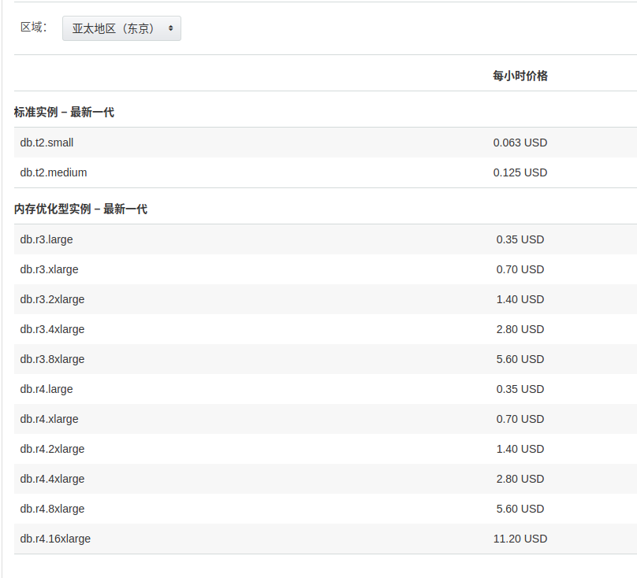

aurora vs mysql
- 具备比mysql更好的可扩展性，备份更为简单
- 易于从其他数据库（mysql/psql）迁移到aurora。aurora是兼容mysql 5.6/5.7的

### 性能
声称相对于标准的mysql数据库，具备5倍以上的性能优势，标准 PostgreSQL 数据库的三倍

### 容量
- aurora基本无需容量规划，aurora存储容量自动增长，10G～64T，每次增长10G。容量扩展过程中不影响系统性能
- aurora表的大小限制取决于aurora的卷大小，最大为64T；mysql 表大小不能超过为16T

### 备份
- aurora的最大副本数为15个,。aurora副本的底层数据卷是共享的，意味着主实例对数据的更改在副本上是瞬间完成的。故障转移是aurora的一个特色，保证了数据在aurora上不被丢失。因此，相对mysql，aurora具备更高的可用性。
- mysql的最大副本数为5，副本的处理速度也更为缓慢。

### 成本
- aurora的成本比mysql高20+%。如果aurora需要可读副本，费用则会翻倍。
- aurora的存储成本计算与mysql不尽相同。
	- RDS MYSQL 需要手动选择数据卷的大小的和实例类型，并确保你的实例类型能够支撑你的EBS IOPs
	- Aurora的IOPs只取决与你的实例类型。因此，如果想要提升IOPs，就只能对aurora的类型进行升级，这也意味着更高的费用

- 任何时候，aurora的成本=存储量+实例类型成本+请求量。 aurora的价格可见https://aws.amazon.com/cn/rds/aurora/pricing/
	- 存储：每月每 GB 0.12 USD
	- 请求：每 100 万个请求 0.24 USD
	- 实例：不同级别实例的费用不同。官方的五倍优势是基于db.r3.8xlarge，5.6$/h。"我们根据 SysBench 对 r3.8xlarge 实例进行的测试表明，Amazon Aurora 每秒提供超过 500000 次选择和 100000 次更新，是在同一硬件上运行相同基准的 MySQL 的五倍。"
	- 带宽使用量：同aurora

	

- mysql 定价 https://aws.amazon.com/cn/rds/mysql/pricing/
	- 单可用区部署
		- 存储： 每月每 GB 0.15 USD
		- 请求： 每月每 IOPS 0.12 USD
	- 多可用区部署
		- 存储： 每月每 GB 0.24 USD
		- 请求：每 100 万个请求 0.12 USD
	- 实例：不同级别的费用不一样
	- 带宽使用量: 同aurora

### 总结
- 如果需要极高的可用性，可以考虑使用aurora
- 对于高并发读的应用，aurora具备更高的性能
- 如果存在大量的二级索引读写，aurora的性能可能会略差于RDS MYSQL。（当然，不同级别的aurora实例的性能并不一样）
- 如果使用aurora，可能对于以后将数据服务转移到其他服务商或数据库类型有影响，因为aurora是完全依赖于aws的生态环境的
- aurora只支持innodb引擎（这没太大问题，因为我们基本都是使用innodb）
- aurora的成本略高于mysql
