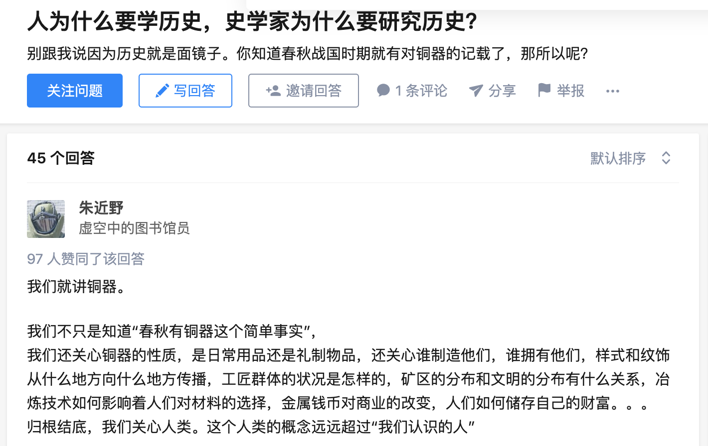

## 书透（书中观点）
&#8195;&#8195;万历十五年，即1587年，距洪武元年（1328）已过去259年，“在西欧历史上为西班牙舰队全部出动征英的一年”。这一年，大明帝国歌舞升平，政治几近发展到顶峰。同年并没有发生动摇帝国根基的事情，但是却为帝国轨迹的下行埋下了种子：皇权和文官集团从此失去平衡。皇权无法彻底领导军政；政府行政能力逐步下降；腐败懒政逐渐加深。同期的草原民族却开始合并、联盟，经济、军事实力得到了巨大的提升。

&#8195;&#8195;万历十五年，此时身为首辅的张居正已经62岁。这个年纪放在古今政治中都已经是不小的岁数了，但是，古今大部分的政人也基本是在这个年纪到达了权力巅峰。身为万历皇帝的老师兼当朝首辅，张居正依旧在推行对本朝积弊深重的赋税、徭役制度、人事制度进行改革，以期提升税收效率和。然而改革总是会触犯某些人的利益的。

&#8195;&#8195;申时行，作为张居正的接班人，深谙孔孟之道对于文官集团的影响， 认为“口头公认的理想为‘阳’，不能告人的私欲称为‘阴’”。申首辅在政期间，以温和、斡旋、调停作为行政准则，以期缓和朝政矛盾。故其虽无显要政绩，于庙堂之外仍可安身。

&#8195;&#8195;朱翊钧，身为当朝皇帝（年号万历），九岁御宇，在位四十八年。在位期间，见惯了文官集团的勾心斗角、沽名钓誉，遂渐隐于朝堂，出现三十载不早朝的颇受诟病之举。同时，身为皇帝，因而不可展现个人个性的压抑，最终使得他对文官。集团开始感到厌恶。（其实对于重大事项，万历哪怕不上朝，仍会亲自阅览、审批，倒还没有到达完全怠政的程度。）

---
## 我思

&#8195;&#8195;自汉武之后，以四书、道德作为选人、用人的标准，以孔孟之道作为治世理念，一心效祖宗之法，执祖宗之礼，中国政治几无进步。而那些偶尔出现的变革者，由于没有长期稳固的权力，大多都没有好下场。而且，他们的政策如果得到掌握权力的统治者（国家的统治者有时候是皇帝，有时候是文官集团）的大力支持，也会逐步被推翻。

&#8195;&#8195;改变大部分民众思想的，是可观测的（内部或者外部）经济基础的发展。如果没有工业革命，封建王朝在中国可能仍将延续数百年。其实，清王朝的人均GDP未必比数百年前的其他王朝低，甚至可能更高。只是工业革命后，中国和欧美日的经济差距愈来愈大，国内经济结构遭受到巨大冲击、人民在经济上的被剥削程度不断扩大、国家利益被他国日益强大的机器掠夺、民族文化遭受巨大冲击。随着差距逐渐变大，再不变革，为奴或者灭国也就不远了。

&#8195;&#8195;人都是有私心的，绝大部分人、利益集团，都打着某种口号，谋求自己的利益。这些人当自身利益受损后，就会以各种理由维护自己的利益。大部分时候，古代政治集团和农工商人民在利益上是处于敌对面的。古代文官集团会将那些想要提升底层民众生活水平、经济水平的官员视为叛徒，并使用孔孟伦理而非当朝律例对其进行抨击。当底层民众生活水平降低到无法生存（生存是当时经济条件下的最低要求）的地步而政府又无力解决此问题，社会就会发生动乱，严重者可能改朝换代。

&#8195;&#8195;当今时代经济条件下的生活最低要求已经远远高于“有饭吃”了。我们追求更高效廉洁的政府、健全的医疗和福利保障、先进公平的教育资源、完善的法律制度等等，如果政府当前无法实现且在可预见的未来没有满足这些需求的可能性的能力，社会同样会发生动荡。

<!-- 当今中国的距离真正的法制仍有巨大的距离，部分法律仍然只是一纸空文。真正实现法制仍需数代人的努力。 -->

&#8195;&#8195;所谓的生产资料所用权，等价于一段时期内的生产资料使用权。掌握生产资料的使用权的人，将会获得最高的资本报酬。

&#8195;&#8195;改革最重要的点是改变人们对旧制度的看法，“必须明确依靠谁、团结谁和打击谁这个首要问题”，争取得到大部分人的支持，并消灭阻碍改革的思想。其中最有效的方法之一，便是改变教育以及人事的制度，或者说改变大部分人的思想。

&#8195;&#8195;对一个政治人物的评价，在其死前、死后差异可能十分巨大。当该政治人物的利益相关者死后或者失去军政权力后，评价又会发生一次巨大的变化。

&#8195;&#8195;所有的错误，基本都是源于制度的错误。

---
## 只言片语
- 功在社稷，过在身家。恩怨尽时方论定，封疆危日见才难。
- 《明史》盛赞张居正为政期间「海内殷阜，纪纲法度莫不修明。功在社稷，日久论定，人益追思」。

