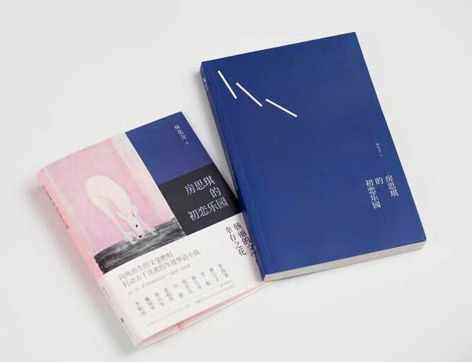
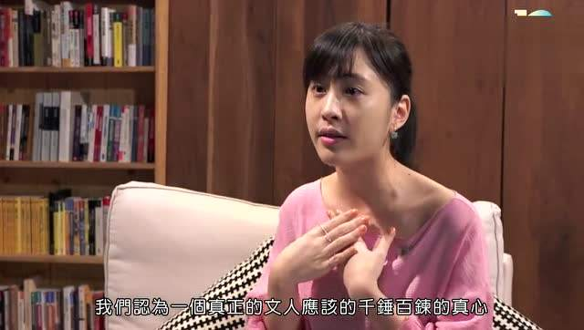
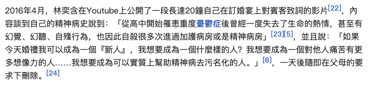

## 概要
&#8195;&#8195;怡婷和思琪是灵魂上的双胞胎，住在高档住宅楼，从小饱读诗书、热爱文学，有着相似的爱好和思维。两人都迷恋着大他们三十多岁的李国华老师。而李国华利用少女们对优秀长者的信任和爱慕，把魔爪伸向了年轻漂亮的思琪，而怡婷却因为相貌普通而逃过一劫。

&#8195;&#8195;初始时，为了维护对李国华的美好想象以及不让两人的关系染上污点，思琪强迫自己要和李国华相爱。因为，只要有爱，这一切都不是肮脏的了。

&#8195;&#8195;怡婷得知思琪和李国华的关系后，是怨恨，是嫉妒，她不懂为什么只有思琪能够得到老师的青睐。当她长大后，才真正地理解了思琪的痛苦，而这时，思琪已经疯了。

&#8195;&#8195;书中也有其他人物有着悲苦的经历：为了婚姻放弃学业，惨遭家暴的伊纹姐姐；被李国华侵犯后，接着又被爱人唾弃，一跃而下的“饼干”；被李国华强暴后维持多年性关系后自甘堕落的晓奇...

## 摘要
- 成年后的房思琪在上面批注：“为什么是我不会？为什么不是我不要？为什么不是你不可以？直到现在，我才知道这整起事件很可以化约为这第一幕：他硬插进来，而我为此道歉。”
- 房妈妈前几天送我的螃蟹也是绑成这样。（李国华闯进她的房间，拿着绳子把她绑成一个螃蟹，剥光她的衣服，把她绑成螃蟹的模样，拍下裸照。裸照是用去威胁郭晓奇的，因为她竟然敢去揭发他。）
- “思琪发现她永远无法独自一人去发掘这个世界的优雅之处，国一的敎师节以后她从未长大。李国华压在她身上不要她长大，而且她对生命的上进心，对活着的热情，对存在原 圆睁的大眼睛，或无论叫它什么，被人从下面伸进她的身体，整个地捏爆了。”
- “思琪用面包涂奶油的口气对妈妈说：「我们的家教好像什么都有，就是没有性教育。」妈妈诧异地看着她，回答：「什么性教育？性教育是给那些需要性的人，所谓教育不就是这样吗？」思琪一时间明白了，在这个故事中父母将永远缺席，他们旷课了，却自以为是还没开学。” 
- 思琪在家一面整理行李，一面用一种天真的口吻对妈妈说：「听说学校有个同学跟老师在一起。」「谁？」「不认识。」「这么小年纪就这么骚。」思琪不说话了，她一瞬间决定从此一辈子不说话了。

<!-- ## 作者

作者出生医学世家，从小热爱文学、阅读、写作，曾是台南唯一一个在升大学测验中获得满分的学生。年少是遭其师长性侵，罹患抑郁，需定期到精神医院接受治疗，曾三次自杀未遂。26岁，上吊身亡。

## 评价
我实在不愿意评价这本书，因为我只希望这本书的故事仅仅是一个故事，和现实没有任何相似之处。

书中思琪的父母描写次数屈指可数。在事情发生之后，聪明的思琪曾试探着求助于父母，只是母亲的一句“性教育是给那些需要性的人”，让扑腾的思琪沉溺在黑暗中。最后，只能寄希望于和李国华的感情是书中描述的爱。 -->

## 评价
&#8195;&#8195;尽管思琪的经历并不等同于作者的经历，但我还是实在不愿意评价这本书，因此把和作者相关的文字都删除了。

&#8195;&#8195;作者在书写的时候，就已经把自己的伤口剖开过无数遍了。我不想这样做。我只希望这本书的故事仅仅是一个故事，和现实没有任何相似之处。

## 其他
&#8195;&#8195;希望我们的社会给被侵犯者提供的是爱护，而不是谴责、议论。

&#8195;&#8195;希望我们的父母、教育不再谈“性”色变。我不希望在某一天，恶人把我自己压在费兹杰罗、纪德、诺贝尔文学集下，用他（她）丑陋的阴茎（阴道）粗鲁而狡诈地给自己上这门课。