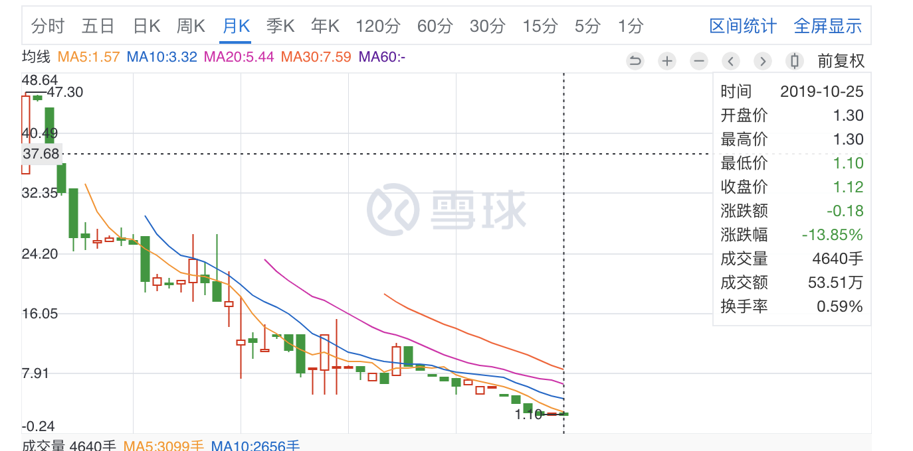

&#8195;&#8195;终于，还是在国庆前的一天提交了离职申请。

&#8195;&#8195;有米作为我的第一份正式工作，给我带来的影响还是很大的。从2017年12月到2019.10月，在这接近两年的时间里，认识了很多优秀的同事，也经历了公司很多人员、制度的变迁。

&#8195;&#8195;当年有米校招给我的offer不算特别出众，甚至在我手中的offer中，算是中等偏下的了。当年为啥会选择有米，我至今也未能想起来具体的原因，哈哈哈。其实现在想来，有米对我的影响还是很大的，甚至完全塑造了我对工作、企业、学习的认知。（可能是当时太年轻和幼稚了）

&#8195;&#8195;有米教给我的第一课就是：“公司不是学习的地方”。这句话可能有点笼统，但的确是有米给我的感觉。我也是挺认同这个观念的。公司雇佣我，是为了让我给公司创造收益，不是让我学习的。当然，在工作的过程中，必定会遇到一些以前从未遇到的点和面，在解决问题的过程中，必定也能学习到新的东西。但是，还是需要明确的一点就是，学习只是附带的。工作得到的知识是有限的，真正的成长，还是看你业余时间的使用。

&#8195;&#8195;有米最近也在开展一些培训课，如操作系统、计算机网络。然而，我个人不太认同有米的培训方式：布置一些作业，然后下节课就让学员们讲解一些这些作业，仅此而已。讲师或者导师根本就不会或者极少的讲解具体的知识，更不用说写个教学ppt或者文档了。我个人是不太喜欢这种无文档、无讲解而只有作业的课程的。“师者，所以传道授业解惑也”。如果一个课程、导师、讲师没有做到传道、授业、解惑，那么这个课程的实际意义就值得商榷了（其价值等同于叫学员自学）。况且，最近部分课程作业内容，于我看来，有点太过基础（如操作系统启动过程这些，读书阶段老师都已经讲解过了吧）。

&#8195;&#8195;说了一些牢骚后，还是说一些我离职的原因吧。工作的三要素：薪资、优秀的人、开心，三者缺二不可。有时，我也会反问自己，为什么要离职？但是我没能想到一个好的理由。但是，换个角度，我为什么要留下呢？同样也没想到一个好的理由。在停止调薪调职、优秀员工陆续流失后，心情就更复杂了。所以，当老板问我为啥要跑路的时候，我的回答很简单：想去外面的世界看看。

&#8195;&#8195;有米在2018和2019年停止了对员工调职调薪。对于一个刚工作一两年的员工来说，调职调薪是对其工作和成长的肯定。每个应届生都会和他同届的同学进行对比，如果发现成长速度落后于平均水平（最直观的就是薪资和职称），那么就会对自己、公司进行反省，如果发现主要原因是公司，那么内心的小鹿就会开始乱跳。当然，有米在私底下还是有给少部分人调薪的。

&#8195;&#8195;另一个原因，就是一些我很喜欢的同事如高昌、诵弦、培阳、亚特、莺爷等都相继离开了。从这些优秀的同事身上，都或多或少地映射出我部分的不足。有什么不懂的，努力无果后也可以很爽脆地请教他们。和他们相处的时间，是在有米里最开心的。

&#8195;&#8195;制度上，行情好的时候，拼命摊大饼，风头过后，只能断臂自救；公司的业务线（网盟）混乱；各个业务的负责人都在努力维护自己部门的利益，有时损害了公司整体；部门leader基本是一年换一次（处于基层的我也不知道原因）；公司组织架构多次调整；业务奖惩制度不合理；过度投入“营销云”等等。回过头看，在这两年里，公司做了挺多错误的决策或者制定了部分不合理的制度，而这些，都削弱了有米在互联网寒冬的抵抗力。

&#8195;&#8195;当然，有米还是有一些不错的地方的，比如网盟技术组相对优秀的技术栈和技术积累、轻松的的工作氛围等等。

&#8195;&#8195;当然，还是希望有米在未来能够总结经验，好好发展。