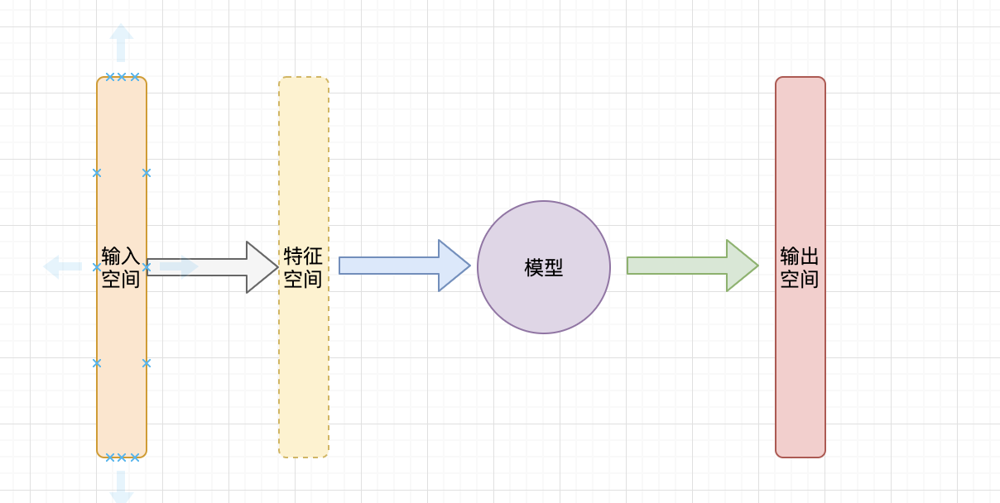

# 统计学习
## 统计学习的特点
&#8195;&#8195;统计学习是关于计算机基于数据构建概率统计模型并运用模型对数据进行预测和分析的一门学科，也称为统计机器学习。

主要特点：
- 以计算机及网络为平台
- 以数据为研究对象。统计学习的对象是数据，它从数据出发，提取数据的特征，抽象出数据的模型，发现数据中的知识，又回到对数据的分析和预测中去。
- 目的是对数据进行预测和分析
- 是概率论、统计学、信息论、计算理论、最优化理论、计算机科学等多个领域的交叉学科

&#8195;&#8195;现在，当人们提及机器学习是，往往指统计机器学习。

## 统计学习的方法
&#8195;&#8195;统计学习方法包括模型的假设空间、模型选择的准则以及模型学习的算法，称其为统计学习方法的三要素。简称模型、策略、算法。

实现统计学习方法的步骤如下：
- 得到一个有限的训练数据集合
- 确定包含所有可能的模型的假设空间，即学习模型的集合
- 确定模型选择的准则，即学习的策略。 （一般主要指损失函数）
- 实现求解最优模型的算法，即学习的算法。（如何根据训练数据训练模型）
- 通过学习方法选择最优模型（如何评判最优模型：准确率、损失函数、F1等）
- 通过学习的最优模型对新数据进行预测和分析

## 统计学习的重要性
统计学习是：
- 处理海量数据的有效方法
- 计算机智能化的有效手段
- 计算机科学发展的一个重要组成部分

# 监督学习
&#8195;&#8195;统计学习包括监督学习、非监督学习、半监督学习及强化学习。
- 非监督学习：现实生活中常常会有这样的问题：缺乏足够的先验知识，因此难以人工标注类别或进行人工类别标注的成本太高。很自然地，我们希望计算机能代我们完成这些工作，或至少提供一些帮助。根据类别未知(没有被标记)的训练样本解决模式识别中的各种问题，称之为无监督学习。直接对输入数据集进行建模，例如聚类。
- 半监督学习：半监督学习(Semi-Supervised Learning，SSL)是模式识别和机器学习领域研究的重点问题，是监督学习与无监督学习相结合的一种学习方法。半监督学习使用大量的未标记数据，以及同时使用标记数据，来进行模式识别工作。当使用半监督学习时，将会要求尽量少的人员来从事工作，同时，又能够带来比较高的准确性，因此，半监督学习目前正越来越受到人们的重视。
- 强化学习：强化学习（Reinforcement Learning, RL），又称再励学习、评价学习或增强学习，是机器学习的范式和方法论之一，用于描述和解决智能体（agent）在与环境的交互过程中通过学习策略以达成回报最大化或实现特定目标的问题。


## 基本概念
### 输入空间、特征空间
&#8195;&#8195;在监督学习中，将输入和数据所有可能的取值的集合称为输入空间和输出空间。
<p align="center">

</p>

&#8195;&#8195;模型的输入是特征向量（将输入空间转化特征空间）。

&#8195;&#8195;输入变量X和输出变量Y有不同的类型，可以是连续的，也可以是离散的。根据输入、输出的不同类型，对预测任务给予不同的名称：X、Y均连续，则为回归问题；Y为有限的离散变量则为分类问题；X、Y均为变量序列的预测问题成为标注问题。

## 联合概率分布
&#8195;&#8195;监督学习假设输入和输出的随机变量X、Y遵循联合概率分布P(X,Y), P(X,Y)表示分布函数或者分布密度函数。

## 假设空间
&#8195;&#8195;监督学习的目的在于学习一个由输入到输出的映射，这一映射有模型来表示。模型术语由输入空间到输出空间的映射的集合，这个集合就是假设空间。假设空间的确定意味着学习范围的确定。

# 统计学习的三要素
## 模型
&#8195;&#8195;模型就是所要学习的条件概率分布或决策函数。假设空间可以定位为决策函数的集合。
```L(Y, f(X)) = |Y-f(X)|
F={f|y=f{X}}
```
&#8195;&#8195;F通常是由一个参数向量决定的函数族，参数向量Θ就是我们需要学习的参数，其取值范围我们称为参数空间。

## 策略
### 损失函数和风险函数
&#8195;&#8195;损失函数/代价函数用于度量模型的一次预测的好坏，风险函数度量平均意义下模型预测的好坏。

常见的损失函数如下：
- 0-1损失函数：L(Y, f(X)) = Y!=f(X) ? 1 : -1
- 平方损失函数：L(Y, f(X)) = (Y-f(X))^2
- 绝对损失函数：L(Y, f(X)) = |Y-f(X)|
- 对数损失函数：L(Y, f(X)) = -log(P(Y|X))
  
&#8195;&#8195;损失函数越小，模型越好。我们最希望得到的结果就是联合分布的损失函数的期望最小化。学习的目标就是选择期望风险最小的模型（即如何使得损失函数的期望最小）。由于联合分布式未知的，因此损失的期望也是未知的。那如何是好呢？

&#8195;&#8195;不过我们可以计算得到训练数据的平均损失函数，也称为经验风险。
```
R=∑L(y, f(x))/N
```
&#8195;&#8195;根据大数定理，当样本容量（测试数据容量）N无穷大时，R就趋于期望风险。因此，我们的目标就可以转化为选择经验风险最小的模型。

### 经验风险和结构风险最小化
&#8195;&#8195;当样本容量很小时，经验风险最小化的效果未必好：即对训练数据表现优异，但是对测试数据却表现低能，即产生了过拟合现象。

&#8195;&#8195;结构风险最小化是防止过拟合而提出的策略。结构风险最小化等价于正则化。
```
R=∑L(y, f(x))/N + λJ(f)
```
- J(f)为模型的复杂度，一般可取L1或者L2正则化
```
L1=||Θ||_1，即Θ的L1范数
L2=||Θ||_2，即Θ的L2范数
```
- λ用于权衡经验风险和结构风险

&#8195;&#8195;贝叶斯估计中的醉倒后验概率估计就是结构风险最小化的一个例子。当模型是条件概率分布、损失函数是对数损失函数、模型负载度有模型的先验概率表示是，结构风险最小就等价于最大后验概率估计。

## 算法
&#8195;&#8195;现在知道了模型以及策略（损失函数），那如何调整模型参数来是使得损失最小呢？这是一个最优化问题。

# 模型评估和效果选择
&#8195;&#8195;评估模型的时候，我们可以以测试数据的平均损失作为度量。当然也可以使用其他方法：
- 准确率：I(y=f(x))/N

# 正则化和交叉验证
## 正则化
正则化见结构化风险一节。

## 交叉验证
- 将训练数据分为测试集和训练集
- S折交叉验证：将数据氛围S个互不相交的子集，选取S-1个子集作为训练，使用余下的自己测试。对可能的S种选择进行训练、测试，选取S次训练、评测中平均测试误差最小的模型作为最优模型。
- 当S=N时，即为留一交叉验证。


# 泛化能力
&#8195;&#8195;学习方法的泛化能力是指由该学习方法得到的模型对未知数据的预测能力。模型对位置数据预测的误差称为泛华误差。事实上，泛化误差就是所学到的模型的期望风险。

&#8195;&#8195;我们无法得知模型的泛化误差，但是我们能计算泛化误差的上界，以此作为对一个模型的评价。泛化误差上界通常具备以下性质：
- 它是样本容量的函数，当样本容量增加时，泛化上界趋于0。（训练数据集越大，则泛化误差上界越小）
- 它是假设空间容量的函数，假设空间容量越大，模型就越难学，泛化误差上界就越大。

# 生成模型和判别模型
监督学习方法可以分为生成方法和判别方法。

&#8195;&#8195;生成方法由数据学习联合概率分布P(X,Y)，然后求出条件概率分布P(Y|X)作为预测的模型，即生成模型。
```
P(Y|X) = P(X, Y)/P(X)
```
典型的生成模型有：朴素贝叶斯法、隐马尔可夫模型。

&#8195;&#8195;判别方法有数据直接学习决策函数f(X)或者条件概率P(Y|X)作为预测模型，即判别模型。模型的数据即为目标输出。典型的判别模型有：
- k近邻法
- 感知机
- 决策树
- 逻辑斯蒂回归
- 最大熵模型
- 支持向量机
- 提升方法
- 添加随机场等


# 分类问题
&#8195;&#8195;分类器正确分类的样本数和总样本数之比，也就是损失函数为0-1损失函数是测试数据集上的准确率。

&#8195;&#8195;对于二分类问题，常用的评价指标是精确率和召回率
- TP：将正类预测为正类的数量
- FN：将正类预测为负类的数量
- FP：将负类预测为正类的数量
- FN：将负类预测为负类的数量
```
精确率P=TP/(TP+FP)
召回率R=TP/(TP+FN)
2/F1 = 1/P + 1/R
F1=2TP/(2TP+2FP+FN)
```
&#8195;&#8195;F1是精确率和召回率的调和均值。根据不同场景，会使用不同的评判标准来评价模型。（体检时将一个病人判断为健康 比 将一个健康人判断为病人 更为严重，因为这会使病人错过最佳治疗时间）。

# 标注问题
&#8195;&#8195;标注问题是分类问题的一个推广，又是更复杂的结构预测问题的简单形式。标注问题的输入是一个观测序列，输出是一个标记序列和状态序列。标注问题的目的在于学习一个模型，使得它能够对观测序列给出标记序列作为预测。常见的应用有：自然语言处理中的词性标注、天气预测、语音翻译等。

&#8195;&#8195;标注问题常见的统计学习方法有：隐马尔可夫模型，条件随机场等。

# 回归问题
&#8195;&#8195;回归用于预测输入变量和输出变量的关系，其等价于函数拟合。按照输入变量的个数，分为一元回归和多元回归；按输入变量和输出变量之间关系的类型即模型的类型，分为线性回归和非线性回归。

常见的回归问题有：市场趋势、股市等。