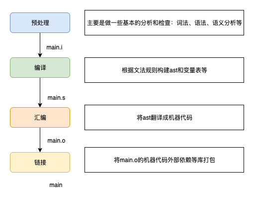

&#8195;&#8195;自从换了工作以后，学习、阅读的时间就相对减少了，日益觉得自己面目可憎了。

<p align="center">

</p>

&#8195;&#8195;链接是将各种代码和数据片段手机并组合成为一个单一温江的过程，这个文件可被加在到内存并执行。链接可以执行于编译时，也就是在源代码被翻译成机器代码时；也可以执行于加载时，也就是在程序被加载起加在到内存执行时；甚至执行于运行时，也就是由应用程序来执行。在现代系统中，链接是由叫链接器的程序自动执行的。

&#8195;&#8195;为什么要了解连接器：
- 理解连接器将帮助你构建大型程序
- 理解链接器将帮助你避免一些危险的编程错误
- 理解连接器将帮助你理解语言的作用域规则是如何实现的
- 理解链接将是你利用共享库（或者链接库的工作原理）

下文的例子、内容使用c语言为例，其他语言也是大同小异。

## 编译器驱动程序
<p align="center">

</p>

&#8195;&#8195;大多数编译系统提供编译器驱动程序，它代表用户在需要时调用语言预处理器、编译器、汇编器和连接器。

- 驱动程序手下运行C预处理器，它将c的源程序main.c翻译成一个ASCII码的中间文件main.i。命令如下：cpp main.c main.i
- 接下来运行c编译器，它将main.i翻译成一个ASCII汇编语言文件main.s。命令如下：cc1 main.i -Og -o main.s
- 然后运行汇编器as，它将main.s翻译成一个可重定位目标文件(文件内引用的外部变量、外部函数、外部库尚待链接器来定位加载)。命令如下：as -o main.o main.s
- 最后运行连接器ld，将main.o和sum.o以及一些必要的系统目标文件组合起来，创建一个可执行目标文件。命令如下：ld -o main main.o sum.o

&#8195;&#8195;运行时，shell调用操作系统一个叫加载器（loader）的函数，来将可执行文件中的代码和数据复制到内存，然后将控制权转移到程序的开头。


## 静态链接
想linux LD程序这样静态链接器以一组可重定位目标文件和命令行参数作为输入，生成一个完全链接的、可以加载和运行的可执行目标文件作为输出。输出的可重定位目标温江由各种不同的代码和数据节组成。

为了狗仔可执行文件，连接器必须完成以下两个主要任务：
- 符号解析：每个符号对应于一个函数、一个全局变量或者一个静态变量。符号解析的目的是将每个符号引用正好和一个符号定义关联起来。
- 重定位：编译器和汇编器生成从地址0开始的代码和数据节。链接器通过把每个符号定义和一个内存位置关联起来，从而重定位这些节。

## 目标文件
目标文件有三种形式：
- 可重定位目标文件：包含二进制代码和数据，其形式可以在编译时和其他可重定位目标文件合并起来，创建一个可执行目标文件
- 可执行目标文件。包含二进制代码和数据，其形式可以被直接复制到内存并执行
- 共享目标文件。一种特殊类型的可重定位目标文件，可以在加载或者运行时被动态地加载进内存并链接。（java的动态加载的基本原理也类似如此）

编译器、汇编器生成可重定位目标文件（包括共享目标文件）。链接器生成可执行目标文件。

## 可重定位目标文件
<p align="center">
</p>

- ELF header开头的16个字节描述生成改文件的系统的字的大小和字节顺序。剩余部分包含帮助链接器语法分析和解析目标文件的信息，如ELF header 的大小、目标文件类型（可重定位/可执行/可共享）、机器类型（x86-64）、节头部表的文件偏移等。
- .text：已编译程序的机器代码
- .rodata：只读数据，比如printf语句中的格式串和开关语句的跳转表
- .data：已初始化的全局和静态C变量
- .bss：未初始化的全局和静态C变量，以及所有被初始化未0的全局和静态变量（为何命名为bss也是一段有趣的历史）
- .symtab: 一个符号表，它存放了程序汇中定义和引用的函数和全局变量的信息
- .rel.txt: 一个.txext节中位置的列表，当连接器把这个目标文件和其他文件组合时，需要修改这些位置。即函数表
- .rel.data：被模块引用或定义的所有全局变量的重定位信息。即外部数据表
- .debug：一个调试符号表，其条目是程序中定义的局部变量和类型定义、程序中定义和引用的全局变量表、原始的c源文件。只有在编译时使用 -g 选项才会得到这张表
- .line：程序中的行号和.text节中机器指令之间的映射，只有以-g选项调用编译器驱动程序才会得到这张表（程序运行中可以打印代码行号也是基于这个表）
- .strtab：一个字符串表，其内容包括.symtab和.debug中的符号表


## 符号和符号表
每个可重定位目标模块m都有一个符号表，它包含m定义和饮用的富豪的信息。在链接器的上下文中，有三种不同的符号：
- 由模块m定义并能被其他模块引用的全局符号。全局链接器符号对应于非静态的C函数和全局变量
- 由其他模块定义并被模块m引用的全局符号。这些符号被成为外部符号，对应于在其他模块中定义非静态的C函数和全局变量
- 只被模块m定义和引用的局部符号。对应于带static属性的C函数和全局变量。

不包含本地非静态程序变量的任何符号。

符号表是有汇编器构造的。表中的每个项代表一个符号，每个项的结构如下
```c
typedef struct {
    int name;       // 字符串表.strtab中的字节偏移
    char type:4     // 表示符号是数据还是函数
        binding:4;  // 表示符号是本地还是全局
    char reserved;
    short section; // 该符号被分配到目标文件的哪个字节，不同的值对应 .rodata/.bss等节
    long value;    // 符号的地址。对于可重定位模块来说，value是距定义目标的节的起始位置偏移
    long size;     // 目标的大小，单位字节
}
```

## 符号解析
链接器介些符号引用的方法是将每个引用与它输入的可重定位目标文件的符号表中的一个确定的符号定义关联起来。（也就是根据引用，从符号表找到符号具体定义的位置）。

对于本模块内的变量，符号解析是非常简单明了的。但是对于全局符号的引用解析，当编译器没法在当前模块找到其定义是，会假设该符号是在其他某个模块中定义的，生成一个链接器符号表条目，并将它交给链接器处理。如果链接器在它的任何输入模块都找不到这个被引用符号的定义，就会报错。如：
```
undefined reference to $your_variable/func_mame
```

### 关联/联想
c++、java等语言支持方法重载，这些方法在源代码中都有着相同的名字，却有这不同的参数，那么链接器是如何区别这些重载方法的？原因是编译器将每个唯一的方法和参数列表组合编码成一个对链接器来说唯一的名字。这个过程叫“重整”，而相反的过程叫“恢复”。类Foo的bar(int, long)方法就被编码为“bar__3Fooil”。其中的“3”是类的名字长度，“i”和“l”表示参数类型分别为int和long。（再思考一下，如果参数不是基本类型，那么编码会是什么？）

### 多重定义的全局符号的解析
链接器输入的模块中，有一些符号是局部的，有些是全局的（及其他模块可见）。如果多个模块定义同名的全局符号，会发生什么？下面是linux编译系统采用的方法。

在编译时，编译器向汇编器输出每个全局符号（强符号或者弱符号），并把强弱信息编码在可重定位目标文件的符号表里。函数和已初始化的全局变量是强符号，未初始化的全局变量是弱符号。

根据强弱符号的定义，linux有如下规则处理多重定义的符号名：
- 规则1: 不允许有多个同名的强符号。违反则输出“multiple definition of xxxx”
- 规则2: 如果有一个强符号和多个弱符号同名，则选择强符号。
- 规则3: 如果多个弱符号同名，则从这些弱符号任意选择一个

规则二有如下例子：
```c
// foo3.c
int x = 10; // 已初始化的全局变量是强符号
int main() {
    f();
    print(x); // 运行输出：1234
    return 0;
}

// bar3.c
int x; // 未初始化的全局变量是弱符号
void f() {
    x = 1234; // 优先选取强符号
}

// 运行输出：1234
gcc -o des_file foo3.c bar3.c
```

### 静态库链接