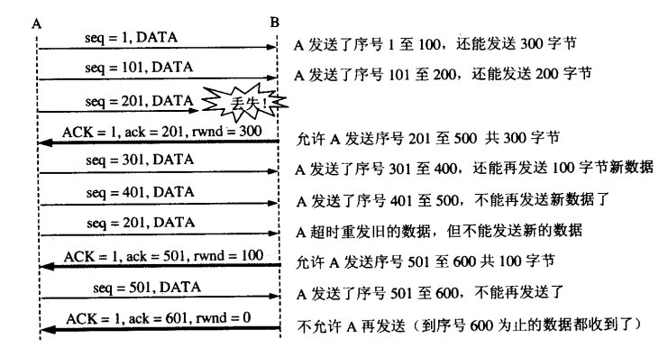
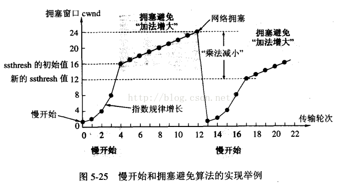

## 流量控制和拥塞控制的介绍
TCP采用大小可变的滑动窗口进行流量控制，窗口大小的单位是字节。
发送窗口在连接建立时由双方商定。但在通信的过程中，接收方可根据自己的资源情况，随时动态地调整对方的发送窗口上限值(可增大或减小)。
1. 接收端窗口 rwnd（也称为通知窗口）：接收端缓冲区大小，表示接收方的接收能力。接收端将此窗口值放在 TCP 报文的首部中的窗口字段，传送给发送端。
2. 拥塞窗口cwnd (congestion window)：发送端缓冲区大小
3. 发送窗口swnd：发送窗口的上限值 = Min [rwnd, cwnd]
4. 当 rwnd < cwnd 时，是接收端的接收能力限制发送窗口的最大值。
当 cwnd < rwnd 时，则是网络的拥塞限制发送窗口的最大值。
 
> 流量控制：就是让发送方的发送速率不要太快，让接收方来得及接收。

> 拥塞是指：数据发送速度超出网络所能承受的极限，经常造成路由器丢包的现象。

## 流量控制
> 让发送方的发送速率不要太快，让接收方来得及接收。利用滑动窗口机制可以很方便的在TCP连接上实现对发送方的流量控制。TCP的窗口单位是字节，不是报文段，发送方的发送窗口不能超过接收方给出的接收窗口的数值。

> 主要想法：让发送方知道接收方当前的接收能力，调整发送速率。

### 控制方法

1. 主机A向主机B发送数据。双方确定的窗口值是400.再设每一个报文段为100字节长，序号的初始值为seq=1,图中的箭头上面大写ACK，表示首部中的确认为ACK，小写ack表示确认字段的值。
2. 接收方的主机B进行了三次流量控制。第一次把窗口设置为rwind=300，第二次减小到rwind=100最后减到rwind=0，即不允许发送方再发送过数据了。这种使发送方暂停发送的状态将持续到主机B重新发出一个新的窗口值为止。
3. 假如，B向A发送了零窗口的报文段后不久，B的接收缓存又有了一些存储空间。于是B向A发送了rwind=400的报文段，然而这个报文段在传送中丢失了。A一直等待收到B发送的非零窗口的通知，而B也一直等待A发送的数据。这样就死锁了。为了解决这种死锁状态，TCP为每个连接设有一个持续计时器。只要TCP连接的一方收到对方的零窗口通知，就启动持续计时器，若持续计时器设置的时间到期，就发送一个零窗口探测报文段（仅携带1字节的数据），而对方就在确认这个探测报文段时给出了现在的窗口值。

### TCP报文段发送时机的选择
1. TCP维持一个变量，它等于最大报文段长度MSS，只要缓存中存放的数据达到MSS字节就组装成一个TCP报文段发送出去。
2. 由发送方的应用程序指明要求发送报文段，即TCP支持的推送操作
3. 是发送方的一个计时器期限到了，这时就把当前已有的缓存数据装入报文段发送出去。

## 拥塞控制
> 主要想法：从丢包情况估计网络的负载情况，调整发送速率，防止过多的数据注入到网络中，这样可以使网络中的路由器或链路不致过载。

> 因特网建议标准RFC2581定义了进行拥塞控制的四种算法，即慢开始/慢启动（Slow-start)，拥塞避免（Congestion Avoidance)快重传（Fast Restrangsmit)和快回复（Fast Recovery）。我们假定
> 1. 数据是单方向传送，而另外一个方向只传送确认
> 2. 接收方总是有足够大的缓存空间，因为发送窗口的大小由网络的拥塞程度来决定。

### 慢开始

1. 在主机刚刚开始发送报文段时可先将拥塞窗口 cwnd 设置为一个最大报文段 MSS 的数值。
2. 在每收到一个对新的报文段的确认后，将拥塞窗口增加至多一个 MSS 的数值（一开始窗口大小为1，发送一个，接收一个，增长为2；发送两个，得到两个确认，增长为4......因此，窗口是指数增长的）。
3. 用这样的方法逐步增大发送端的拥塞窗口 cwnd，可以使分组注入到网络的速率更加合理。
4. 因为拥塞窗口是指数增长的，为防止后期增长过快，需要另外一个变量---慢开始门限（阈值）ssthres，当cwind == ssthress时，要预防拥塞的产生，开始执行拥塞避免算法，cwnd按线性规律增长
5. 当网络发生拥塞（即没有在TTL时间内接收到确认数据报，确认超时），把ssthresh值更新为拥塞前cwind值的一半，cwnd重新设置为1，按照步骤2执行。

### 快重传
发送端只要一连收到三个重复的 ACK 即可断定有分组丢失了，就应立即重传丢失的报文段而不必继续等待为该报文段设置的重传计时器的超时。

### 快恢复
算法有以下两个要点：
1. 当发送方连续收到三个重复确认时，就执行“乘法减小”算法，把慢开始门限减半，这是为了预防网络发生拥塞（同慢启动）。
2. 由于发送方现在认为网络很可能没有发生拥塞，因此现在不执行慢开始算法，而是把cwnd值设置为慢开始门限减半后的值（而不是同慢启动一样从1开始），然后开始执行拥塞避免算法，是拥塞窗口的线性增大。

 

  [1]: http://www.cnblogs.com/newwy/p/3254029.html
  [2]: http://www.cnblogs.com/gaopeng527/p/5255757.html
  [3]: /img/bVW0iT
  [4]: /img/bVW0oE
  [5]: /img/bVW0x2