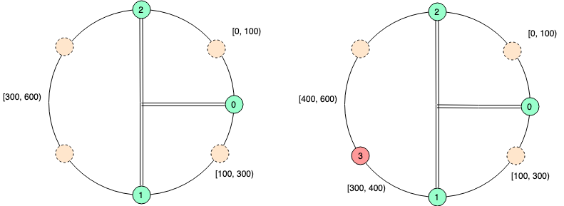

<!--more-->

<p align="center">

</p>

&#8195;&#8195;负载平衡（Load balancing）是一种计算机技术，用来在多个计算机（计算机集群）、网络连接、CPU、磁碟驱动器或其他资源中分配负载，以达到最佳化资源使用、最大化吞吐率、最小化响应时间、同时避免过载的目的。 使用带有负载平衡的多个伺服器组件，取代单一的组件，可以通过冗余提高可靠性。负载平衡服务通常是由专用软件和硬件来完成。 主要作用是将大量作业合理地分摊到多个操作单元上进行执行，用于解决互联网架构中的高并发和高可用的问题。——维基百科

&#8195;&#8195;简单介绍在软件层面实现的负载均衡。


## 随机
&#8195;&#8195;假设有N个服务提供者provider，编号为[0, N-1]
```
// 随机生成一个整数，取值范围为[0, N-1]
int idx = rand(N)
return providers[idx]
```
&#8195;&#8195;缺点：只在各个provider一致时才较为公平、有效，但实际应用中，不同服务提供者的负载能力一般是有差异的；出现连续多次返回同一个provider的情况

## 权重
&#8195;&#8195;假设有N个服务提供者provider，编号为[0, N-1]
```
// abilities[i] 为第i个服务提供者的负载能力或权重
abilities = [ability_0, ability_1, ...]
// 计算中的负载能力/权重
totalAbility = sum(abilities)
// 根据负载能力/权重随机选取一个
weight = rand(totalAbility)
for i := range abilities {
    weight -= abilities[i]
    if weight <= 0{
        return providers[i]
    }
}
```
&#8195;&#8195;缺点：仍有可能连续多次返回同一个provider的情况

&#8195;&#8195;以上两种方法纯属屁话。

## 去重
&#8195;&#8195;解决：连续多次返回同一个provider的情况

- 初始化：
```
abilities = [ability_0, ability_1, ...]
tmpAbilities = copy(abilities)
```
- 取值
```
totalAbilities = sum(tmpAbilities)
weight = rand(totalAbility)
for i := range abilities {
    weight -= abilities[i]
    if weight <= 0{
        // 减少权重
        tmpAbilities[i]--
        // 当总权重为0，则重置
        if sum(tmpAbilities) == 0 {
            tmpAbilities = copy(abilities)
        }
        return providers[i]
    }
}
```
&#8195;&#8195;比如初始权重为[2, 1]。第一次选取了0，则下一次选取的权重为[1, 1], 保证每三次就有两次选取得到第一个服务提供者。

## 回话/缓存均衡
&#8195;&#8195;回话/缓存数据一般不会同时存在多个provider/node中,provider/node也会存在上下线的情况，因此，需要尽可能的将同一个请求发送到同一个provider/node中，尽可能减少session或者缓存不命中。

&#8195;&#8195;普通的hash分配（idx=hash()/node_num）在provider/node上下线时，由于node_num发生了变化，相同的请求计算得到的idx就会发生变化，使得同样的可能会落在其他节点上。例子：
- 初始有三个节点，选取方法为hash(ip)/3，某个ip A的请求的hash值为7，此时会选取providers[1]
- 当新增一个节点时，选取方法变为hash(ip)/4，来自A请求就落到了provders[3]上，使得A的session或者缓存失效

&#8195;&#8195;一般可以使用一致性哈希来解决/缓解这种问题。
```
// 假设三个provider的负载能力为1:2:3。我们随机一个数，以此来选择不同的provider/node
// providers[0] 处理hash为[0:100)的请求
// providers[1] 处理hash为[100:300)的请求
// providers[2] 处理hash为[300:600)的请求 
// （hash的范围我们一般取一个较大的数(也有人称之为虚节点数量)，1000~10000就基本能满足需求。此处我们为方便，选取600，并按负载能力分配给各个provier）
flags={
    0: {0, 100},
    1: {100, 300},
    2: {300, 600}
}
weight := hash(id)/600  // 可根据ip、user_id等进行hash
for i := range flags {
    if weight >= flags[i][0] && weight = flags[i][1] {
        return providers[i]
    }
} 
```
&#8195;&#8195;如果新增一个provider/node，那么可以根据其负载能力让其负责处理hash值在某个范围的请求(往abilities、providers相应位置添加一个元素即可)，如负责[300,400)；其他范围的请求仍能落在原provider/node上。
```
// providers[0] 处理hash为[0:100)的请求
// providers[1] 处理hash为[100:300)的请求
// providers[3] 处理hash为[300:400)的请求 // 新节点
// providers[2] 处理hash为[400:600)的请求 
```


&#8195;&#8195;如果providers[1]故障或者下线，那么可以将provider[1]处理的范围分配到provider[2]

## 如何确定负载能力
&#8195;&#8195;实际应用中，服务提供者的负载能力一般是会变化。写死权重无法应对这样的情况。一次，权重/负载能力应该能够动态调整。
- 根据provider的内存、cpu等物理条件调整权重
- 根据provider的正在处理的任务数、空闲线程数、空闲连接数等调整权重
- 根据provider处理任务的耗时进行处理

&#8195;&#8195;provider或者节点需要向负载均衡器提供这些数据，以进行负载能力的计算。阿里开源的中间件Dubbo

&#8195;&#8195;可以参考[TCP的流量控制和拥塞控制 或者<<计算机网络>>](https://segmentfault.com/a/1190000011641120)，有同工之处。

其他关联：
- 负载均衡器可以使用漏桶、令牌桶等方法来控制请求速率或应对突发流量，防止provider/node被打挂。

## 其他
&#8195;&#8195;之前在阿里的高性能中间件比赛中发现了一个比较有趣的均衡方法：
```
int idx1 = rand(node_num);
// PRIME是一个大于节点数的质数
int idx2 = rand(idx1 + PRIME)%node_num; 
// idelConnectionNumber是空闲连接数
return providers[idx1].idelConnectionNumber > providers[idx2].idelConnectionNumber ? providers[idx1] : providers[idx2]
```
&#8195;&#8195;其实就是从两个provider里选取空闲连接数做多的来处理请求