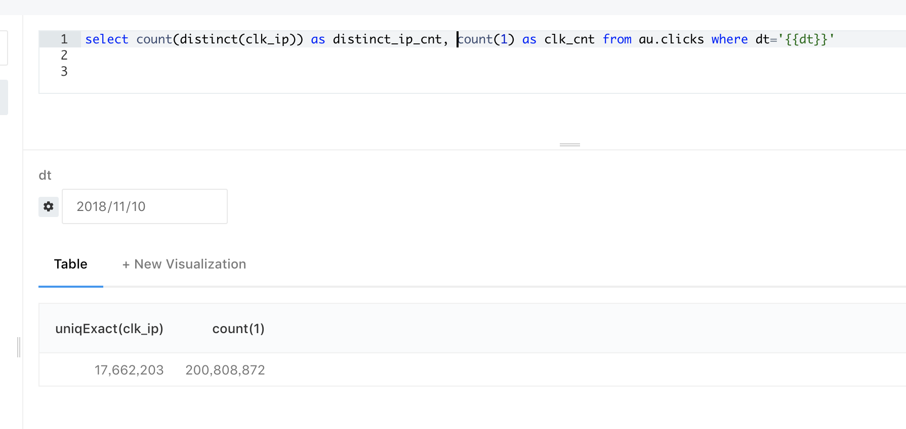
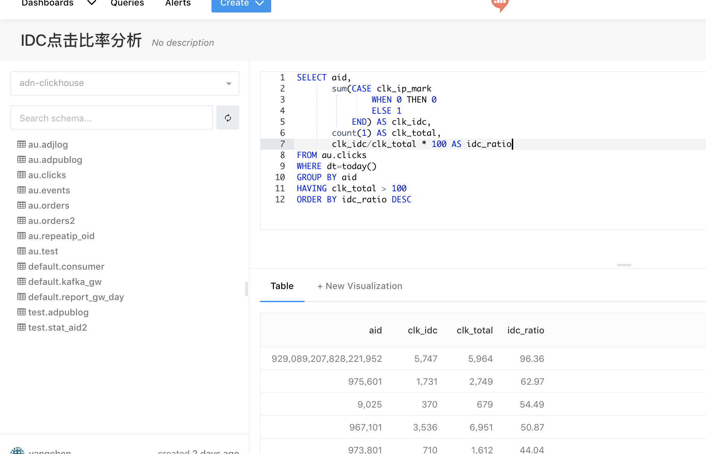

## 介绍
本文主要介绍数据库的基本操作，面向读者为业务、运营人员，作为其数据查询的指导和参考。因此，本文并不打算介绍数据库的基本原理、设计规范，而是着重于数据的查询。

## 数据库介绍
資料庫管理系统（英语：Database Management System，簡稱DBMS）是为管理資料庫而設計的电腦軟體系統，一般具有儲存、擷取、安全保障、備份等基礎功能。資料庫管理系統可以依據它所支援的資料庫模型來作分類，例如關聯式、XML；或依據所支援的電腦類型來作分類，例如伺服器群集、行動電話；或依據所用查詢語言來作分類，例如SQL、XQuery；或依據性能衝量重點來作分類，例如最大規模、最高執行速度；亦或其他的分類方式。不論使用哪種分類方式，一些DBMS能够跨類別，例如，同時支援多種查詢語言。-——-维基百科

下文，我们将假设需要查的数据库为au，需要使用到的表有orders（订单/转化），clicks（点击），分别存储了我们的转化数据和点击数据。相关字段请查看 [AU点击/结算日志定义](https://conf.umlife.net/pages/viewpage.action?pageId=58982648)

基本术语：
- database、schema：database是对一个数据集合的统称。schema是对一个数据库的结构描述。在一个关系型数据库里面，schema定义了表、每个表的字段，还有表和字段之间的关系。
- table：存储结构化数据的表，表中的每条记录的字段数量、字段类型是确定的。如au的orders表和clicks表，
- column、field：表的每一列，在关系型数据库中也可称为字段。

数据库类型：
- mysql：开发人员常用的数据库
- redshift：aws提供的数据库服务，我们用于存储订单等信息
- clickhouse：数据仓库，可以存储的数据量较大，查询较快。在本业务中，clickhouse的数据只存储15天
- hive：数据仓库，可以存储的数据量巨大，但是查询极为缓慢

业务人员在redash上要导的数据基本是来源于上述四种数据库，最频繁的为redshift和clichouse

## 基本查询
- 查询所有字段，如查询一个订单的所有字段
```
select * from au.orders; // 其中au为数据库名，如果前文指定了数据库，则可省略，见下；orders是表名；* 表示查询所有字段；
// 等价于：
use au;
select * from orders;
```

- 查询个别字段，如查询订单所属的渠道和offer
```
select aid, oid from au.orders // redash上查询语句结尾可不写分号
```

- 根据字段排序可以使用"order by"，如将订单按revenue字段从高到低排序
```
select aid, oid from orders order by revenue desc // redash上查询语句结尾可不写分号
select aid, oid from orders order by revenue asc // 从低到高排序
```
如果同时需要按revenue、payout排序呢？只需在order by后面增加需要排序的字段即可，如：
```
select aid, oid from orders order by revenue, payout desc
```


- 聚合查询/分组查询，比如查看每个渠道今天的总revenue和总payout
```
select aid, sum(revenue) from orders group by aid // sum(revenue) 代表对revenue求和
select aid, sum(revenue)，sum(payout) from orders group by aid
```
上述查询中的sum称为聚合函数，group by称为分组。二者一般是配合起来使用的。其他常用的聚合函数有：
```
count(field)   //记录数, 如查询每个渠道的转化数： select aid, count(1) from orders group by aid
avg(field)     //平均值, 如查询每个渠道的所有转化的平均revenue: select aid, avg(revenue) from orders group by aid
min(field)     //最小值, 如查询每个渠道所有转化中最小的revenue: select aid, min(reveune) from orders group by aid
max(field)     //最大值, 同上
sum(field)     //总和
```
如果需要查询每天revenue大于1000的渠道呢？可以在group by后面增加having，如下：
```
select aid, sum(revenue)，sum(payout) from orders group by aid having sum(revenue)>1000
```

- 指定返回的记录数量/行数，如只查询十条订单
```
select * from orders limit 10
```
查询第11到20条订单
```
select * from orders limit 10,10 // 第一个10表示略过前十条，第二个表示返回10条，即返回第11到20条
```

## 条件查询
- 普通条件查询: 大于>，小于<，等于，不等于，大于或等于，小于或等于，between，包含，不包含，空，非空等
```
select oid from orders where revenue > 10 // 返回revenue大于10的广告id，小于同理
select oid from orders where revenue >= 10 and revenue < 20 // 返回reveune在区间[10, 20）的广告id
select oid from orders where revenue between 10 and 20 // 返回reveune在区间[10, 20]的广告id
select oid from orders where revenue between 10 and 20 and oid in (234,567,573485937) // 返回234,567,573485937三条广告中reveune在区间[10, 20]的广告id
```

## 子查询
子查询(SubQuery)是指出现在其他SQL语句内的SELECT子句。
```
select * from orders where oid in (select oid from orders where revenue between 10 and 20) // 返回reveune在区间[10, 20]的订单，与“select * from orders where revenue between 10 and 20”是等价的

select * from clicks where oid in (select tid from orders) // 查询所有发生转化的点击
```

## 时间处理
在实际业务中，我们经常需要查询某天、某小时的数据，然而，我们的数据的时间格式只有两种：date（如dt)、datetime/timestamp（如cov_ts），date精确到天，datetime/timestamp精确到秒，那我们如何查询每个小时的数据呢？比如，如何查询每个小时的renvenue？我们应该进行如下操作：
```
select cov_ts转化为小时 as hr, sum(revenue) from orders group by hr;
```
那如何将datetime/timestamp转化为小时呢？不同的数据库有不同的处理方式。下面列举常用的几种数据库关于时间的处理方式
- clickhouse: toStartOfHour(cov_ts)
- redshift: date_trunc('hour', cov_ts)

如在clickouse进行上述查询，则查询语句为
```
select toStartOfHour(cov_ts) as hr, sum(revenue) from orders group by hr
```


其他请见
- [各种数据库使用的时间函数](https://conf.umlife.net/pages/viewpage.action?pageId=56795730)
- [clickhouse的时间函数](https://clickhouse.yandex/docs/en/query_language/functions/date_time_functions/)
- [redshift/psql时间函数](https://www.postgresql.org/docs/9.1/functions-datetime.html)


## 实战
实际应用中的查询语句会比上述的情况负载，但是，基本都是上述查询方法的组合使用。
```
select column_1, column_3, sum(column_7),...              // 选取的列
from [database_name.]table_name                            // 从某个数据库的某个表
[where column_i=value_i and ... or ... and ...]           // 选取符合这些条件的记录
[group by column_j, column_k, ... ]                      // 按某几个字段对这些记录分组
[having sum(columnm_q) > value and max(column_p)= value]   // 符合这些条件的组
[order by column_1, column_2, ... [desc|asc]]             // 按某些字段排序
```
[]表示的是可选功能


### 例子一
十一月十号不同的ip数量和总点击量



### 例子二
如查询今天每个渠道的点击数、服务器（IDC）点击数(clk_ip_mark!=o)、服务器（IDC）点击数占比，可如下分析：
```
SELECT aid,
       sum(CASE clk_ip_mark
               WHEN 0 THEN 0
               ELSE 1
           END) AS clk_idc,
       count(1) AS clk_total,
       clk_idc/clk_total * 100 AS idc_ratio
FROM au.clicks
WHERE dt=today()
GROUP BY aid
HAVING clk_total > 100
ORDER BY idc_ratio DESC
```

