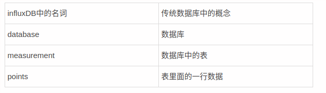
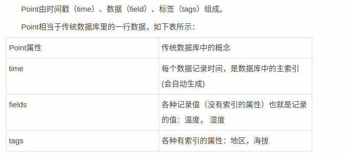
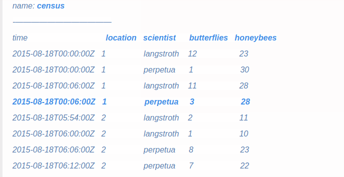
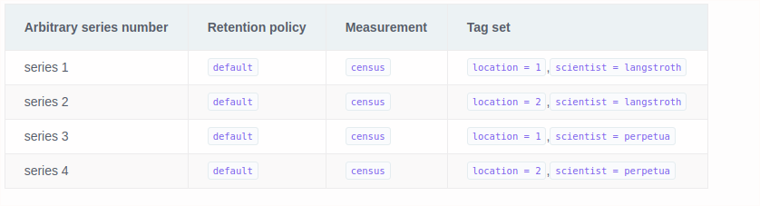

### 与传统数据库对比
时间序列数据库，主键永远是时间time

### point

### measurement
一类数据

### series
数据序列

* 一个series就是一个测点，或者说一条曲线，那么retention policy, measurement, tagset就共同组成了一个定位测点序列的唯一标识。
* point，就是某个series的同一个时刻的多个field的value，就组成了一个point；其实就是一般曲线上的一个点。
* InfluxDb不需要做schema定义，这意味着你可以随意的添加measurements, tags, and fields at any time，
