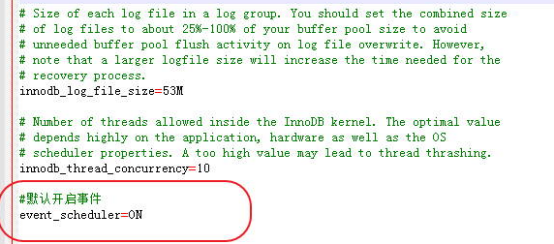

https://www.jianshu.com/p/bbab32eb3323
https://www.jianshu.com/p/7b2d74701ccd

1. 写存储过程
```
CREATE PROCEDURE `del_data`(IN `date_inter` int)
BEGIN
    delete from youmi_stat.table1 where insertTime < date_sub(curdate(), interval date_inter day);
    delete from youmi_stat.table2 where insertTime < date_sub(curdate(), interval date_inter day);
END
```
2. 写Event事件
```
create event del_event  
on schedule
EVERY 1 day
STARTS '2017-04-12 00:00:00'  
ON COMPLETION  PRESERVE ENABLE  
do  call del_data(30)
```
* EVERY 1 day STARTS '2017-04-12 00:00:00'：从2017.4.12起开始每天执行一次这个时间
* ON COMPLETION [NOT] PRESERVE ：表示当事件不会再发生的情况下，删除事件（注意特定时间执行的事件，如果设置了该参数，执行完毕后，事件将被删除，不想删除的话可以设置成ON COMPLETION PRESERVE）；
* ENABLE：表示系统将执行这个事件；

3. 把Event事件设置成Enable并打开事件任务

```
set global event_scheduler = on
SHOW VARIABLES LIKE 'event_scheduler';
```
虽然这里用set global event_scheduler = on语句开启了事件，但是每次重启电脑。或重启mysql服务后，会发现，事件自动关闭（event_scheduler=OFF），所以想让事件一直保持开启，最好修改配置文件，让mysql服务启动的时候开启时间，只需要在my.ini配置文件的[mysqld]部分加上event_scheduler=ON 即可，如下：

```
 source on_schedule_delete.sql
 show events  
DROP EVENT del_event  删除事件
```


### example
```
delimiter //
CREATE PROCEDURE `del_data`(IN `date_inter` int)
BEGIN
    delete from youmi_stat.stat_aid_api_fetch where dt < date_sub(curdate(), interval date_inter day);
END
//

create event del_event  
on schedule
EVERY 1 day  
STARTS '2018-01-01 00:00:00'  
ON COMPLETION  PRESERVE ENABLE  
do  call del_data(7)
//

delimiter ;

set global event_scheduler = on;
```
