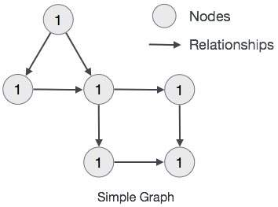
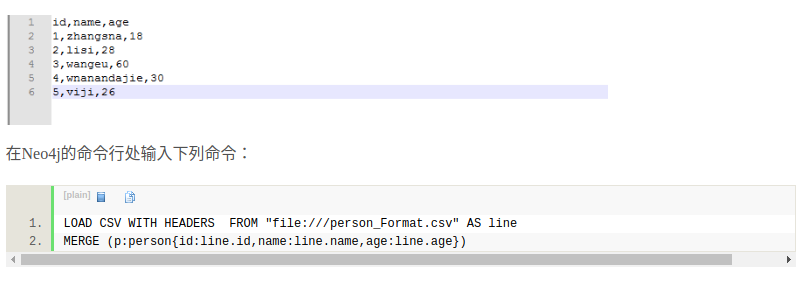
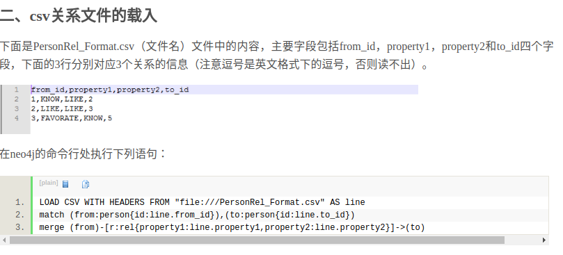

  ### 介绍
图形数据库（Graph Database）是NoSQL数据库家族中特殊的存在，用于存储丰富的关系数据，Neo4j 是目前最流行的图形数据库，支持完整的事务，在属性图中，图是由顶点（Vertex），边（Edge）和属性（Property）组成的，顶点和边都可以设置属性，顶点也称作节点，边也称作关系，每个节点和关系都可以由一个或多个属性。Neo4j创建的图是用顶点和边构建一个有向图，其查询语言cypher已经成为事实上的标准。

模型规则
- 表示节点，关系和属性中的数据
- 节点和关系都包含属性
- 关系连接节点
- 属性是键值对
- 节点用圆圈表示，关系用方向键表示。
- 关系具有方向：单向和双向。
- 每个关系包含“开始节点”或“从节点”和“到节点”或“结束节点”



w3c上面的教程和官网也可以参考

### 安装
- 先安装jdk,并配置好环境变量,略
- 先到https://neo4j.com/product/ 下载,需要注册后才能下载

```
1. tar -xvf 压缩包
2. cd 解压文件/bin
3. neo4j install
```

### 运行启动
```
启动
sudo service neo4j start 或者 sudo neo4j start
关闭
sudo service neo4j stop 或者 sudo neo4j stop
```

### web访问
```
http://localhost:7474/browser/
```
初始用户为neo4j,密码为neo4j,登录后需要更改密码.web端的教程见w3c.但我更喜欢在命令行访问


### 命令行访问
参考https://neo4j-client.net/
```
 sudo add-apt-repository ppa:cleishm/neo4j
 sudo apt-get update
 sudo apt-get install neo4j-client libneo4j-client-dev
```

默认端口是7687
```
neo4j-client -u neo4j localhost 7687
```

你可以在neo4j-client命令行登录后更改密码:
```
CALL dbms.changePassword('your new password')
```

### 使用
- create 创建一个节点或关系

```
// 格式
create (node_name:lable_name
	{
		property1_name:property1_value
		p2:v2
		p3:v3
	});
// node_name 类型于关系型数据库的表的别名
// label_name 类似于表明一样,表明一类实体

create (dog:DOG{name:"dog_name",age:20});
```

- match 查询

```
// 查询节点的某个属性
match(node_name:node_label)
	where node_name.p1=v1
return node.p3 as p3

// 查询整个节点
match(node_name:node_label)
	where node_name.p1=v1 and/or node_name.p2>v2
return node_name
```

- relationship

```
// 给现有节点添加关系
match (a:A),(b,B)
where a.p1=p1 and b.p2=v2 or ...
create (a)-[r:R{p3:v3,p4:v4,...}]->(b)

// 新建节点的同时创建关系,甚至可以在后面追加return
create (a:A{...})-[r:R{...}]->(b:B{...}) return r

// 查询关系
match (a:A)-[r:R]->(b:B)
	where a.p1=v1 or r.p2=v2 and b.p3=v3
return r
```

- label 一个节点有多个label

```
create (a:A:B...) ...

// match
match (a:A:B) 会返回label既是A也是B的node
match(a:A) 会返回A,也返回A:B,即label包含A的节点
```

- delete 删除节点或关系,在删除节点前,必须先删除其相关关系

```
match (a:A) where a.p1=v1 delete a

match (a:A) where a.p1=v1 delete a.p1

match (a:A) delete a

// 删除所有A\B之间的R关系
match (a:A)-[r:R]->(b:B) delete r

// 同时删除关系和节点
match (a:A)-[r:R]->(b:B) where a.p1=v1 delete a,b,r
```

- remove 移除节点或关系的属性,可在后面追加return

```
语法基本同delete
match (a:A) where ... remove a.p1 return ...

match (a:A)-[r:R]->(b:B)  where ... remove r.p2
```

- set 添加或修改属性

```
match (a:B) where ... set a.p1=v1
```

- order by 按一个或多个属性值排序返回结果, 默认是按升序,降序就在order列表后追加DESC

```
match (a:A) where ... return a.p1, a.p2, a.p3 order by a.p1,a.p2
```

- union 连接返回结果(名字要相同),去除重复行.注意这里的连接和关系型数据库不相同,这里只是将两个return语句返回的结果列表拼接而已.

```
match (a:A) return a.p1 as p1, a.p2 as p2
union
match (b:B) return b.p1 as p1, b.p3 as p2
```
union all 同上,只是不去除重复行


- limit 限制返回结果的数量

```
match (a:A) return a limit 10 // 返回前10个结果
```

- skip 跳过前面的结果数目

```
match (a:A) return a skip 10 // 跨过前十条结果
```

- merge 命令在图中搜索给定模式，如果存在，则返回结果,如果它不存在于图中，则它创建新的节点/关系并返回结果。

```
merge (a:A{p1:v1})-[r:R{...}]->(b:B{...})

相当于
match (a:A)-[r:R]->(b:B) where a.p1=v1 and r... and b.... return a,r,b
if a或b或r不存在, 就create
```

- null 如果return的属性不存在,就会返回一个null作为该属性的值

```
where a.name is not null  // 查询name值不为null的节点,即有name属性的节点
```

- in 判断属性值是否在列表中

```
where a.name in ['given', 'zeng']
```
- id “Id”是节点和关系的默认内部属性/home/zjw/Pictures/neo4j_import_relationship.png。 这意味着，当我们创建一个新的节点或关系时，Neo4j数据库服务器将为内部使用分配一个数字。 它会自动递增。最大值约为35亿

- upper 转大写字母.lower同理

```
match (a:A) where ... return upper(a.p1) as p1
```

- substring 它接受一个字符串作为输入和两个索引：一个是索引的开始，另一个是索引的结束，并返回从StartInded到EndIndex-1的子字符串。

```
match (a:A) where ... return substring(a.p1,0,10) as p1
```

- 聚合count\max\sum\min\avg

```
match (a:A) where ...  return count(*)

match (a:A) where ...  return max(a.age), min(a.age), avg(a.age), sum(a.age)
```

- 关系函数
	- startnode 获取关系的开始节点
	- endnode 关系的结束节点
	- id 关系的id
	- type 关系的类型type

```
MATCH (a)-[movie:ACTION_MOVIES]->(b)  RETURN STARTNODE(movie)
```

- 索引

```
create index on a:A (p1)
create index on :A (p1)
drop index on :A (p1)
```

- unique

```
create constraint on (a:A) assert a.p1 is unique
```

- 其他

```
where exists (a.name) //节点存在属性
where n.name contains 'giv' // 属性包含
where a.name starts with 'g' // 属性开头
where a.name ends with 'n' //属性结尾
where n.name=~'.*ive.*' // 使用正则表达式
match(n) optional match(n)-[r]-() delete n,r // 清空数据库所有节点和关系
match (n) detach delete n // 清空数据库所有节点和关系
```


### 导入数据
csv格式:第一行是字段名,后面是每个字段的值
```
p1,p2
v1,v2
v1,v2
...
```

```
load csv with headers from "file path" as line
merge (a:A{p1:line.p1, p2:line.2})
```




