# 基于深度学习的问答模型的设计与实现

### 摘  要
&#8195;&#8195;问答系统是一种高级形式的信息检索系统，它能够回答自然场景下用户提出的问题，有助于用户快速、准确地获取信息。由于文本理解的复杂性以及不同语言间的差异，当前大部分问答系统仍然存在答案抽取不全甚至答案抽取错误的缺陷。为提升用户信息检索的准确度和便利性，在本文，我们针对非结构化的学者信息数据，基于语义网络和深度学习的方法设计两个模型（答案定位模型和答案抽取模型）。答案定位模型用于预测句子蕴含答案的概率；答案抽取模型从句子中抽取出具体的答案。联合使用这两个模型，我们相较于当前较为先进的答案抽取模型取得了更好的成绩。

### 关键词
&#8195;&#8195;信息检索；问答；答案抽取

### Design and implementation of Question and Answer Model Based on Deep Learning
&#8195;&#8195;Abstract:. The question answering system is an advanced form of sexual information retrieval system. It can answer the questions raised by users in the natural scene and help users to obtain information quickly and accurately. Due to the complexity of text comprehension and the differences between different languages, most of the current Q&A systems still have the defects that the answers are incomplete or even the answers are wrong. In order to improve the accuracy and convenience of user information retrieval, in this paper, we design two models (answer location model and answer extraction model) based on unstructured scholar information data using semantic network and deep learning methods. The answer location model is able to predict the probability of the sentences implied by the answer; the answer extraction model extracts specific answers from the sentences. Using these two models together, we have achieved better performance than the state-of-the-art answer extraction models.

### Keywords
&#8195;&#8195;Information retrieval; Question and answer; Answer extraction

## 引言
&#8195;&#8195;自动问答系统指的是可以能够正确回答自然场景下用户提出的问题的系统，是信息检索系统的高级形式。自1950年图灵提出图灵测试以判断机器是否具备智能，自动问答系统就不断地往这个目标发展。现有的问答技术研究仍有许多难题尚未解决，距离通过图灵测试仍有较远的距离。

&#8195;&#8195;问答系统一般可以划分为开放领域问答系统和特定领域问答系统。开发领域问答系统能够处理自然场景下用户提出的问答，但是对特定领域问题难以进行准确回答；而特定领域问答系统则只能处理关于特定领域的问题。传统的问答系统基本是属于专家系统类型的，使用基于类似于朴素贝叶斯或者知识库的形式实现，可扩展性较差（如无法将问答系统应用于其他领域等），而且无法应对自然场景下的不同形式的问答；而且传统的专家型问答系统一般是基于结构化的数据知识库，对于此类非结构化的数据无法进行信息提取，且需要较高的成本将原始数据整理为结构化的形式来存储。因此，具备其他领域扩展性、能够有效识别用户问题并且能够从非结构化文档提取答案功能，是当今较先进的信息检索系统或问答系统基本具备的特征。

&#8195;&#8195;为了更有效地理解问句以及从文本中抽取答案，人们结合语言学的研究成果如语法、句法、语义等，提出一系列提高模型文本理解能力的方法（如依存组合语法树DCS-Tree、组合范畴语法CCG等），并且取得了一些成绩。随着深度学习的研究愈加深入和设备计算能力的提升，深度学习方法在其他领域（如图像识别[1]、自然处理（NLP））取得了很多其他方法无法媲美的优异成绩。使用深度学习来对非结构化的文本进行信息提取已经具备一定的理论基础以及相应工具，甚至已经出现一些较成熟的具有开放性领域问答能力的应用，如微软小冰、谷歌assistant、苹果Siri等聊天机器人等。与国外的研究相比，由于中英文语言差异、中文语言资源缺乏、中文问答评测机制不够完善等，国内在问答系统的研究水平和规模仍然存在一定的差距。

&#8195;&#8195;在本文，我们针对非结构化的学者信息，实现了两个模型，分别用于定位答案所在的句子、从句子抽取所需的具体答案。相较于当前传统的问答系统以及DGCNN问答模型[12]，我们的模型有更好的表现；另外，我们为模型提供了与学者信息无关的的问答训练数据，使得模型能够回答简单的开放性领域问题。 

## 相关知识
### 卷积神经网络
&#8195;&#8195;卷积神经网络是在20世纪60年代由Hubel和Wiesel提出的，两人在研究猫的脑皮层神经元时，发现其神经元网络结构具有有效降低网络复杂性的特性，继而提出了卷积神经网络（Convolutional Neural Networks，简称CNN）。卷积神经网络能够有效、快速地提取出数据的特征，因此CNN一般位于神经网络模型的较前的位置，用于对数据进行特征提取。卷积神经网络的操作一般分为如下步骤：卷积、池化。对于具体的模型，一般会在卷积网络层后添加若干隐藏层和目标输出层等。

#### 卷积的功能及结构
&#8195;&#8195;所谓的卷积在数学意义上，是对数据的一种运算，如增加、合成、旋转等，而卷积神经网络的功能就是对输入的数据运算，进行的特征的抽取。卷积神经网络中具体的卷积操作是由卷积核（filter，也称过滤器，一个小型的矩阵）进行的[1]。
我们通过不断移动该卷积核（移动速度称为步长stride），使其和输入的不同区域进行卷积操作，就可得到整个输入的某种特征。卷积操作的数学描述如下式所示：

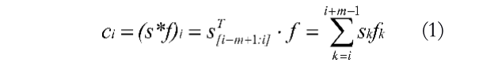

&#8195;&#8195;其中ci为第i个卷积操作的结果，f为卷积核，m为卷积核的大小。实际应用中，我们一般会为卷积操作增加一个偏置向量b。

#### 膨胀卷积
&#8195;&#8195;原始的卷积操作中，一次卷积操作的作用范围（也称卷积核的视野）和卷积核的大小相同，如3*3的卷积核只能看到大小为3*3的区域。为了增大卷积核的视野范围，膨胀卷积[2]放大了操作范围，如图1-4，一个3*3的膨胀卷积操作的对象之间相隔了一个参数（即膨胀率或空洞率），其视野放大为原来的4倍。为了不对输入进行重复卷积，膨胀卷积的膨胀率一般为2的幂级数，即以“1、2、4、8、...”的形式递增。本文中，输入数据是问句和文档的embedding 矩阵，而对于自然语言来说，相关的词汇在句子中可能相隔距离较远，因此，为更好地提取特征，我们采用了不同膨胀率的卷积操作。

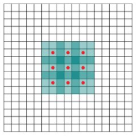

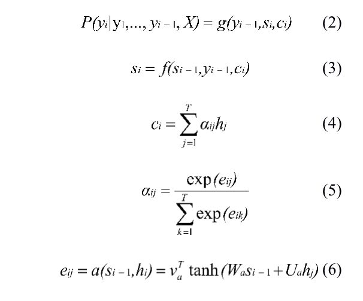

### Attention神经网络的网络结构
&#8195;&#8195;Attention机制是对seq2seq模型的重要优化。传统的seq2seq解编码模型（一般基于RNN及其变形LSTM等）将输入序列使用Encoder模型编码成一个固定长度的向量，然后将得到的向量结合输入xi，在Decoder模型进行解码得到输出yi。seg2seq模型在机器翻译、语音识别等领域较其他模型取得了更好的结果。然而seq2seq模型只能将输入编码为定长的向量，因此其信息存储能力受到限制，并且并没有对过去不同时刻的信息根据重要性区别对待，因此当输入序列过长时，对于距离较远的信息丢失严重，但这些信息可能有一部分与当前时刻具有密切关联。

&#8195;&#8195;传统的seq2seq编码器当前时刻的输出只与当前时刻的输入和上一时刻的输出相关，而Attention模型[18]通过保留编码器的中间输出结果，联合当前时刻的输入再进行当前时刻的输出计算，因此可以更好的保留了过去时刻的信息。Attention的结构如图2-7所示：

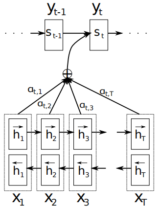

&#8195;&#8195;从上式可见Attention对于编码器的中间输出hi乘以一个权重αi，用于提取中间输出序列中中更为重要的部分。虽然Attention的加入使得了模型的复杂度增加，但是能在解码之前更好地捕捉到编码器中间输出中的重要部分，有效地提升了模型的准确度。

## 模型设计
### 答案定位模型的设计
&#8195;&#8195;答案定位模型的输入为问句和文档的某句子的embedding矩阵，用于估计答案在该句子中的概率。答案定位模型的架构如图3所示：

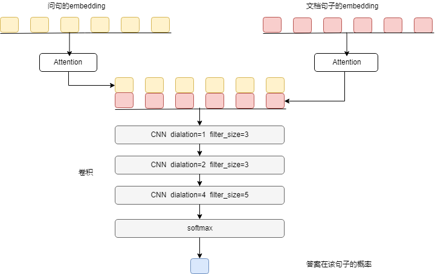

&#8195;&#8195;本模型中，我们先对输入的问句和文档句子进行分词，然后使用word2vec分别对词语进行word embedding，得到每个词语的特征向量Wi，从而得到两个特征矩阵Q和S。为了对Q和S的长度进行限制，我们对Q和S 分别使用Attention分别进行编码，得到大小相同的两个特征向量，接着将特征向量进行拼接（也可以再拼接上其他的已知数据），作为后面三个卷积层的输入（池化操作使用最大池化）。

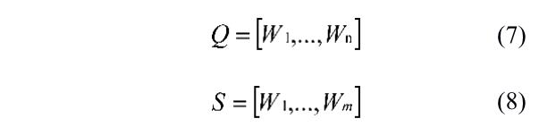

&#8195;&#8195;此处的Attention是参考seq2seq模型中的Attention机制，代替常用的pooling操作，用于对原始输入卷积得到的信息进行整合，其数学形式为：

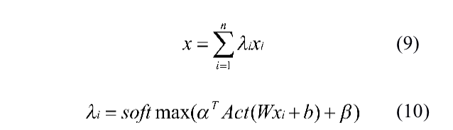

&#8195;&#8195;其中W和β是需要训练的参数；Act为激活函数。
考虑到关联性较强的词语之间距离不一，我们采用不同的膨胀率和不同大小的卷积核来做卷积操作。
我们模型只是用于判断答案是否存在于句子当中，因此模型的输出我们将其设置为答案存在于句子的概率（使用sigmoid作为输出）。因此我们在Embedding操作后只是简单地对模型的输入进行三层卷积操作，经过平滑后，连接到一个全连接层作为输出。

### 答案抽取模型的设计
&#8195;&#8195;答案抽取模型的输入为问句和文档的某句子的embedding矩阵，用于预测答案在该句子的开始位置和结束位置。我们的答案抽取模型是对DGCNND（Dilate Gated Convolutional Neural Network 膨胀卷积神经网络）[5]的改良。DGCNN是一个用于针对非结构化文本信息进行事实性答案的模型，如从“广州白云山最高点摩星岭海拔382米”，针对问题“白云山的海拔高度”提取出答案“382米”。原始的DGCNN模型结构如图2-1所示。由于问句具有不定长的特性和结构，DGCNN使用一个卷积层和Attention层对问句的Embedding矩阵进行编码，再将编码结果连接到文档句子的Embedding 矩阵，得到输入S。 这样就得到同时蕴含问句和文档句子的特征序列。然后，为了捕捉距离更远的关联信息，模型先使用三层不同大小和膨胀率的卷积层对S进行卷积操作，以便更好地抽取特征。接着进行以sigmoid为激活函数全连接，得到R1和R2。

&#8195;&#8195;参考[16]，DGCNN模型给卷积操作加上了一个门用于控制输入流量：

&#8195;&#8195;其中第一个卷积操作是普通的膨胀卷积；第二个卷积用来生成控流门；两个卷积核的形式是相同的，但是权值并不共享。激活函数sigmoid的值域为(0,1)，因此可以视为是对第一个卷积的结果的流量控制，即原信息以1-σ的概率进行更新，卷积后的信息以σ的概率再流动到下一层。同时，DGCNN在卷积中使用残差网络以减少梯度消失的问题，并使得信息在多通道得到传输。

&#8195;&#8195;DGCNN模型中的Attention与答案定位模型基本相同。

&#8195;&#8195;DGCNN模型为了过滤掉答案不在句子中的情况，对S的卷积结果进行另一个以sigmoid为激活函数的全连接作为打分器，得到打分矩阵P。最后将P分别与R1和R2进行点积，得到模型的两个输入。即，当答案不存在于句子中时，将P设为0，与两个输入R1和R2点积后的结果就会变为0，以表示答案不在文档句子当中。

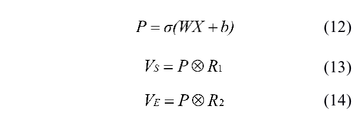

&#8195;&#8195;模型的第一个输出是答案的开始位置向量VS，第二个是答案的结束位置向量VE。假设句子经过分词后得到句子单词列表[w1,w2,...,wn]，VS的最大值的下标为i，VE最大值的下标为j，则预测答案为[wi,wi+1,...,wj]（wi表示文档句子的第i个词语）连接而成的句子。

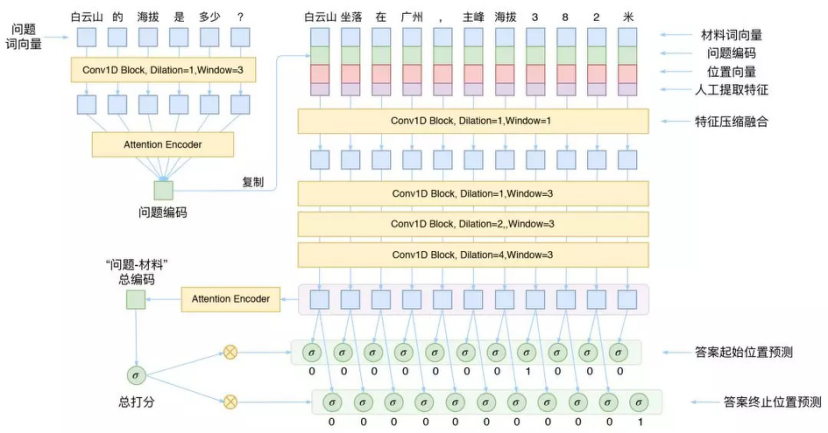

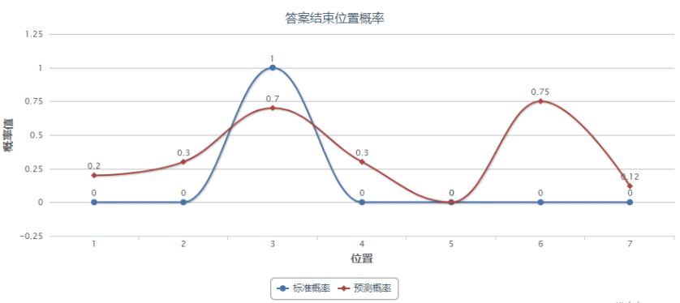

&#8195;&#8195;原始的DGCNN只是简单地判断答案在文档句子中的开始结束位置，因此容易受到噪声的影响。如图3-3所示，假设标准答案的开始位置为1，结束位置为3，即答案为[w1,w2,w3]；但当预测结果中具有一个噪声点，其概率值只是比正确结束位置稍大一点（0.75>0.7），预估出来的答案就变为了[w1,w2,w3,w4,w5,w6]。因此，在DGCNN中，哪怕预估得到的最高概率值只是比正确位置的的概率稍高，但是当其索引和正确点索引距离相差较大时，就会造成预测出来的结束位置就和实际结束位置相距甚远。可见，当噪声点的预估值稍大于正确点，预测出来的答案可能就完全不一样，而且原始模型对开始位置和结束位置分开进行预测，没有考虑到二者的先后关系，因此，有时候预估出来的开始位置甚至比结束靠后。

&#8195;&#8195;为了提高模型的抗噪声能力，我们将原始的DGCNN模型改造如图2-3。相较于原始的DGCNN模型，我们去除了评分器P，还将输出从多输出R1和R2更改为单输出R，模型的基础架构并未改变。输出R中的每个位置的值代表该位置的词位于答案的概率。当我们进行答案抽取时，不仅是考虑该位置的值，还考虑该位置附近概率值的平均值，当该位置附近概率值的平均值大于某个阈值我们才认为这个位置的词是答案的一部分。

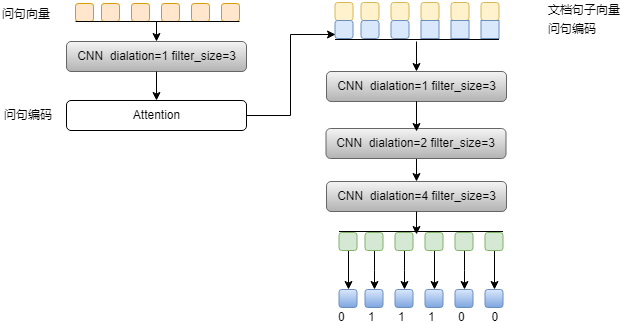

&#8195;&#8195;我们使用以下不等式进行答案抽取，将满足不等式的第一个位置和最后一个位置作为答案的开始和结束位置。

&#8195;&#8195;其中d是我们要考虑的范围的大小，一般取4至8即可；α是我们在训练完模型后根据测试需要确定的数据，一般略大于1，即抽取附近平均值大于全局平均值某一倍数的位置。

&#8195;&#8195;使用以上方法，我们的模型从预测答案的开始、结束位置转化为预测词语是否为答案的一部分，有效地减少参数规模，在预测的时候也可以有效地降低噪声数据的影响。

### 本章小结
&#8195;&#8195;本章我们主要介绍了答案定位模型的基本架构以及DGCNN对输入输出的处理方式、特征提取方式以及答案判断方式。在DGCNN的基础上，我们去除打分器，并将模型的两个输出合并为一个，更改其答案提取方式，使用范围式的判断选择代替原来的单点判断方式来获取答案的起始、结束位置，形成我们的答案抽取模型。

## 实验过程及其结果
### 样本简介
&#8195;&#8195;我们的数据源是学者网上的学者个人简介，针对这些数据，我们人工提出一些问题并根据源数据标注答案，如：问句——“俞鹤伟的研究兴趣”；句子——“俞鹤伟，华南理工大学，感兴趣的研究领域包括移动互联网关键技术、多媒体网络传输技术等”；结果——“移动互联网关键技术、多媒体网络传输技术等”。当然，我们的训练数据中部分训练样例的问题在文档是不存在答案的，此时答案为空；同时我们也在训练数据中添加了部分非学术性的问答材料和样例，如“白云山的海拔高度”等，以增强模型的抗干扰能力和泛化能力。

### 答案定位模型实验及结果分析
&#8195;&#8195;由于答案定位模型的输出结果代表答案位于该文档句子的概率，因此我们通过设定概率阈值的方式来判定该句子是否蕴含答案。图4-1显示了答案定位模型测试在不同阈值下的准确率：

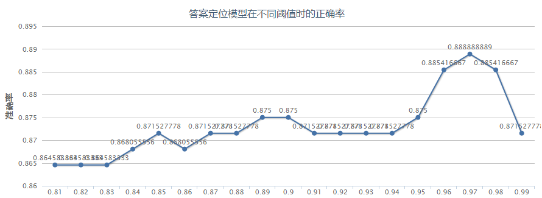

&#8195;&#8195;可见答案定位模型地准确率能达到为88.8%。对于蕴含答案的句子，我们的模型能够得到较高的预估值；反之得到的值则较小；由于文档中不含有答案的句子比含有答案的句子的数量更大，因此即使是对于不同的阈值(大于0.85)，模型的准确度也十分接近。然而在实际应用中，将事实上不蕴含答案的句子判错的概率比将事实上蕴含答案的句子判错的可能性更大（因为不想关的文档更多）。考虑到用户的体验性（返回错误答案比返回整个文档的体验更差），应将阈值设为较大值以提高用户体验。

&#8195;&#8195;我们实现一个简单的SVM和答案定位模型进行对比，该SVM模型使用的特征有：出现在问句中的文档句子的词语数量占问句词语数量的比例；文档句子中的词和问句句子的词语义相似度大于某个阈值的数量占问句词语数量的比例；文档各词性（名词、动词等）和问句各词性的词语数量比例。两个模型的查准率和查全率结果如表4-1所示。可见，我们的答案定位模型相较于SVM模型具备更好的表现。

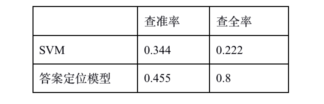

### 答案抽取模型实验及结果分析
&#8195;&#8195;答案抽取模型的输出是文档句子词语位于标准答案的概率。结合概率向量和范围抽取方法，我们从文档中抽取得到预测答案。由于文本具有多样性，因此无法简单地通过预测结果和实际结果是否相同来判断预测结果是否正确，如“移动互联网关键技术、多媒体网络传输技术”和“互联网关键技术、多媒体网络传输”是基本相同的（都可以作为正确的答案）。因此，为了对我们的模型正确性进行判断，我们使用预测答案和标准答案的字符相同个数（“多媒体网络传输技术”和“多媒体网络传输”的相同个数为7）及二者的语义相似度作为相似性评价方法。当预测答案和标准答案的相似度大于一定阈值，则将预测结果视为正确。基于此判定规则，我们使用Levenshtein以及gensim工具来判断。经过测试，我们的答案抽取模型的准确率为68%（准确度随阈值降低而提高）。

&#8195;&#8195;为了比较我们的答案抽取模型的性能，我们实现了一个原始DGCNN模型以及一个普通的CNN模型（模型结果如图3-1所示）。

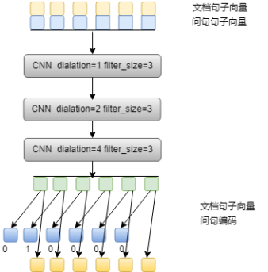

&#8195;&#8195;该模型的卷积方式以及答案判定方式与原始的DGCNN相同，是在DGCNN的基础上削减了的问句编码以及打分器得到的。

&#8195;&#8195;我们将三个模型基于同一数据集和上述正确性判断标准进行对比，结果如表3-1所示。可见，原始的DGCNN架构中的编码以及打分方式，的确能够有效地提升模型的准确率。而相较于一般的CNN架构和原始的DGCNN架构，我们模型具备更高的准确率。

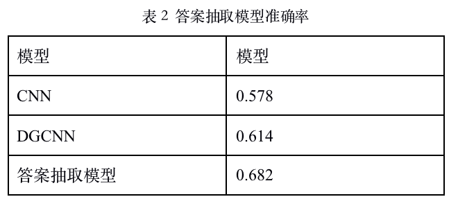

### 本章小结
&#8195;&#8195;本章简述了我们的模型的训练数据以及测评结果。我们的模型在实际测评中取得了较为良好的表现，但我们也发现了模型存在的一些缺陷，如答案定位模型的查准率较低；答案抽取模型的准确率不足、训练数据较少等。模型结构和训练数据尚存在可优化的地方。

## 结论
### 论文工作总结
&#8195;&#8195;本文主要阐述用于问题系统的答案定位模型、答案抽取模型以及它们的结构、准确度等。答案抽取模型是对DGCNN的优化，用于从蕴含答案的句子定位答案的开始位置和结束位置，相较于原始的DGCNN，我们的模型具有更高准确率。在实际应用中，我们先使用答案定位模型从文档中抽取包含答案概率较高的句子，然后使用答案抽取模型从这些句子中抽取答案。

### 工作展望
&#8195;&#8195;在数据时代，非结构化文本的答案检索是自然语言处理和信息检索领域中难度较大的一个方向。随着深度学习研究的进步，使用深度学习方法作为答案检索手段具有重要的研究意义和应用价值。本文介绍的答案抽取模型针对学者信息具备一定检索能力，但是距离实际的应用要求仍有一定的差距，模型的结构与参数、损失函数的选择、训练数据仍有尚待优化的地方。而且，如果进行跨领域的合作应用（如将深度学习的方法和语言学的研究成果结合，将语法结构而非词语作为答案抽取对象）可能可以取得更好的结果。在后续的工作中，我们将针对当前模型和系统的缺陷，结合其他领域的研究成果，进行调整优化，以提高模型的准确率以及系统的性能。

## 参考文献
- [1] Alex Krizhevsky , Ilya Sutskever , Geoffrey E. Hinton . ImageNet Classification with Deep Convolutional Neural Networks. nips cc 2012. 
- [2] Fisher Yu, Vladlen Koltun. Multi-scale context aggregation by dilated convolutions. arXiv:1511.07122 [cs.CV]  
- [3] Sepp Hochreiter，Jurgen Schmidhuber.  LONG SHORT-TERM MEMORY.  Neural Computation 9(8):1735{1780, 1997
- [4] Dzmitry Bahdanau, Kyunghyun Cho, Yoshua Bengio. Neural Machine Translation by Jointly Learning to Align and Translate. ICLR 2015
- [5] Volodymyr Mnih, Nicolas Heess, Alex Graves, Koray Kavukcuoglu. Recurrent Models of Visual Attention. arXiv:1406.6247 [cs.LG]2014
- [6] Ashish Vaswani, Noam Shazeer, Niki Parmar, Jakob Uszkoreit, Llion Jones, Aidan N. Gomez, Lukasz Kaiser, Illia Polosukhin. Attention Is All You Need. 2017
- [7] Jonas Gehring, Michael Auli, David Grangier, Denis Yarats, Yann N. Dauphin. Convolutional Sequence to Sequence Learning. arXiv:1705.03122 [cs.CL] 2017 
- [8] 基于CNN的阅读理解式问答模型：DGCNN  https://zhuanlan.zhihu.com/p/35755367
- [9] Kaiming He, Xiangyu Zhang, Shaoqing Ren, Jian Sun. Deep Residual Learning for Image Recognition. arXiv:1512.03385 [cs.CV]
- [10] Tomas Mikolov, Ilya Sutskever, Kai Chen, Greg Corrado, Jeffrey Dean. Distributed Representations of Words and Phrases and their Compositionality. arXiv:1310.4546 [cs.CL]