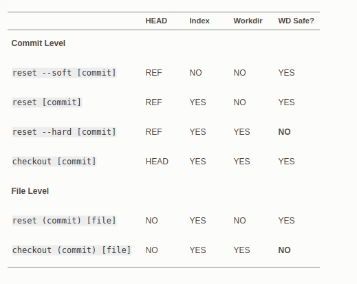

本文只作为总结性文档，建议在阅读本文之前，你要有一定的git操作经验或知识，对git的使用有一个初步了解。


### 查看分支
```
git branch
git branch -a  //包含远程分支
```

### 更新远程分支信息
有时我们需要获取远程有哪些分支，但是本地分支记录比较旧，就无法及时获取远程新创建了哪些分支
```
git fetch origin --prune
```
### 下载远程某分支
```
git branch -r     //查看所有分支
* master
  origin/HEAD -> origin/master
  origin/master
  origin/b1          //远程有一个b1分支
git checkout b1     //拉取远程b1分支

git fetch origin d1:temp   //拉取最新的远程b1分支，并命名为本地temp
git merge temp     //将当前分支与temp合并
git branch -d temp  //删除本地分支temp
```
### 删除分支
```
git branch -d branch_name //删除本地分支
git branch -D branch_name //强制删除本地分支
git push origin --delete branch_name //删除远程分支
git push origin :branch_name  //删除远程分支
```

### 重命名分支
```
git branch -m old_local_branch_name new_local_branch_name //重命名本地分支

* 重命名远程分支：先在本地将分支重命名；删除远程分支；将重命名后的分支推到远程
```

### 调基
https://git-scm.com/book/zh/v2/Git-%E5%B7%A5%E5%85%B7-%E9%87%8D%E7%BD%AE%E6%8F%AD%E5%AF%86
现在我在AAN-711分支，我commit了很多遍，大部分commit是一些小的修改，甚至与功能无关。那么我如何能使得我的commit记录只有关于“添加新功能”
```
git rebase master   //将分支的基础分支调为master，如果有冲突，就add、rebase --continue
git status  
git log   //查看自己原来的commit记录，每一个commit记录有一个id，找到你个人所有commit之前的稳定版本的id
git reset --soft id    //取消id对应commit之后的commit
git status
git commit -am "the bug/function that you fix"
git push origin AAN-711
```


* 取消最近的一次commit:git reset --soft HEAD~
* 取消前面k次的commit：git reset --soft HEAD~k
* 清空缓存区，即取消add操作：git reset [--mixed] HEAD~
* 清空修改，谨慎使用：git reset --hard HEAD~
* 取消对某一个文件的add：git reset filePath
* 取消对一个文件的add以及修改：git checkout [--hard] [branch] filePath
* 取消对某一文件的修改，慎用：git reset id -- file.txt  //回到该id对应的commit
* 如果当前指向develop，运行：git reset master //结果：develop和master指向同一个提交（指向master对应的提交）
* 上述的HEAD~都可以使用id代替，即branch

  


### 参考
* [git reset](https://git-scm.com/book/zh/v2/Git-%E5%B7%A5%E5%85%B7-%E9%87%8D%E7%BD%AE%E6%8F%AD%E5%AF%86)
