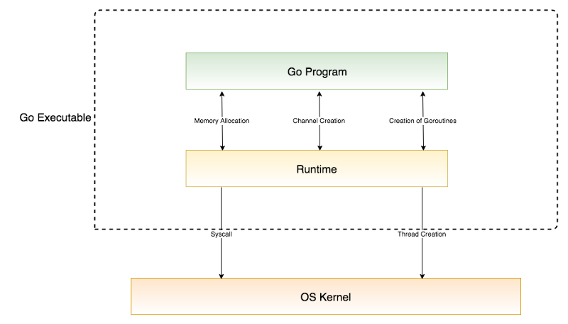

&#8195;&#8195;go routine的调度原理和操作系统的线层调度是比较相似的。这里我们将介绍go routine的相关知识。

## goroutine
&#8195;&#8195;goroutine（有人也称之为协程）本质上go的用户级线程的实现，这种用户级线程是运行在内核级线程之上。当我们在go程序中创建goroutine的时候，我们的这些routine将会被分配到不同的内核级线程中运行。一个内核级线程可能会负责多个routine的运行。而保证这些routine在内内核级线程安全、公平、高效运行的工作，就由调度器来实现。

## Go的调度
&#8195;&#8195;Go的调度主要有四个结构组成，分别是：
- G：goroutine的核心结构，包括routine的栈、程序计数器pc、以及一些状态信息等；
- M：内核级线程。goroutine在M上运行。M中信息包括：正在运行的goroutine、等待运行的routine列表等。当然也包括操作系统线程相关信息，这些此处不讨论。
- P：processor，处理器，只要用于执行goroutine，维护了一个goroutine列表。其实P是可以从属于M的。当P从属于（分配给）M的时候，表示P中的某个goroutine得以运行。当P不从属于M的时候，表示P中的所有goroutine都需要等待被安排到内核级线程运行。
- Sched：调度器，存储、维护M，以及一个全局的goroutine等待队列，以及其他状态信息。




### Go程序的启动过程：
- 初始化Sched：一个存储P的列表pidle。P的数量可以通过GOMAXPROCS设置，默认和计算机核数相同；
- 创建第一个goroutine。这个goroutine会创建一个M，这个内核级线程（sysmon）的工作是对goroutine进行监控。之后，这个goroutine开始我们在main函数里面的代码，此时，该goroutine就是我们说的主routine。


### 创建goroutine：
- goroutine创建时指定了代码段
- 然后，goroutine被加入到P中去等待运行。
- 这个新建的goroutine的信息包含：栈地址、程序计数器

### 创建内核级线程M
&#8195;&#8195;内核级线程由go的运行时根据实际情况创建，我们无法再go中创建内核级线程。那什么时候回创建内核级线程呢？当前程序等待运行的goroutine数量达到一定数量及存在空闲（为被分配给M）的P的时候，Go运行时就会创建一些M，然后将空闲的P分配给新建的内核级线程M，接着才是获取、运行goroutine。创建M的接口函数如下：
```
// 创建M的接口函数
void newm(void (*fn)(void), P *p)

// 分配P给M
if(m != &runtime·m0) {Â
	acquirep(m->nextp);
	m->nextp = nil;
}
// 获取goroutine并开始运行
schedule();
```


M的运行
```
static void schedule(void)
{
	G *gp;

	gp = runqget(m->p);
	if(gp == nil)
		gp = findrunnable();

  // 如果P的类别不止一个goroutine，且调度器中有空闲的的P，就唤醒其他内核级线程M
	if (m->p->runqhead != m->p->runqtail &&
		runtime·atomicload(&runtime·sched.nmspinning) == 0 &&
		runtime·atomicload(&runtime·sched.npidle) > 0)  // TODO: fast atomic
		wakep();
  // 执行goroutine
	execute(gp);
}
```

- runqget: 从P中获取goroutine即gp。gp可能为nil（如M刚创建时P为空；或者P的goroutine已经运行完了）。
- findrunnable：寻找空闲的goroutine（从全局的goroutine等待队列获取goroutine；如果所有goroutine都已经被分配了，那么从其他M的P的goroutine的goroutine列表获取一半）。如果获取到goroutine，就将他放入P中，并执行它；否则没能获取到任何的goroutine，该内核级线程进行系统调用sleep了。
- wakep：当当前内核级线程M的P中不止一个goroutine且调度器中有空闲的的P，就唤醒其他内核级线程M。（为了找些空闲的M帮自己分担）。


### 调度
&#8195;&#8195;前面说的是G，M是怎样创建的以及什么时候创建、运行。那么goroutine在M是是怎样进行调度的呢？这个才是goroutine的调度核心问题，即上面代码中的schedule。在说调度之前，我们必须知道goroutine的状态有什么，以及各个状态之间的关系。


- Gidle：创建中的goroutine，实际上这个状态没有什么用；
- Grunnable：新创建完成的goroutine在完成了资源的分配及初始化后，会进入这个状态。这个新创建的goroutine会被分配到创建它的M的P中；
- Grunning：当Grunnable中的goroutine等到了空闲的cpu或者到了自己的时间片（Go1.2之后实现了一定程度的抢占式调度）的时候，就会进入Grunning状态。这个装下的goroutine可以被前文提到的findrunnable函数获取；
- Gwaiting：当正在运行的goroutine进行一些阻塞调用的时候，就会从Grunning状态进入Gwaiting状态。常见的调用有：写入一个满的channel、读取空的channel、IO操作、定时器Ticker等。当阻塞调用完成后，goroutine的状态就会从Gwaiting转变为Grunnable；
- Gsyscall：当正在运行的goroutine进行系统调用的时候，其状态就会转变为Gsyscall。当系统调用完成后goroutine的状态就会变为Grunnable。（前文提到的sysmon进程会监控所有的P，如果发现有的P的系统调用是阻塞式的或者执行的时间过长，就会将P从原来的M分离出来，并新建一个M，将P分配给这个新建的M）。

综上，触发调度的事件有：
- channel的阻塞读写；
- go routine的调用，如go func(){xxx}()；
- 阻塞式的系统调用，如耗时IO等；
- GC。（GC时间的时候goroutine会暂停运行）


&#8195;&#8195;本文并不属于原创，只是汇总、修改了个人看了的几篇blog而已。

## Ref
- https://zhuanlan.zhihu.com/p/29698463
- http://skoo.me/go/2013/11/29/golang-schedule?utm_campaign=studygolang.com&utm_medium=studygolang.com&utm_source=studygolang.com
- https://povilasv.me/go-scheduler/
- https://medium.com/@riteeksrivastava/a-complete-journey-with-goroutines-8472630c7f5c
- https://rakyll.org/scheduler/
