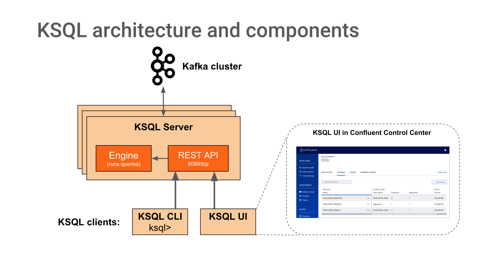
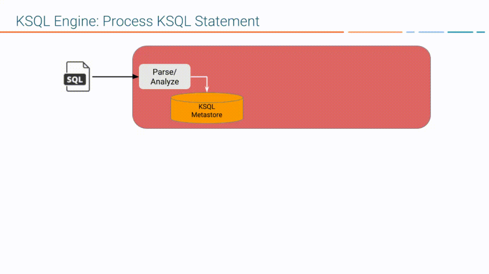

&#8195;&#8195;在阅读该文之前，我已经假设你已经对kafka的broker、topic、partition、consumer等概念已经有了一定的了解。

## 流处理
&#8195;&#8195;流数据是一组顺序、大量、快速、连续到达的数据序列,一般情况下,数据流可被视为一个随时间延续而无限增长的动态数据集合。

## Confluent KSQL
&#8195;&#8195;Confluent KSQL是一个基于kafka的实时数据流处理工具引擎，提供了强大且易用的sql交互方式来对kafka数据流进行处理，而无需编写代码。ksql具备高扩展、高弹性、容错式等优良特性，并且它提供了大范围的流式处理操作，比如数据过滤、转化、聚合、连接join、窗口化和[Sessionization](https://www.dataiku.com/learn/guide/code/reshaping_data/sessionization.html)（即捕获单一会话期间的所有的流事件）等。

## 概念
### 架构
<!--  -->
<p align="center">

</p>

- KSQL engine： 处理ksql声明和查询
- REST interfaceL：客户端和engine的连接器
- KSQL CLI：命令行交互终端，通过rest api和引擎进行交互
- KSQL UI：ksql的控制中心

### stream和table
&#8195;&#8195;流（stream）表示的从开始至今的完整的历史，它代表了过去产生的数据（事件、日志等）及其相应的时间。新的数据只能被不断地添加到流中，无法被删除和修改，它们是既定的事实。从某种角度而言，流是对事实的建模。

&#8195;&#8195;表（table）表示的是基于数据流进行了某种操作之后的数据，它是对历史数据的某种状态的快照。表的这个概念，是源自于已经发展了数十年的RDBMS，因此，基本可以用相同的理解去使用table。

&#8195;&#8195;其实，RDBMS中也有数据流，如binlog本身就是一种流式数据。KSQL将stream作为基础对象，而RDBMS的基础对象是table。KSQL和RDBMS都有将stream和table互相转化的功能，只是二者的侧重点不同而已。

###  query的生命周期
<!--  -->

<p align="center">

</p>

- 使用DDL注册一个stream或者table，如:create stream stream_name with topic_name ...
- 使用一个ksql声明来表示你的应用：create table as select from stream_name ...
- ksql将你的DDL/DML解析为AST
- ksql基于ASL生成一个逻辑计划
- ksql基于逻辑计划生成一个物理执行计划
- ksql生成和执行kafka流应用
- 你可以通过对stream和table进行操作来管理你的应用

基本流程和一般DBMS相同。

### 使用
&#8195;&#8195;最简单的体验方式: 使用docker。这种方式默认下将zookeeper、kafka、ksql在一个compose（一共9个service）下启动。最低配置8G内存，尝试请谨慎。
```
git clone https://github.com/confluentinc/cp-docker-images
cd cp-docker-images
git checkout 5.2.1-post
cd examples/cp-all-in-one/
docker-compose up -d --build
# 新建topic: user
docker-compose exec broker kafka-topics --create --zookeeper \
zookeeper:2181 --replication-factor 1 --partitions 1 --topic users
# 新建topic: pageview
docker-compose exec broker kafka-topics --create --zookeeper \
zookeeper:2181 --replication-factor 1 --partitions 1 --topic pageviews
```
&#8195;&#8195;样例里面会自动生成两个topic：pageview和user，表示用户对某个页面的访问日志。

&#8195;&#8195;现在我们kafka和ksql都已经有了，还创建了两个topic。现在我们使用一个脚本来往这两个topic写入一些数据（这个脚本写入的数据为avro）
```
wget https://github.com/confluentinc/kafka-connect-datagen/raw/master/config/connector_pageviews_cos.config
curl -X POST -H "Content-Type: application/json" --data @connector_pageviews_cos.config http://localhost:8083/connectors
```

```
wget https://github.com/confluentinc/kafka-connect-datagen/raw/master/config/connector_users_cos.config
curl -X POST -H "Content-Type: application/json" --data @connector_users_cos.config http://localhost:8083/connectors
```

&#8195;&#8195;启动KSQL终端
```
docker-compose exec ksql-cli ksql http://ksql-server:8088
```
### DDL
- CREATE STREAM：基于某个topic新建一个流
- CREATE TABLE：基于一个stream新建一个table
- DROP STREAM/TABLE：删除stream或者table
- CREATE STREAM AS SELECT (CSAS)
- CREATE TABLE AS SELECT (CTAS)

- 新建stream pageviews/users。（SHOW STREAMS;可以用来查看当前有什么stream）
```
CREATE STREAM pageviews (viewtime BIGINT, userid VARCHAR, pageid VARCHAR) \
WITH (KAFKA_TOPIC='pageviews', VALUE_FORMAT='AVRO');

CREATE TABLE users (registertime BIGINT, gender VARCHAR, regionid VARCHAR,  \
userid VARCHAR) \
WITH (KAFKA_TOPIC='users', VALUE_FORMAT='AVRO', KEY = 'userid');

SHOW STREAMS;
```

-  从stream中查询数据
```
# 设置query语句读取最开始的数据
SET 'auto.offset.reset'='earliest';
SELECT pageid FROM pageviews LIMIT 3;
```
&#8195;&#8195;你会发现这条query会从pageviews流中获取每条记录的pageid。你也可以加上一些where条件尝试一下。

- 从其他stream生成一个新的stream
```
CREATE STREAM pageviews_female AS SELECT users.userid AS userid, pageid, \
regionid, gender FROM pageviews LEFT JOIN users ON pageviews.userid = users.userid \
WHERE gender = 'FEMALE';
```
&#8195;&#8195;这条DDL会对pageviews和users中的数据进行左连接操作，并把连接结果作为新stream pageviews_femails的数据。这个stream的数据会写到一个新的kafka topic：PAGEVIEWS_FEMALE。

&#8195;&#8195;即：我们可以完全基于一个现有的topic新建一个stream；也可以基于现有的stream新建一个stream，这建立方法所得到的数据会存储在一个和stream名相同的topic中。

- 我们也可以基于一个现有的topic的部分数据建立一个stream，并指定新stream的topic名。以下这个stream的数据会存储在topic pageviews_enriched_r8_r9中。
```
CREATE STREAM pageviews_female_like_89 WITH (kafka_topic='pageviews_enriched_r8_r9', \
value_format='AVRO') AS SELECT * FROM pageviews_female WHERE regionid LIKE '%_8' OR regionid LIKE '%_9';
```

- stream的建立语句可以使用聚合函数和窗口函数
```
CREATE TABLE pageviews_regions AS SELECT gender, regionid , \
COUNT(*) AS numusers FROM pageviews_female WINDOW TUMBLING (size 30 second) \
GROUP BY gender, regionid HAVING COUNT(*) > 1;
```

- 查看stream的定义
```
# 类似于mysql的desc
DESCRIBE EXTENDED pageviews_female_like_89;
```

### 和外部系统的连接
ksql可以使用[ksql connectors](https://docs.confluent.io/current/connect/managing/connectors.html)和外部系统如：mysql、s3、hdfs等进行通信、操作。

### 优缺点
- 优点
    - KSQL 流数据查询在实现上是分布式的、容错的、弹性的、可扩展的和实时的，这些特性可以满足现代企业对数据的需求。
    - KSQL的数据过滤、转化、聚合、连接join、窗口化和Sessionization等功能基本能够覆盖大部分应用场景；近似标准SQL的客户端实现降低了学习成本。
    - 对于 Java 或 Scala 开发人员而言，Kakfa Streams API 是一个强大的软件库，它实现了将流数据处理集成到应用中。
    - 利用ksql可以轻松实现实时报告、服务监控、活动告警、基于会话的用户数据分析、实时ETL等。
- 缺点
    - KSQL算是一种重量级的流数据处理工具，对于资源要求较高。

### 其他工具
- [Apache Storm](https://storm.apache.org/)
- [Trident](https://storm.apache.org/releases/2.0.0-SNAPSHOT/index.html)
- [Spark Streaming](http://storm.apache.org/releases/current/Trident-tutorial.html)
- [Apache Flink](https://flink.apache.org/)
- [Spark](https://databricks.com/spark/about)

## 相关链接
- [ksql 源码](https://github.com/confluentinc/ksql)
- [confluent ksql](https://www.confluent.io/product/ksql/)
- [kafka streams example](https://github.com/confluentinc/kafka-streams-examples)
- [使用 Apache Kafka 和 KSQL 实现普及化流处理](https://www.infoq.cn/article/democratizing-stream-processing-apache-kafka-ksql)
- [mysql to kafka:KSQL in Action: Enriching CSV Events with Data from RDBMS into AWS](https://www.confluent.io/blog/ksql-in-action-enriching-csv-events-with-data-from-rdbms-into-AWS/)
- [ksql connectors](https://docs.confluent.io/current/connect/managing/connectors.html)