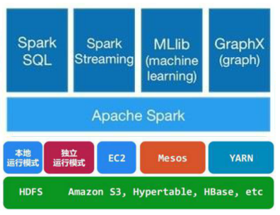
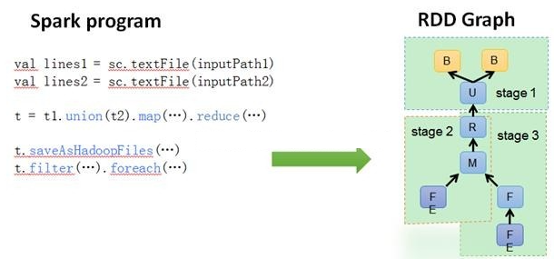
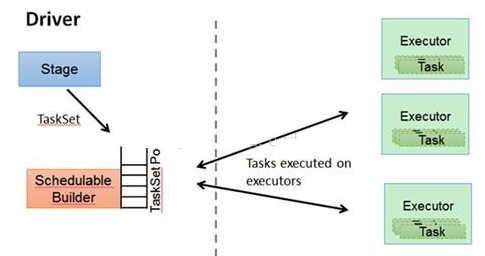
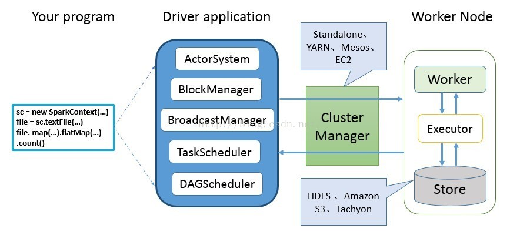
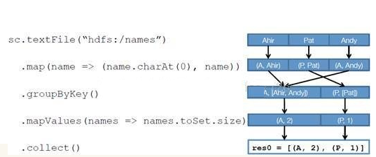
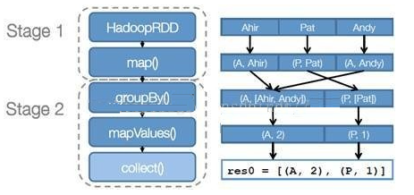
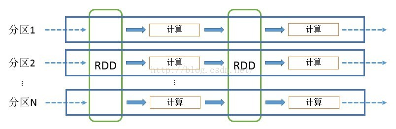
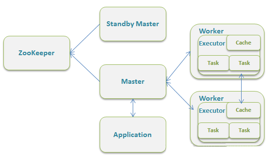
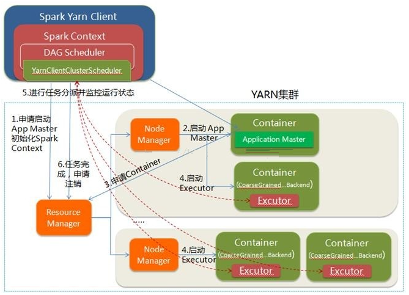
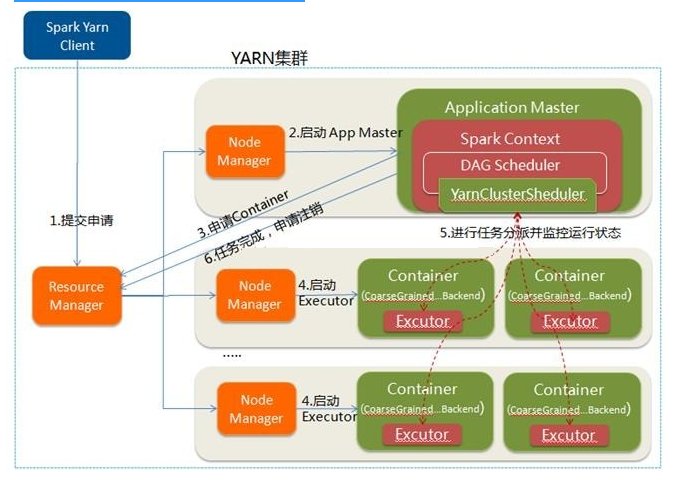

Apache Spark是一个针对大规模数据处理的统一分析引擎，是一种快速通用的集群计算系统。它提供Java，Scala，Python和R中的高级API，以及支持通用执行图的优化引擎。它还支持一组丰富的高级工具，包括用于SQL和结构化数据处理的Spark SQL，用于机器学习的MLlib，用于图形处理的GraphX和Spark Streaming。(官方提供了四种API编程接口：java、scala、python、r)

[试用](https://spark.apache.org/docs/latest)


<p align="center">

</p>

Spark最常见的应用场景就是和hadoop或者kafka结合。官方宣称Spark可以将Haddop集群中的应用在内存中的运行速度提升100，甚至能够将应用在磁盘上的运行速度提升10倍。这些优势都要归功于Spark对数据的组织形式（RDD）和处理流程优化。

Spark是基于内存的迭代计算框架。随着数据规模、操作次数的增大，基于内存的计算优势会明显高于基于磁盘的计算，并且Spark会将工作集（有没有想起操作系统的内存段页式管理里面的工作集？）缓存起来，后续的的查询可以重用工作集。因此，Spark一般用于数据量不是特别大（当数据规模超过内存大小，Spark会将数据下放到磁盘），但是需要进行近实时统计的场景。

## spark运行层次
<p align="center">

</p>

- Application: Appliction都是指用户编写的Spark应用程序，其中包括一个Driver功能的代码和分布在集群中多个节点上运行的Executor代码
- Driver:  Spark中的Driver即运行上述Application的main函数并创建SparkContext，创建SparkContext的目的是为了准备Spark应用程序的运行环境，在Spark中有SparkContext负责与ClusterManager通信，进行资源申请、任务的分配和监控等，当Executor部分运行完毕后，Driver同时负责将SparkContext关闭，通常用SparkContext代表Driver
- Executor:  某个Application运行在worker节点上的一个进程，  该进程负责运行某些Task， 并且负责将数据存到内存或磁盘上，每个Application都有各自独立的- 批Executor， 在Spark on Yarn模式下，其进程名称为CoarseGrainedExecutor Backend。一个CoarseGrainedExecutor Backend有且仅有一个Executor对象， 负责将Task包装成taskRunner,并从线程池中抽取一个空闲线程运行Task， 这个每一个oarseGrainedExecutor Backend能并行运行Task的数量取决与分配给它的cpu个数
- Cluter Manager：指的是在集群上获取资源的外部服务。目前有三种类型
  - Standalon : spark原生的资源管理，由Master负责资源的分配
  - Apache Mesos:与hadoop MR兼容性良好的一种资源调度框架
  - Hadoop Yarn: 主要是指Yarn中的ResourceManager
- Worker: 集群中任何可以运行Application代码的节点，在Standalone模式中指的是通过slave文件配置的Worker节点，在Spark on Yarn模式下就是NoteManager节点
- Task: 被送到某个Executor上的工作单元，但hadoopMR中的MapTask和ReduceTask概念一样，是运行Application的基本单位，多个Task组成一个Stage，而Task的调度和管理等是由TaskScheduler负责
- Job: 包含多个Task组成的并行计算，往往由Spark Action触发生成， 一个Application中往往会产生多个Job
- Stage: 每个Job会被拆分成多组Task， 作为一个TaskSet， 其名称为Stage，Stage的划分和调度是有DAGScheduler来负责的，Stage有非最终的Stage（Shuffle - Map Stage）和最终的Stage（Result Stage）两种，Stage的边界就是发生shuffle的地方
- DAGScheduler: 根据Job构建基于Stage的DAG（Directed Acyclic Graph有向无环图)，并提交Stage给TASkScheduler。 其划分Stage的依据是RDD之间的依赖的关系找出开销最小的调度方法，如下图
<p align="center">

</p>

- TASKSedulter: 将TaskSET提交给worker运行，每个Executor运行什么Task就是在此处分配的. TaskScheduler维护所有TaskSet，当Executor向Driver发生心跳时，TaskScheduler会根据资源剩余情况分配相应的Task。另外TaskScheduler还维护着所有Task的运行标签，重试失败的Task。下图展示了TaskScheduler的作用
<p align="center">

</p>


## Spark使用过程
<p align="center">

</p>

- 使用SparkContext/SQLContext/StreamingContext等连接外部数据，如文本、SQL、流式数据
- 使用BlockManger和BroadcastManager将任务的Hadoop配置广播到各个节点；然后使用DAGScheduler将任务转化为RDD，然后将RDD组织成DAG，并将其划分为不同的Stage；最后TaskScheduler借助ActorSystem将任务提交给集群管理器。（本地模式下，只需会进行RDD转化和DAG组织）
- 集群管理器将任务分发到各个woker上，woker创建executor来处理任务。

<p align="center">

</p>

<p align="center">

</p>


SparkWordCountWithScala.scala 例子
```
import org.apache.spark.rdd.RDD
import org.apache.spark.{SparkConf, SparkContext}

// https://www.cnblogs.com/qingyunzong/p/8899715.html
object SparkWordCountWithScala {
  def main(args: Array[String]): Unit = {
    val conf = new SparkConf()
    /**
      * 如果这个参数不设置，默认认为你运行的是集群模式
      * 如果设置成local代表运行的是local模式
      */
    conf.setMaster("local")
    //设置任务名
    conf.setAppName("WordCount")
    //创建SparkCore的程序入口
    val sc = new SparkContext(conf)
    //读取文件 生成RDD
    val file: RDD[String] = sc.textFile("E:\\hello.txt")
    //把每一行数据按照，分割
    val word: RDD[String] = file.flatMap(_.split(","))
    //让每一个单词都出现一次
    val wordOne: RDD[(String, Int)] = word.map((_,1))
    //单词计数
    val wordCount: RDD[(String, Int)] = wordOne.reduceByKey(_+_)
    //按照单词出现的次数 降序排序
    val sortRdd: RDD[(String, Int)] = wordCount.sortBy(tuple => tuple._2,false)
    //将最终的结果进行保存
    sortRdd.saveAsTextFile("E:\\result")
    sc.stop()
  }
```

## 计算流程
<p align="center">

</p>
RDD可以看做是对各种数据计算模型的统一抽象，Spark的计算过程主要是RDD的迭代计算过程。RDD的迭代计算过程非常类似于管道。分区数量取决于partition数量的设定，每个分区的数据只会在一个Task中计算。所有分区可以在多个机器节点的Executor上并行执行。

Spark的计算是针对RDD，为我们屏蔽了底层的数据存储系统。一个RDD经过处理（Transformation：包含过滤、聚合、映射、联合union、连接join等；Action：对Transformation后的数据进行合并，如果处理借宿，则可以写回存储系统）后会转化为一个新的RDD（如果内存允许，Spark会将数据缓存，而非想Hadoop一样写回存储系统）。

## 集群基础架构
<p align="center">

</p>

- Master节点：常驻Master守护进程，负责管理全部的Worker节点。
- Worker节点：常驻Worker守护进程，负责与Master节点通信并管理executors。
- Driver：负责运行你写的Spark程序。

## 不同运行模式下的架构图
### standalone
<p align="center">

</p>

### yarn-client
<p align="center">

</p>

### yarn-cluster
<p align="center">

</p>


## Ref
- https://my.oschina.net/sunzy/blog/1617071
- https://juejin.im/post/5b9491d36fb9a05d082a0145
- https://www.kancloud.cn/kancloud/spark-internals/45237
- https://cloud.tencent.com/developer/article/1005706
- https://www.cnblogs.com/tgzhu/p/5818374.html
- [RDD](https://jaceklaskowski.gitbooks.io/mastering-apache-spark/spark-rdd.html)