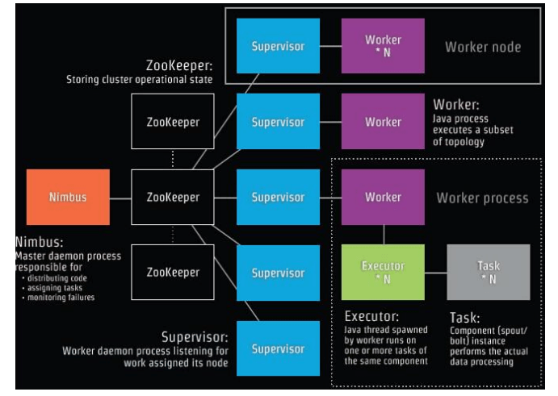
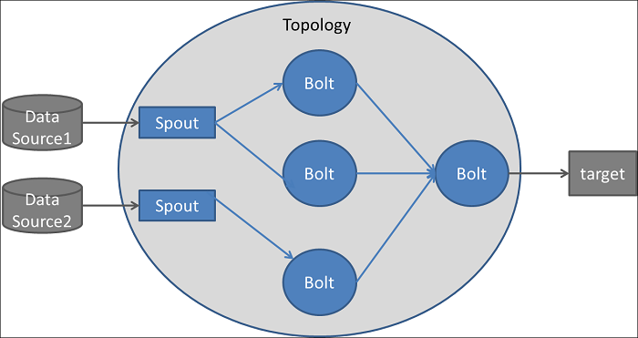

## 流处理
&#8195;&#8195;流数据是一组顺序、大量、快速、连续到达的数据序列,一般情况下,数据流可被视为一个随时间延续而无限增长的动态数据集合。

&#8195;&#8195;常见的可以对流数据进行处理的工具有：KSQL，Storm，Spark等。本文将会对这三种工具进行简单的处理（本文的流数据均以kafka为数据源，因此KSQL会稍微详细一点）。我不会对具体的使用的方法进行介绍，因为我认为最好的使用指南就是看官方文档。

## KSQL
&#8195;&#8195;Confluent KSQL是一个基于kafka的实时数据流处理工具引擎，提供了强大且易用的sql交互方式来对kafka数据流进行处理，而无需编写代码。ksql具备高扩展、高弹性、容错式等优良特性，并且它提供了大范围的流式处理操作，比如数据过滤、转化、聚合、连接join、窗口化和Sessionization（即捕获单一会话期间的所有的流事件）等。

&#8195;&#8195;我们有一篇专有的短文来介绍[KSQL](./ksql.md)，此处不再赘述。

## Storm
Apache Storm是一个开源、免费的分布式实时计算系统。借助Storm，我们可以向Hadoop批量处理数据一样，对无边界的流数据进行的处理。再加之Strom的易用性（官方声称提供所有编程语言库），吸引了很多企业或者组织使用。

Storm可以具备强大的性能（单节点的数据处理速率达1 million/s）、扩展性、容错性，并保证每条数据都能得到处理。Storm可以和大部分队列服务、数据库服务进行集成，

### Storm Architecture
<p align="center">

</p>

#### 主节点Nimus
主节点会启动一个后台进程Nimbus，负责分发代码到集群的其他节点，从而给其他几点分发任务并检测任务的执行情况。Nimbus是一个Apache Thirft用于实时分发代码的服务。因此，你可以使用你所精通或者喜欢的语言来利用Storm。

#### 工作节点Supervisor
每个工作节点都会运行一个后台进程Supervisor。Supervisor负责监听节点收到的任务信息以及启动worker进程来执行任务。每个worker进程执行topology的数据的一个子集。一个正在运行的topology，描述的是一个数据流的处理流程，是一个有向无环图，包含的一个或者多个worker进程（可能分布在多个节点机器）来处理数据。

Supervisor和Nimus之间通过ZooKeeper来通信。Supervisor和Nimus具备快速退出、无状态的特点。虽然无状态的特性有一定的缺点，但是也使得Storm可以更快的处理实时数据。其实Storm也并不是完全无状态的。Storm会把任务存储在zk中，因此一个退出后的Nimus进程在重启后可以快速的获取到上次退出时的状态，并于该状态点继续执行任务。

#### 拓扑Topology
<p align="center">

</p>

如果需要使用Storm，你需要创建一个Topology，用来指定数据处理流程。Topology中的每个节点（这里的节点指的不是机器）包含一个逻辑处理单元。这些节点可以分为两种类型：Spout、Bolt。

Spout负责冲外部系统（如RDBMS、kafka等）读取数据，并转化为一个字典（Storm称转化后的数据为tuple）,然后传输个Bolt进程处理。

Bolt的输入数据可以源于Spout，也可以源于Bolt。Bolt将收到的tuple数据进行转换（如筛选、聚合、分组等）传输给其他Bolt。

Topology最后（通过图中最后的节点Bolt）可以将数据传输到其他地方，如DBMS，kafka等。

Topology的使用方法：将你所需要进行执行的任务定义为Spout、Bolt的形式，并指定二者的逻辑关系，然后将其及相关依赖打包成为一个JAR，然后启动之。Nimus会将这个topology分发给各个Supervisor，Supervisor在监督worker来执行这些任务。（因此，真正执行这些任务（Spout、Bolt）的还是woker进程）。
```
storm jar all-my-code.jar org.apache.storm.MyTopology arg1 arg2
```

#### Spout
Spout是一个Topology的入口。它可以将外部系统的数据转化为Strom的数据形式——tuple，然后将这些数据发射到Bolt来进行实际的处理操作。Spout在worker进程以Executor线程的形式存在。

#### Bolt
数据的实际处理是在Bolt中进行的。Bolt可以对数据记性过滤、聚合、连接、写到数据库或者其他数据存储系统。

单个Bolt可以执行一些简单的操作。如果需要执行一个复杂的数据处理操作，应该将划分为多个简单的操作，然后通过多个Bolt组合在一起以实现目的。

#### Worker进程
一个worker进程负责任务的真正执行，这涉及到三个概念：
- woker进程：负责topology的一个子集，并只从属于一个Topology（即不会出现一个woker为多个topology服务的情况）。每个woker都会运行一个或者多个executor来执行topology的某个组件（即spout或者bolt）。
- Executor线程：woker中的一个进程。一个Executor可以负责一个或则多个task，即（spout或者bolt）。
- task：表示的是对数据的实际操作。你所实现的spout或者bolt代码就是作为task来运行的。在一个Topology的生命周期中，task的数量是相同的（因为流程已经固定下来了），但是每个Executor（线程）的数量是可以变化的。这也意味着在一个worker中，线程的数量是<=task的数量的

## Spark
[](./spark.md)

### 总结 summary

### 其他工具
- [Trident](https://storm.apache.org/releases/2.0.0-SNAPSHOT/index.html)
- [Spark Streaming](http://storm.apache.org/releases/current/Trident-tutorial.html)
- [Apache Flink](https://flink.apache.org/)

## Ref
- https://linux.cn/article-10053-1.html
- [Apache Storm](https://https://dzone.com/articles/apache-storm-architecturestorm.apache.org/)
- [Spark](https://databricks.com/spark/about)