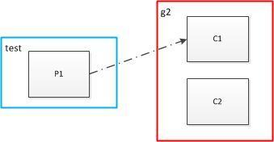
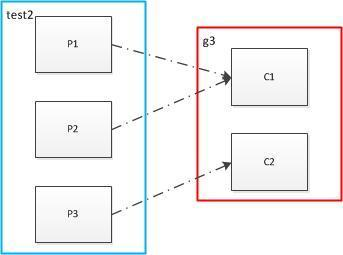
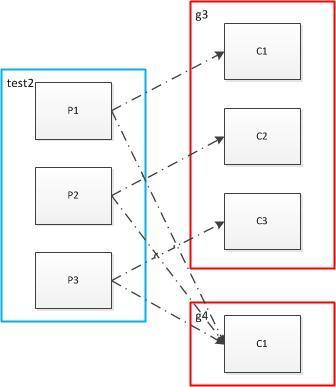

```
bin/kafka-console-consumer.sh --zookeeper localhost:2181  --group gouptid --topic Multibrokerapplication
```

https://www.jianshu.com/p/6233d5341dfe

### partition和消费者组
本文中
* 红圈内的消费者属于同一个组
* 蓝圈内的分区属于同一个topic

#### 一个partion 多个消费者



* 一个partition内的消息只能被同一个组中的一个consumer消费。当消费者数量多于partition的数量时，多余的消费者空闲。
* 也就是说如果只有一个partition你在同一组启动多少个consumer都没用，partition的数量决定了此topic在同一组中被可被均衡的程度，例如partition=4，则可在同一组中被最多4个consumer均衡消费。


#### 消费者<=partition


* 即存在一个消费者消费多个分区的情况。


#### 多个消费者组订阅同一个topic



* 启动多个组，则会使同一个消息被消费多次
