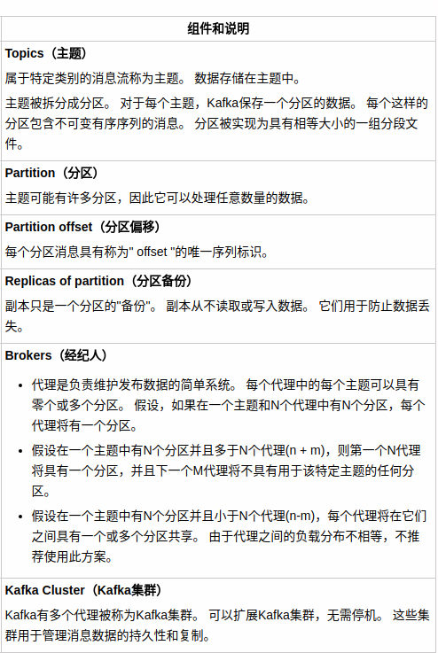
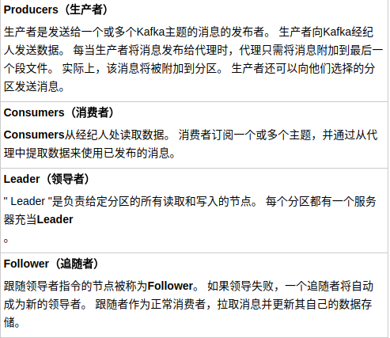
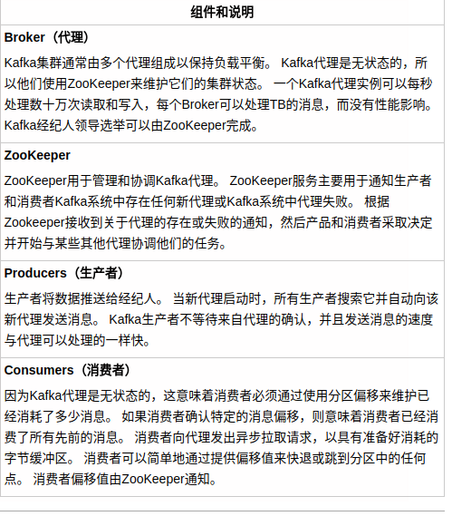

Apache Kafka起源于LinkedIn，后来于2011年成为开源Apache项目，然后于2012年成为First-class Apache项目。Kafka是用Scala和Java编写的。 Apache Kafka是基于发布订阅的容错消息系统。 它是快速，可扩展和设计分布。

https://www.w3cschool.cn/apache_kafka/apache_kafka_workflow.html

### 消息系统
消息系统负责将数据从一个应用程序传输到另一个应用程序，因此应用程序可以专注于数据，但不担心如何共享它。 分布式消息传递基于可靠消息队列的概念。 消息在客户端应用程序和消息传递系统之间异步排队。 有两种类型的消息模式可用 - 一种是点对点，另一种是发布 - 订阅(pub-sub)消息系统。 大多数消息模式遵循 pub-sub 。

### 点到点
在点对点系统中，消息被保留在队列中。 一个或多个消费者可以消耗队列中的消息，但是特定消息只能由最多一个消费者消费。 一旦消费者读取队列中的消息，它就从该队列中消失。 该系统的典型示例是订单处理系统，其中每个订单将由一个订单处理器处理，但多个订单处理器也可以同时工作。 下图描述了结构。

### 发布-订阅
在发布 - 订阅系统中，消息被保留在主题中。 与点对点系统不同，消费者可以订阅一个或多个主题并使用该主题中的所有消息。 在发布 - 订阅系统中，消息生产者称为发布者，消息使用者称为订阅者。 一个现实生活的例子是Dish电视，它发布不同的渠道，如运动，电影，音乐等，任何人都可以订阅自己的频道集，并获得他们订阅的频道时可用。

### kafka
Apache Kafka是一个分布式发布 - 订阅消息系统和一个强大的队列，可以处理大量的数据，并使您能够将消息从一个端点传递到另一个端点。 Kafka适合离线和在线消息消费。 Kafka消息保留在磁盘上，并在群集内复制以防止数据丢失。 Kafka构建在ZooKeeper同步服务之上。 它与Apache Storm和Spark非常好地集成，用于实时流式数据分析。

用处：
* 指标 - Kafka通常用于操作监控数据。 这涉及聚合来自分布式应用程序的统计信息，以产生操作数据的集中馈送。
* 日志聚合解决方案 - Kafka可用于跨组织从多个服务收集日志，并使它们以标准格式提供给多个服务器。
* 流处理 - 流行的框架(如Storm和Spark Streaming)从主题中读取数据，对其进行处理，并将处理后的数据写入新主题，供用户和应用程序使用。 Kafka的强耐久性在流处理的上下文中也非常有用。

### kafka基本概念

### kafka 集群

 

### kafka 工作流程
* Kafka只是分为一个或多个分区的主题的集合。 Kafka分区是消息的线性有序序列，其中每个消息由它们的索引(称为偏移)来标识。 Kafka集群中的所有数据都是不相连的分区联合。 传入消息写在分区的末尾，消息由消费者顺序读取。 通过将消息复制到不同的代理提供持久性。
* Kafka以快速，可靠，持久，容错和零停机的方式提供基于pub-sub和队列的消息系统。 在这两种情况下，生产者只需将消息发送到主题，消费者可以根据自己的需要选择任何一种类型的消息传递系统。 让我们按照下一节中的步骤来了解消费者如何选择他们选择的消息系统。

#### 发布 - 订阅消息的工作流程
* 生产者定期向主题发送消息。
* Kafka代理存储为该特定主题配置的分区中的所有消息。 它确保消息在分区之间平等共享。 如果生产者发送两个消息并且有两个分区，Kafka将在第一分区中存储一个消息，在第二分区中存储第二消息。
* 消费者订阅特定主题。
* 一旦消费者订阅主题，Kafka将向消费者提供主题的当前偏移，并且还将偏移保存在Zookeeper系综中。
* 消费者将定期请求Kafka(如100 Ms)新消息。
* 一旦Kafka收到来自生产者的消息，它将这些消息转发给消费者。
* 消费者将收到消息并进行处理。
* 一旦消息被处理，消费者将向Kafka代理发送确认。
* 一旦Kafka收到确认，它将偏移更改为新值，并在Zookeeper中更新它。 由于偏移在Zookeeper中维护，消费者可以正确地读取下一封邮件，即使在服务器暴力期间。
* 以上流程将重复，直到消费者停止请求。
* 消费者可以随时回退/跳到所需的主题偏移量，并阅读所有后续消息。

#### 队列消息/用户组的工作流
在队列消息传递系统而不是单个消费者中，具有相同组ID 的一组消费者将订阅主题。 简单来说，订阅具有相同 Group ID 的主题的消费者被认为是单个组，并且消息在它们之间共享。 让我们检查这个系统的实际工作流程。
* 生产者以固定间隔向某个主题发送消息。
* Kafka存储在为该特定主题配置的分区中的所有消息，类似于前面的方案。
* 单个消费者订阅特定主题，假设 Topic-01 为 Group ID 为 Group-1 。
* Kafka以与发布 - 订阅消息相同的方式与消费者交互，直到新消费者以相同的组ID 订阅相同主题 Topic-01  1 。
* 一旦新消费者到达，Kafka将其操作切换到共享模式，并在两个消费者之间共享数据。 此共享将继续，直到用户数达到为该特定主题配置的分区数。
* 一旦消费者的数量超过分区的数量，新消费者将不会接收任何进一步的消息，直到现有消费者取消订阅任何一个消费者。 出现这种情况是因为Kafka中的每个消费者将被分配至少一个分区，并且一旦所有分区被分配给现有消费者，新消费者将必须等待。
* 此功能也称为使用者组。 同样，Kafka将以非常简单和高效的方式提供两个系统中最好的。

总结：一个消费者组只能有一个消费者消费某条消息。如组g1有两个消费者a，b；g1订阅了t1的消息。当生产者往t1发送消息msg1，那么g1中只有一个消费者（要么是a，要么是b）来消费msg1。当一个组的消费者数大于该组订阅的topic的分区数，那么该组内的某些消费者永久无法得到消息来消费。
