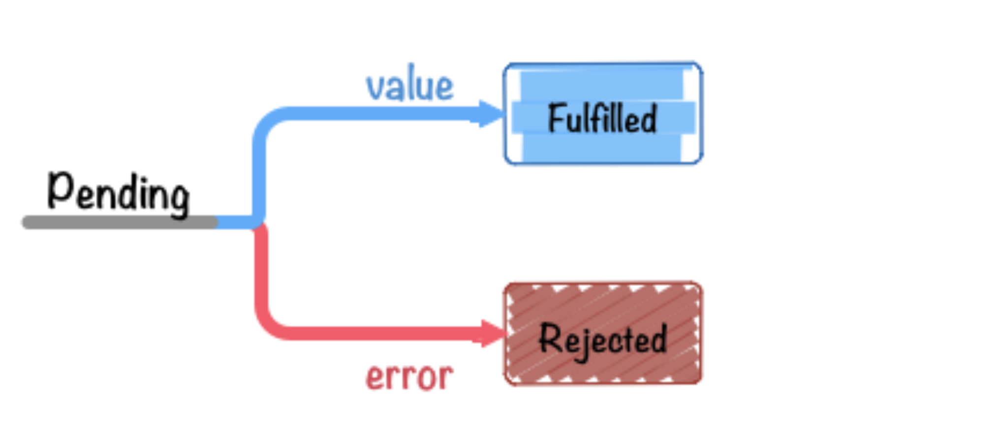

可参考：https://www.jianshu.com/p/60a2129af455

### 前言
Promise是抽象异步处理对象以及对其进行各种操作的组件。(Promise并不是从JavaScript中发源的概念)。简单说就是一个容器， 里面保存着某个未来才会结束的事件（ 通常是一个异步操作）的结果。

普通的异步操作
```
getAsync("fileA.txt", function(error, result){
    if(error){
        // 取得失败时的处理 throw error;
    }
}
```
Nodejs中规定在Javascript的回掉函数的第一个参数是Error对象。像上面这样基于回调函数的异步处理如果统一参数使用规则的话，写法也会很明了。但是，这也仅是编码规约而已，即使采用不同的写法也不会出错。

Promise则是把类似的异步处理对象和处理规则进行规范化，并按照采用统一的接口来编写，而采取规定方法之外的写法都会出错。

下面通过Promise写法改写上面的函数
```
var promise = getAsyncPromise("fileA.txt"); //返回promise对象
promise.then(function(result){
    // 获取文件内容成功时的处理
}).catch(function(error){
    // 获取文件内容失败时的处理
});
```

我们可以向这个预设了抽象化异步处理的promise对象，注册这个promise对象执行成功 时和失败时相应的回调函数。

这和回调函数方式相比有哪些不同之处呢? 在使用promise进行一步处理的时候，我们 必须按照接口规定的方法编写处理代码。

也就是说，除promise对象规定的方法(这里的 then 或 catch )以外的方法都是不可以使用的，而不会像回调函数方式那样可以自己自由的定义回调函数的参数，而必须严格遵守固定、统一的编程方式来编写代码。

这样，基于Promise的统一接口的做法， 就可以形成基于接口的各种各样的异步处理模 式。所以，promise的功能是可以将复杂的异步处理轻松地进行模式化，这也可以说得上是 使用promise的理由之一。


### 简介
要想创建一个Promise对象，可以使用new调用Promise的构造器来进行实例化。
```
var promise = new Promise(function(resolve, reject) { // 异步处理
// 处理结束后、调用resolve 或 reject
});
```


#### 实例方法
对通过new生成的promise对象为了设置其在 resolve (成功)/ reject（失败）时调用的回调函数 可以使用 promise.then()实例方法(也就是说作用是为 Promise 实例添加状态改变时的回调函数。)。
```
promise.then(onFulfilled, onRejected)
```
then方法的第一个参数是 Resolved 状态的回调函数， 第二个参数（ 可选） 是 Rejected 状态的回调函数。
* resolve(成功)时 onFulfilled 会被调用
* reject(失败)时 onRejected 会被调用
* onFulfilled 、 onRejected 两个都为可选参数。
* then方法返回的是一个新的 Promise 实例（ 注意，不是原来那个 Promise 实例）。 因此可以采用链式写法， 即then方法后面再调用另一个then方法。


```
getJSON("/post/1.json") //返回一个Promise对象，详见下文
.then(function(post) {  
    return getJSON(post.commentURL);  //返回一个Promise对象
})
.then(function funcA(comments) {  
    console.log("Resolved: ", comments);  
}, function funcB(err) {  
    console.log("Rejected: ", err);  
});
```
上面的代码使用then方法，依次指定了两个回调函数。 第一个回调函数完成以后，会将返回结果作为参数，传入第二个回调函数。采用链式的then，可以指定一组按照次序调用的回调函数。


#### Promise.prototype.catch()
promise.then成功和失败时都可以使用。另外在只想对异常进行处理时可以采用Promise.then(undefined, onRejected)这种方式，只指定reject时的回调函数即可。Promise.prototype.catch方法是.then(null, rejection) 的别名， 用于指定发生错误时的回调函数,等同于抛出错误。
上文的代码可以改造成如下

```
getJSON("/post/1.json") //返回一个Promise对象，详见下文
.then(function(post) {  
    return getJSON(post.commentURL);  //返回一个Promise对象
})
.then(function (comments) {  
    console.log("Resolved: ", comments);  
})
.catch(err) {  
    console.log("Rejected: ", err);  
});
```
需要注意的是，如果 Promise 状态已经变成Resolved， 再抛出错误是无效的。
```
var promise = new Promise(function(resolve, reject) {  
    resolve('ok');  
    throw new Error('test');  
});  
promise  
    .then(function(value) {  
        console.log(value)  
    })  
    .catch(function(error) {  
        console.log(error)  
    });  
// ok
```
上面代码中， Promise 在resolve语句后面，再抛出错误，不会被捕获， 等于没有抛出。

Promise 对象的错误具有“ 冒泡” 性质， 会一直向后传递， 直到被捕获为止。 也就是说， 错误总是会被下一个catch语句捕获。

```
var catchTest = new Promise(function(resolve, reject) {  
    setTimeout(function(){
        resolve('aa')
    }, 1000)  
})

catchTest
.then(function(value){
    console.log('a')
})
.then(function(value){
    throw new Error('test');  
    console.log('b')
})
.then(function(value){
    console.log('c')
})
.catch(function(error){
    console.log(error)
})

//a
//[Error: test]
```
上面代码中，一共有四个Promise 对象：一个由'catchTest'产生， 三个由then产生。它们之中的第二个then方法出了错误，中断了下面的then方法，直接被最后一个catch捕获。
* 建议总是使用catch方法， 而不使用then方法的第二个处理错误的参数。

跟传统的try / catch代码块不同的是，如果没有使用catch方法指定错误处理的回调函数，Promise 对象抛出的错误不会传递到外层代码， 即不会有任何反应。
```
var someAsyncThing = function() {  
    return new Promise(function(resolve, reject) {  
        //  下面一行会报错，因为 x 没有声明  
        resolve(x + 2);  
    });  
};  
someAsyncThing().then(function() {  
    console.log('everything is great');  
});
```
上面代码中，someAsyncThing函数产生的 Promise 对象会报错， 但是由于没有指定catch方法，这个错误不会被捕获，也不会传递到外层代码， 导致运行后没有任何输出。
* 注意， Chrome 浏览器不遵守这条规定， 它会抛出错误“ ReferenceError: x is not defined”。

```
var promise = new Promise(function(resolve, reject) {  
    resolve("ok");  
    setTimeout(function() {  
        throw new Error('test')  
    }, 0)  
});  
promise.then(function(value) {  
    console.log(value)  
});  
// ok  
// Uncaught Error: test
```
上面代码中，Promise指定在下一轮“ 事件循环” 再抛出错误， 结果由于没有指定使用try...catch语句，就冒泡到最外层，成了未捕获的错误。 因为此时，Promise 的函数体已经运行结束了， 所以这个错误是在Promise函数体外抛出的。


Node.js 有一个unhandledRejection事件，专门监听未捕获的reject错误。unhandledRejection事件的监听函数有两个参数， 第一个是错误对象， 第二个是报错的 Promise 实例， 它可以用来了解发生错误的环境信息。
```
process.on('unhandledRejection', function(err, p) {  
    console.error(err.stack)  
});
```

需要注意的是，catch方法返回的还是一个Promise对象，因此后面还可以接着调用then方法。
```
var someAsyncThing = function() {  
    return new Promise(function(resolve, reject) {  
        //  下面一行会报错，因为 x 没有声明  
        resolve(x + 2);  
    });  
};  
someAsyncThing()  
    .catch(function(error) {  
        console.log('oh no', error);  
    })  
    .then(function() {  
        console.log('carry on');  
    });  
// oh no [ReferenceError: x is not defined]  
// carry on
```
上面代码运行完catch方法指定的回调函数，会接着运行后面那个then方法指定的回调函数。 如果没有报错， 则会跳过catch方法。


#### 静态方法
像 Promise 这样的全局对象还拥有一些静态方法。

包括 Promise.all() 还有 Promise.resolve() 等在内，主要都是一些对Promise进行操作的 辅助方法。


### 状态
我们已经大概了解了Promise的处理流程，接下来让我们来稍微整理一下Promise的状态。

用 new Promise 实例化的promise对象有以下三个状态。

* "has-resolution" 即Fulfilled
resolve(成功)时。此时会调用 onFulfilled
* "has-rejection" 即Rejected
reject(失败)时。此时会调用 onRejected
* "unresolved" 即Pending
既不是resolve也不是reject的状态。也就是promise对象刚被创建后的初始化状态等
关于上面这三种状态的读法，其中左侧为在 ES6 Promises 规范中定义的术语， 而右侧则是在 Promises/A+ 中描述状态的术语。



promise对象的状态，从Pending转换为Fulfilled或Rejected之后， 这个promise对象的状态就不会再发生任何变化。也就是说，只有异步操作的结果可以决定当前是哪一种状态，其他任何操作都无法改变这种状态；一旦状态改变，就不会再改变。

* Promise与Event等不同，在 .then 后执行的函数可以肯定地说只会被调用一次。

还有需要注意，Promise创建后回立刻执行,看下面代码
```
var promise = new Promise(function(resolve, reject) {  
    console.log('Promise');  
    resolve();  
});  
promise.then(function() {  
    console.log('Resolved.');  
});  
console.log('Hi!');  
// Promise  
// Hi!  
// Resolved
```
上面代码中， Promise 新建后立即执行， 所以首先输出的是“ Promise”。 然后， then方法指定的回调函数， 将在当前脚本所有同步任务执行完才会执行， 所以“ Resolved” 最后输出。

Promise也是有缺点的:
* 无法取消Promise，一旦新建它就会立即执行，无法中途取消。
* 如果不设置回调函数， Promise内部抛出的错误，不会反应到外部。
* 当处于Pending状态时， 无法得知目前进展到哪一个阶段（刚刚开始还是即将完成）。


### 编写Promise
new Promise(fn)返回一个Promise对象
在fn中指定异步等处理逻辑
* 处理结果正常的话，调用 resolve(处理结果值)
* 处理结果错误的话，调用 reject(Error对象)
```
function getURL(URL) {
    return new Promise(function (resolve, reject) {
        var req = new XMLHttpRequest();

        req.open('GET', URL, true);

        req.onload = function () {
            if (req.status === 200) {
                resolve(req.responseText);
            } else {
                reject(new Error(req.statusText));
            }
        };

        req.onerror = function () {
            reject(new Error(req.statusText));
        };
        req.send();
    });
}
// 运行示例
var URL = "http://httpbin.org/get";
getURL(URL).then(function onFulfilled(value){
    console.log(value);
}).catch(function onRejected(error){
    console.error(error);
});
```
getURL 只有在通过XHR取得结果状态为200时才会调用 resolve,而其他情况(取得失败)时则会调用 reject 方法。其实是可以优化，因为其他返回码也可能代表着结果正常。


* resolve(req.responseText)
  resolve函数的作用是， 将 Promise对象的状态从“ 未完成” 变为“ 成功”（ 即从 Pending变为Resolved），在异步操作成功时调用，并将异步操作结果，作为参数传递出去。
参数并没有特别的规则，基本上把要传给回调函数参数放进去就可以了。 ( then 方法可以接收到这个参数值)

* reject(new Error(req.statusText));
  reject函数的作用是，将 Promise 对象的状态从“ 未完成” 变为“ 失败”（ 即从 Pending 变为Rejected），在异步操作失败时调用，并将异步操作报出的错误，作为参数传递出去。

上文中，XHR中 onerror事件被触发的时候就是发生错误时，所以理所当然调用 reject 。发生错误时，创建一个Error对象后再将具体的值传进去。传给 的参数也没有什么特殊的限制，一般只要是Error对象(或者 继承自Error对象)就可以。


#### 创建ajax
```
var getJSON = function(url) {  
    var promise = new Promise(function(resolve, reject) {  
        var client = new XMLHttpRequest();  
        client.open("GET", url);  
        client.onreadystatechange = handler;  
        client.responseType = "json";  
        client.setRequestHeader("Accept", "application/json");  
        client.send();  

        function handler() {  
            if(this.readyState !== 4) {  
                return;  
            }  
            if(this.status === 200) {  
                resolve(this.response);  
            } else {  
                reject(new Error(this.statusText));  
            }  
        };  
    });  
    return promise;  
};  
getJSON("/posts.json").then(function(json) {  
    console.log('Contents: ' + json);  
}, function(error) {  
    console.error(' 出错了 ', error);  
});
```
上面代码中，getJSON是对 XMLHttpRequest 对象的封装， 用于发出一个针对 JSON 数据的 HTTP 请求， 并且返回一个 Promise 对象。 需要注意的是，在getJSON内部， resolve函数和reject函数调用时， 都带有参数。关于参数传递，上文做过简要介绍。

如果调用resolve函数和reject函数时带有参数，那么它们的参数会被传递给回调函数。
reject函数的参数通常是 Error 对象的实例，表示抛出的错误；
resolve函数的参数除了正常的值以外，还可能是另一个 Promise实例， 表示异步操作的结果有可能是一个值，也有可能是另一个异步操作，比如像下面这样。
```
var p1 = new Promise(function(resolve, reject) {  
    // ...  
});  
var p2 = new Promise(function(resolve, reject) {  
    // ...  
    resolve(p1);  
})
```
上面代码中，p1和p2都是 Promise 的实例， 但是p2的resolve方法将p1作为参数，即一个异步操作的结果是返回另一个异步操作。

注意，这时p1的状态就会传递给p2，也就是说，p1的状态决定了p2的状态。如果p1的状态是Pending，那么p2的回调函数就会等待p1的状态改变； 如果p1的状态已经是Resolved或者Rejected， 那么p2的回调函数将会立刻执行。
```
var p1 = new Promise(function(resolve, reject) {  
    setTimeout(() => reject(new Error('fail')), 3000)  
})  
var p2 = new Promise(function(resolve, reject) {  
    setTimeout(() => resolve(p1), 1000)  
})  
p2.then(result => console.log(result))
.catch(error => console.log(error))
```
上面代码中，p1是一个 Promise， 3 秒之后变为rejected。 p2的状态在 1 秒之后改变， resolve方法返回的是p1。 此时， 由于p2返回的是另一个Promise， 所以后面的then语句都变成针对后者（ p1）。 又过了 2 秒 p1变为rejected，导致触发catch方法指定的回调函数。
