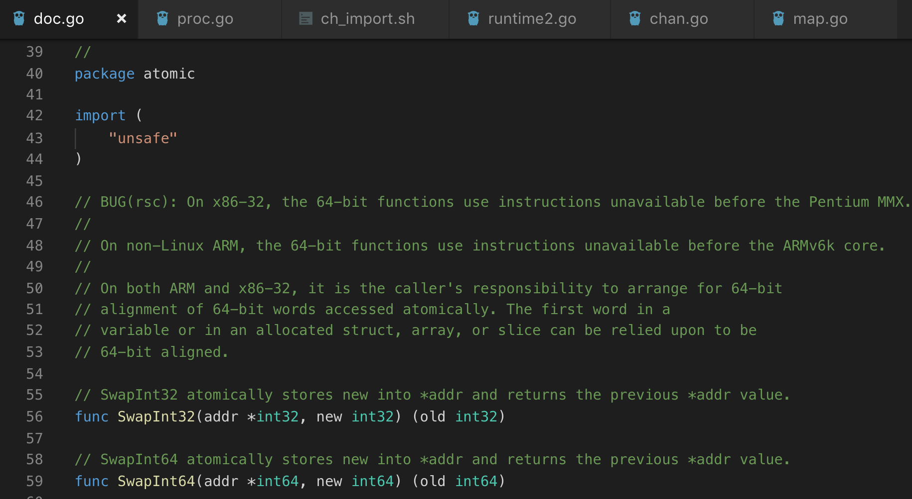

本篇将简单介绍golang的sync库。含sync.map, sync/atomic

### sync/atomic
atomic 是golang对于一些基础数据类型的同步操作的实现。官方的基本介绍如下：
```
Package atomic provides low-level atomic memory primitives useful for implementing synchronization algorithms.

These functions require great care to be used correctly. Except for special, low-level applications, synchronization is better done with channels or the facilities of the sync package. Share memory by communicating; don't communicate by sharing memory.
```
翻译过来就是：atomic包提供了低层次的同步内存操作。atomic的函数需要小心使用。同时，官方建议说除非有特殊情况，否则应该使用channel或sync包提供的工具来实现同步操作。“通过沟通共享内存，不要通过共享内存进行通信”。这是golang的设计原则。

atomic声明了基本数据类型的同步操作。如:


可见atomic包只有函数的声明，并无具体实现。针对不同的系统架构，函数的具体实现不同（使用）。下面是CompareAndSwapInt64在amd64的具体实现（go/1.10.3/libexec/src/sync/atomic/asm_amd64.s）：
```
TEXT ·CompareAndSwapInt64(SB),NOSPLIT,$0-25
	JMP	·CompareAndSwapUint64(SB)

TEXT ·CompareAndSwapUint64(SB),NOSPLIT,$0-25
	MOVQ	addr+0(FP), BP  // 将第一个参数放到BP寄存器
	MOVQ	old+8(FP), AX // 将old值放入AX寄存器
	MOVQ	new+16(FP), CX // 将new值放入CX寄存器
	LOCK             // 锁定下面两条指令对应的总线
	// CMPXCHG r/m,r 将累加器AL/AX/EAX/RAX中的值与首操作数（目的操作数）比较，如果相等，
  // 第2操作数（源操作数）的值装载到首操作数，zf置1。如果不等， 首操作数的值装载到AL/AX/EAX/RAX并将zf清0  
	CMPXCHGQ	CX, 0(BP)  // compare and swap
	SETEQ	swapped+24(FP)
	RET
```
可见，对于atomic函数的具体实现是和系统架构相关的（不同的体系架构有不同的指令集）。当编译golang程序的时候，会将CompareAndSwapInt64函数链接到该机器指令。相较于使用系统级的锁，直接使用机器指令进行原子操作消耗更小（无需系统陷入等一系列系统操作）。


### sync.Map
go 语言中的map并不是并发安全的，在Go 1.6之前，并发读写map会导致读取到脏数据，在1.6之后则程序直接panic。因此之前的解决方案一般都是通过引入RWMutex(读写锁)进行处理，关于go为什么不支持map的原子操作，概况来说，对map原子操作一定程度上降低了只有并发读，或不存在并发读写等场景的性能。
但作为服务端来说，使用go编写服务,大部分情况下都会存在gorutine并发访问map的情况，因此，1.9之后，go 在sync包下引入了并发安全的map。

Map是golang对map的封装，能够提供较高性能的读写负载。其具体结构如下：
```
type Map struct {
	mu Mutex
	read atomic.Value // 存储就是一个readOnly实例
	dirty map[interface{}]*entry
	misses int // 命中失败次数
}

type readOnly struct {
	m       map[interface{}]*entry
	amended bool // true if the dirty map contains some key not in m.
}
type entry struct {
	p unsafe.Pointer // *interface{}
}
// 存储一个k-v，如果k已经存在则覆盖
func (m *Map) Store(key, value interface{})
// 存储一个k-v，如果k已经存在则返回旧值
func (m *Map) LoadOrStore(key, value interface{}) (actual interface{}, loaded bool)
// 删除一个k-v
func (m *Map) Delete(key interface{})
// 遍历k-v
func (m *Map) Range(f func(key, value interface{}) bool)
```
可见该结构十分简单。其主要思想是：
- read只负责读操作
- dirty只负责写操作
- 查询的时候先在read中查询；当在read中找不到的时候，加锁，再到dirty中找，如果找到则返回，且misses加一
- 当misses达到一定值，则将dirty上升为read
- 虽然read和ditry是一个map，但是由于v为指针，因此当修改一个已经存在的k的时候，read和dirty对应的k-v会同时改变

下面我们来分析一下Store的实现：
```
// Store sets the value for a key.
func (m *Map) Store(key, value interface{}) {
	read, _ := m.read.Load().(readOnly)
	// 如果read中存在，则直接更新, 会同时更新read, dirty
	if e, ok := read.m[key]; ok && e.tryStore(&value) {
		return
	}
  // 加锁
	m.mu.Lock()
  // 再读一次read，防止加锁之前其他routine将dirty上升为read
	read, _ = m.read.Load().(readOnly)
  // 该key曾经被刷入到read
	if e, ok := read.m[key]; ok {
    // 这个key之前被删除过
		if e.unexpungeLocked() {
			m.dirty[key] = e
		}
		e.storeLocked(&value)
	} else if e, ok := m.dirty[key]; ok {
		e.storeLocked(&value)
	} else {
		// 如果dirty包含了不在read中的k-v
		if !read.amended {
      // 正在往dirty存入第一个key
		  // dirtyLocked当dirty为空的时候会初始化
			m.dirtyLocked()
			m.read.Store(readOnly{m: read.m, amended: true})
		}
		m.dirty[key] = newEntry(value)
	}
	m.mu.Unlock()
}
```
Load的实现也与Store基本相似：先在read里面找；找不到则加锁在dirty里面找
```
func (m *Map) Load(key interface{}) (value interface{}, ok bool) {
	read, _ := m.read.Load().(readOnly)
	e, ok := read.m[key]
	// 找不到则加锁在dirty里面找
	if !ok && read.amended {
		m.mu.Lock()
		// 在找dirty之前，先从read中再找一次，原因同Store
		read, _ = m.read.Load().(readOnly)
		e, ok = read.m[key]
		if !ok && read.amended {
			e, ok = m.dirty[key]
			m.missLocked()
		}
		m.mu.Unlock()
	}
	if !ok {
		return nil, false
	}
	return e.load()
}
```
分析：
- 能够较好的支持高并发读
- sync.Map不适合高并发写的情况。大量的写操作会导致read命中失败，然后加锁；同时如果命中失败过多，则dirty和read会频繁交换


其他：golang的原语除了atomic、sync之外，channel也可以算是。channel的实现比较简单，完全可以看源码来学习（会牵涉到一些routine的知识）。关于channel的实现、源码分析，网上有很多都分析的非常好：
- [源码](https://github.com/golang/go/blob/master/src/runtime/chan.go)
- [Go Channel 源码剖析](http://legendtkl.com/2017/08/06/golang-channel-implement/)
