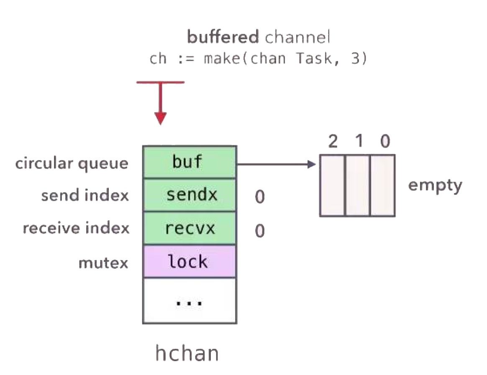
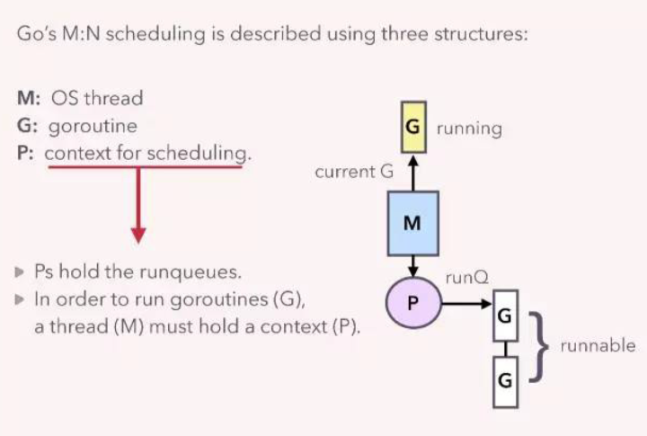

sync.map:
- https://golang.org/pkg/sync/
- https://juejin.im/post/5ae01447f265da0ba062d2e8
- https://golang.org/pkg/sync/atomic/#CompareAndSwapInt64
适用于读多写少的情况

```
func (m *Map) Load(key interface{}) (value interface{}, ok bool)
func (m *Map) Store(key, value interface{})
func (m *Map) LoadOrStore(key, value interface{}) (actual interface{}, loaded bool)
func (m *Map) Delete(key interface{})
func (m *Map) Range(f func(key, value interface{}) bool)
func (m *Map) missLocked()
```

atomic：
- /usr/local/Cellar/go/1.10.3/libexec/src/sync/atomic/doc.go
- https://golang.org/pkg/sync/atomic/#CompareAndSwapInt64
- https://www.jianshu.com/p/8d604a9825b8 cisc risc
- https://studygolang.com/articles/3557
```
/usr/local/Cellar/go/1.10.3/libexec/src/runtime/internal/atomic/asm_amd64.s

// bool	runtime∕internal∕atomic·Cas64(uint64 *val, uint64 old, uint64 new)
// Atomically:
//	if(*val == *old){
//		*val = new;
//		return 1;
//	} else {
//		return 0;
//	}
TEXT runtime∕internal∕atomic·Cas64(SB), NOSPLIT, $0-25
	MOVQ	ptr+0(FP), BX // fp是栈基址寄存器，指向当前函数栈帧的栈底，sp则指向当前函数栈帧的栈顶。
	MOVQ	old+8(FP), AX
	MOVQ	new+16(FP), CX
	LOCK
  // CMPXCHG r/m,r 将累加器AL/AX/EAX/RAX中的值与首操作数（目的操作数）比较，如果相等，
  // 第2操作数（源操作数）的值装载到首操作数，zf置1。如果不等， 首操作数的值装载到AL/AX/EAX/RAX并将zf清0    
  // 我们看到了CMPXCHG的定义，那么很明显这里使用了AX和CX来做对比
	CMPXCHGQ	CX, 0(BX) // IF AX==BX THEN BX=CX,ZF=1 ELSE AX=BX,ZF=0
	SETEQ	ret+24(FP) //
	RET // 把栈顶之值弹出到指令指针寄存器IP中
```


channel:
- /usr/local/Cellar/go/1.10.3/libexec/src/runtime/chan.go
- http://legendtkl.com/2017/08/06/golang-channel-implement/
- https://zhuanlan.zhihu.com/p/27917262



channel 其实就是一个队列加一个锁，只不过这个锁是一个轻量级锁。其中 recvq 是读操作阻塞在 channel 的 goroutine 列表，sendq 是写操作阻塞在 channel 的 goroutine 列表。列表的实现是 sudog，其实就是一个对 g 的结构的封装。


- Go的格言之一是“通过沟通共享内存，不要通过共享内存进行通信”。

atomic words
- chanel <->
- sync.x: mutex，map
- atomic


routine:

- https://docs.google.com/document/d/1TTj4T2JO42uD5ID9e89oa0sLKhJYD0Y_kqxDv3I3XMw/edit
