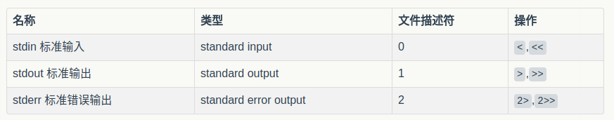

### 输入输出重定向
写程序的时候, 一般都会遇到 stdin, stdout, stderr 三个默认文件描述符（file descriptor）.


平时运行小型的程序, 都通过直接打印到屏幕上看输出就好, 但是在下面两种状况, 通常都会需要用到输出重定向
* 输出很多的时候, 特别是在debug的时候, 通过重定向到文件, 然后对log进行搜索
* 配置好定时任务运行, 当想查看定时任务的运行日志的时候, 查看脚本的运行状况


下面是一段用于测试的Python程序
```
➜ ~  > cat test.py
#!/usr/bin/env python
#encoding=utf-8
from __future__ import print_function
import sys
if __name__ == '__main__':
    print("Output to stdout")
    print("Output to stderr", file=sys.stderr)
```

运行
```
# 把stdout重定向
python test.py > test.log
# 把stderr绑定到stdout中
python test.py > test.log 2>&1
# 与上一个命令同样效果
python test.py &> test.log
# stdout重定向到 /dev/null (Linux下特殊的"黑洞"设备描述符, 相当于抛弃所有stdout输出)
python test.py > /dev/null
```


### 参考
* https://www.zybuluo.com/JaySon/note/724635
*
