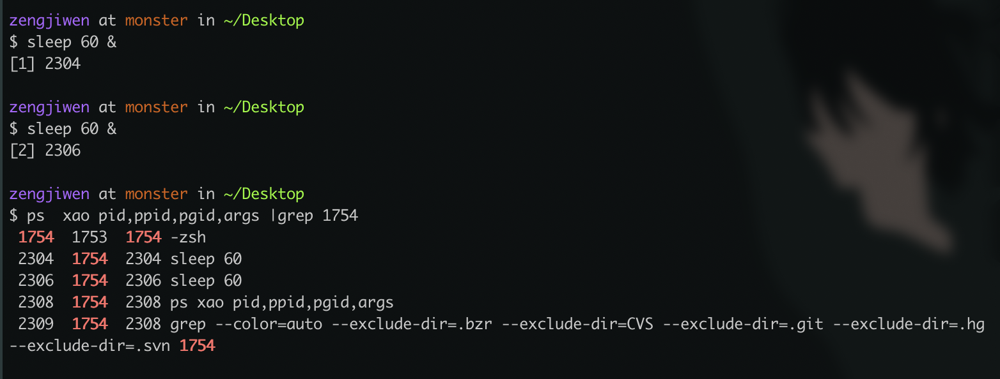

#### 杀死进程
```
kill -9 pid
```

#### 查看进程
```
ps -aux|grep your_app
```

#### 查看内存使用情况
```
cat /proc/$pid/status  |grep VmRSS
```
单位ｋ
---

## 进程
为了方便多个程序并发的执行，需要对正在运行的程序进行抽象、描述、控制，进程的概念由此产生。进程表示的正在运行的程序的状态、数据、指令。

## 守护进程
一类特殊的进程，是在linux中作为后台进程频繁、长期提供服务，一般生活周期较长。脱离于控制终端。将进程作为守护进程运行，可以避免程序的运行时输出打印到终端，并防止进程被终端的输入输出干扰。

## 进程组
每个进程都从属于某个进程组；每个进程组都有一个组长进程。进程组的ID是组长进程的进程号。当进程组创建后，组长进程的结束与否不影响进程组。进程组的生命周期从进程组创建到组内最后一个进程运行结束为止。一个进程组的进程可以转移到另一个进程组。

默认情况下，子进程的进程组号与进程号相同。进程也可以为自己或子进程设置进程组ID

进程组的概念是为了方便管理同一类进程。部分服务需要同时运行多个进程，可以将这些进程分配到同一个进程组。当需要停止该服务的时候，可以通过停止整个进程组来快速结束相关进程，而非逐个进程停止。

<p align="center">

</p>

- 这四列分别为：进程id、父进程id、进程组号。
- 两个sleep的进程号为2304，2306，它们的进程组号和进程id相同。

在任务调度系统（Airflow等）中，一个任务可能涉及多个进程。如果需要停止任务，最好将任务的所有进程规划到同一个进程组。

## 回话周期
回话周期是一个或多个进程组的集合，从用户登录到用户退出为止。在用户在线期间，用户所创建的所有进程组都属于该回话周期内。

## 僵尸进程
进程可以通过fork、execve进程系统调用来创建新的进程（子进程）。如果父进程在fork之前没有设定用于处理子进程退出信号的函数，也没有显示地忽略该信号，那么子进程退出后，会成为僵尸进程，其（子进程）的进程号、相关资源并不会被马上释放，哪怕以root用户来kill -9，也无法杀死僵尸进程，直至父进程退出。父进程退出后，僵尸进程会成为孤儿进程，过继给init进程，ppid=1。init进程的主要工作之一就是负责清理这些僵尸进程。

因此，如果需要子进程，那么父进程最好设定用于处理子进程退出信号的函数。


## 其他
- 当进程fork出一个子进程后，两个进程持有相同的文件描述符，如果一个进程对一个文件描述符进行读写，会影响另一个进程。因此，程序应该关闭无用的文件描述符，避免造成资源浪费和数据错误。
- 进程的工作目录不能被卸下，直至更换进程的工作目录。