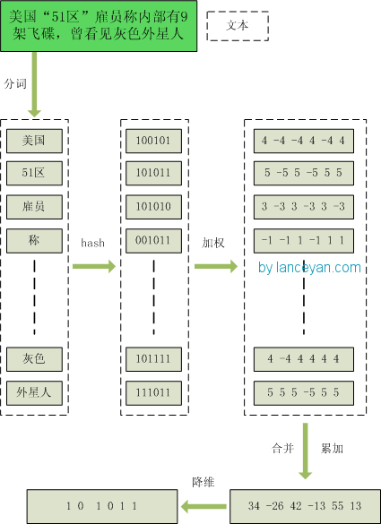

### 文档
- https://www.cnblogs.com/maybe2030/p/5203186.html

### simhash和hash的区别
传统的Hash算法只负责将原始内容尽量均匀随机地映射为一个签名值，原理上仅相当于伪随机数产生算法。传统的hash算法产生的两个签名，如果原始内容在一定概率下是相等的；如果不相等，除了说明原始内容不相等外，不再提供任何信息，因为即使原始内容只相差一个字节，所产生的签名也很可能差别很大。所以传统的Hash是无法在签名的维度上来衡量原内容的相似度，而SimHash本身属于一种局部敏感哈希算法，它产生的hash签名在一定程度上可以表征原内容的相似度。

在解决文本相似度计算的时候，要比较的是两个文章是否相识，当然我们降维生成了hash签名也是用于这个目的。看到这里估计大家就明白了，我们使用的simhash就算把文章中的字符串变成 01 串也还是可以用于计算相似度的，而传统的hash却不行。

### simhash
假设我们有海量的文本数据，我们需要根据文本内容将它们进行去重。对于文本去重而言，目前有很多NLP相关的算法可以在很高精度上来解决，但是我们现在处理的是大数据维度上的文本去重，这就对算法的效率有着很高的要求。而局部敏感hash算法可以将原始的文本内容映射为数字（hash签名），而且较为相近的文本内容对应的hash签名也比较相近。SimHash算法是Google公司进行海量网页去重的高效算法，它通过将原始的文本映射为64位的二进制数字串，然后通过比较二进制数字串的差异进而来表示原始文本内容的差异。

#### 流程实现
1. 把文档A分词形成分词向量L，L中的每一个元素都包涵一个分词C以及一个分词的权重W
2. 对L中的每一个元素的分词C进行hash，得到C1，然后组成一个新的向量L1
3. 初始化一个长度大于C1长度的向量V，所有元素初始化为0
4. 分别判断L1中的每一个元素C1的第i位，如果C1i是1，那么Vi加上w，否则Vi减去w
5. 最后判断V中的每一项，如果第i项大于0，那么第i项变成1，否则变成0
6. 两篇文档a,b分别得到aV,bV
6. 最后求出aV和bV的海明距离，一般距离不大于3的情况下说明两篇文档是相似的

#### 相似度判断
我们把库里的文本都转换为simhash签名，并转换为long类型存储，空间大大减少。现在我们虽然解决了空间，但是如何计算两个simhash的相似度呢？难道是比较两个simhash的01有多少个不同吗？对的，其实也就是这样，我们通过海明距离（Hamming distance）就可以计算出两个simhash到底相似不相似。两个simhash对应二进制（01串）取值不同的数量称为这两个simhash的海明距离。举例如下： 10101 和 00110 从第一位开始依次有第一位、第四、第五位不同，则海明距离为3。对于二进制字符串的a和b，海明距离为等于在a XOR b运算结果中1的个数（普遍算法）。

### 存储优化
　　经过simhash映射以后，我们得到了每个文本内容对应的simhash签名，而且也确定了利用汉明距离来进行相似度的衡量。那剩下的工作就是两两计算我们得到的simhash签名的汉明距离了，这在理论上是完全没问题的，但是考虑到我们的数据是海量的这一特点，我们是否应该考虑使用一些更具效率的存储呢？其实SimHash算法输出的simhash签名可以为我们很好建立索引，从而大大减少索引的时间，那到底怎么实现呢？

   如果我们有1000w的文档要检索，那么就要用输入的文档的simhash和这1000w个文档的simhash进行比对，耗费太大。而且耗费与数据规模成正相关。

   可以使用hansh链表来进行优化：

#### 存储
以d表示海明距离，当d小于等于3表示两个文本相似为例：

- 将一个64位的simhash签名拆分成4个16位的二进制码。（图上红色的16位）
- 分别拿着4个16位二进制码查找当前对应位置上是否有元素。（放大后的16位）
- 对应位置没有元素，直接追加到链表上；对应位置有则直接追加到链表尾端。（图上的 S1 — SN）

#### 检索
- 将需要比较的simhash签名拆分成4个16位的二进制码。
- 分别拿着4个16位二进制码每一个去查找simhash集合对应位置上是否有元素。
- 如果有元素，则把链表拿出来顺序查找比较，直到simhash小于一定大小的值，整个过程完成。

#### 特点
- 简单易懂
- 快速，利用hash检索
- simhash 签名应该拆分为d+1份
