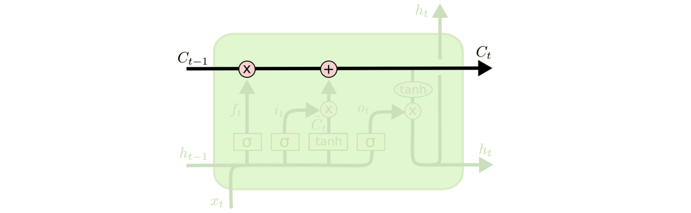
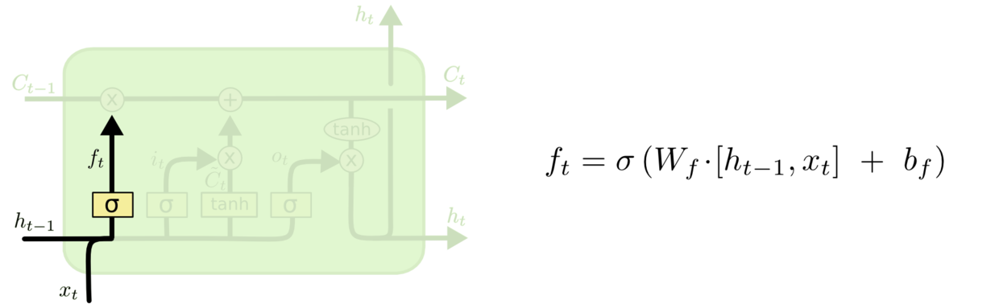
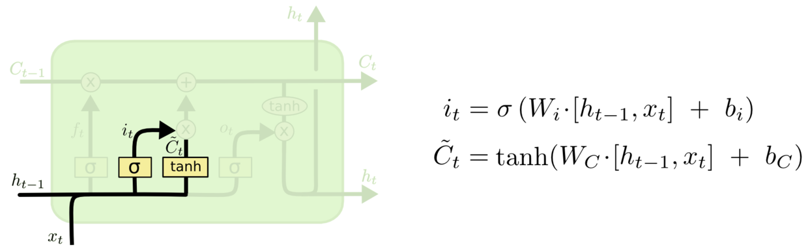
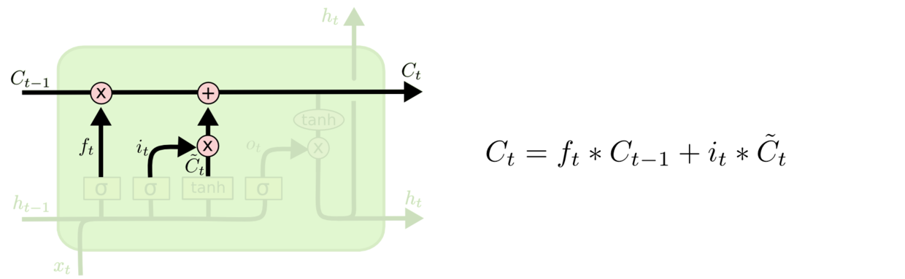
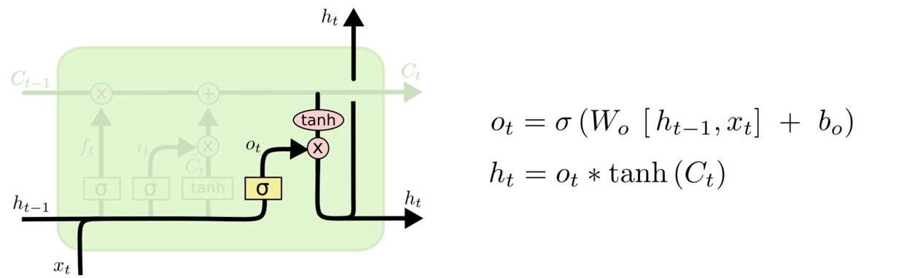

资料
- 原文https://www.cnblogs.com/zhangchaoyang/articles/6684906.html
- 代码https://github.com/nicodjimenez/lstm/blob/master/lstm.py

- LSTM的关键是细胞状态C，一条水平线贯穿于图形的上方，这条线上只有些少量的线性操作，信息在上面流传很容易保持。

-   第一层是个忘记层，决定细胞状态中丢弃什么信息。把 ht−1 和xt拼接起来，传给一个sigmoid函数，该函数输出0到1之间的值，这个值乘到细胞状态Ct−1上去。sigmoid函数的输出值直接决定了状态信息保留多少。比如当我们要预测下一个词是什么时，细胞状态可能包含当前主语的性别，因此正确的代词可以被选择出来。当我们看到新的主语，我们希望忘记旧的主语。

- 上一步的细胞状态Ct−1已经被忘记了一部分，接下来本步应该把哪些信息新加到细胞状态中呢？这里又包含2层：一个tanh层用来产生更新值的候选项C̃t，tanh的输出在[-1,1]上，说明细胞状态在某些维度上需要加强，在某些维度上需要减弱；还有一个sigmoid层（输入门层），它的输出值要乘到tanh层的输出上，起到一个缩放的作用，极端情况下sigmoid输出0说明相应维度上的细胞状态不需要更新。在那个预测下一个词的例子中，我们希望增加新的主语的性别到细胞状态中，来替代旧的需要忘记的主语。

- 现在可以让旧的细胞状态Ct−1与ft（f是forget忘记门的意思）相乘来丢弃一部分信息，然后再加个需要更新的部分it∗C̃ t（i是input输入门的意思），这就生成了新的细胞状态Ct。

- 最后该决定输出什么了。输出值跟细胞状态有关，把Ct输给一个tanh函数得到输出值的候选项。候选项中的哪些部分最终会被输出由一个sigmoid层来决定。在那个预测下一个词的例子中，如果细胞状态告诉我们当前代词是第三人称，那我们就可以预测下一词可能是一个第三人称的动词。

### 变体
- GRU（Gated Recurrent Unit）是LSTM最流行的一个变体，比LSTM模型要简单。

