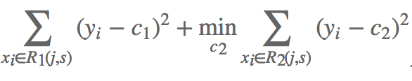
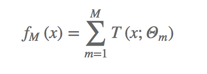
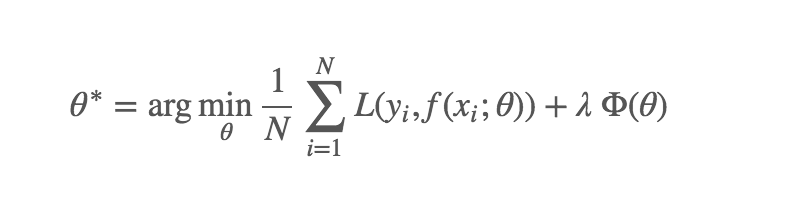
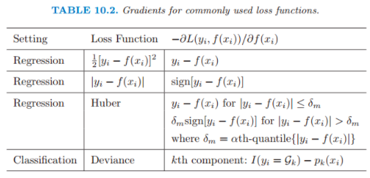
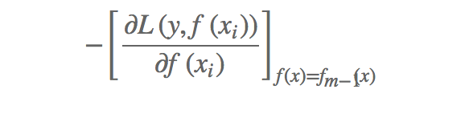

## 决策树
- 决策树是一种基本的分类和回归方法。决策树模型呈树形结构，可以认为是if-else形式的判断集合。其主要的优点有：可读性好；分类速度快。
- 决策树由节点和有向边组成，节点的类型有：内部节点——表示一个特征及其划分值；叶节点——类别或输出值。当使用决策树进行分类或者回归预测的时候，只需递归地按照内部节点的特征及划分值找到对应的叶节点即可，叶节点的类别或者值即为输出。

本文并不打算介绍分类决策树（大家可自行查询和学习ID3，ID4.5，Random Forest等常用的基础决策树的原理，以及决策树的裁剪），而主要是为了介绍GBDT及XGBoost的原理。在介绍GBDT和xgboost之前，我们先介绍一下CART。

后文的标志：
- 训练集： D={(x1,y1),(x2,y2),...,(xn,yn)}，其中xi是m维的向量，yi是第i个训练样本的标准结果。（如果yi的取值是离散的，则是分类问题；如果yi的取值范围是连续的，则是回归问题）。本文中的yi为离散取值。

## CART
分类和回归树（classification and regression tree, CART)是Breiman等人在1984提出的决策树学习方法。CART假设决策树是二叉树，内部节点表示的是对数据根据某个特征的某个值得划分，特征小于或等于该划分值得数据分配在该内部节点的做节点，大于划分值的数据则被划分到右节点。

那么，我们要怎样构建CART呢？决策树的构建问题主要有两点：内部节点选取哪个特征的哪个值作为划分特征？

首先要明确的是，我们的划分目的是使得划分后的到的数据相较于划分前更为纯粹（使得划分后的数据的不确定性更小），或者使得误差（损失值）更小。一般，我们对于不确定性的度量方法有信息熵(使用信息增益最大的划分方法作为划分依据)、基尼指数等，对于损失值可以采用平方损失函数等。对于回归分析，本文使用平方损失函数作为划分依据和损失函数。

#### 算法流程
D={(x1,y1),(x2,y2),...,(xn,yn)}，其中xi是k维的向量，yi是第i个训练样本的标准结果。训练过程——从根节点开始，递归得对每一节点进行一下操作：
1. 设节点的数据集合为D，根据每个特征j的每个可能的取值（划分值）s，将数据划分为两个集合节点R1、R2，节点内数据样例的平均值c1，c2作为节点值（或者按比例使用加权值作为节点值）。计算划分后的损失:
<div align=center>

</div>

2. 选取划分损失最小的特征及其对应的划分值作为该节点的划分方式。
3. 对两个子节点R1,R2,递归进行步骤1、2的处理直至满足停止条件（节点的数据样例个数为1；样例个数不为1，但是y相同；深度超过d等）。如果满足停止条件，则叶子节点内数据样例的平均值作为节点值（或者使用加权值作为节点值）。

至此，一颗CART就训练完成了。


## 提升决策树BDT
提升树(Boosting Decision Tree)是迭代多棵回归树来共同决策。当采用平方误差损失函数时，每一棵回归树学习的是之前所有树的结论和残差，拟合得到一个当前的残差回归树，一般，残差的意义如公式：残差 = 真实值 - 预测值 。提升树即是整个迭代过程生成的回归树的累加。提升树模型可以表示为决策树的加法模型:
<div align=center>

</div>

其中T(x;Θm)表示决策树；Θm为决策树的参数；M为树的个数。

#### 算法流程：
```
D1=训练集D
// m为回归树数量（自定义），m越大表示越精确，同时也意味着可能过拟合
for i range m:
  Ti=根据Di使用训练出的一棵CART
  使用Ti对Di进行预测，rj=Ti对Di第j个样例的预测结果，并获取每个训练样本的残差yj'， 其中yj'=yj-rj
  Di+1={(x1,y1'),(x2,y2'),...,(xn,yn')}

// 最后的模型为：
f(x)=T1+T2+...+Tm
```

## 梯度提升决策树GBDT
GBDT（Gradient Boosting Decision Tree）是一种迭代的决策树算法，又叫 MART（Multiple Additive Regression Tree)，它通过构造一组弱的学习器（树），并把多颗决策树的结果累加起来作为最终的预测输出。该算法将决策树与集成思想进行了有效的结合。

我们需要知道的是，度量任何一个模型最重要的就是这个模型的损失函数。我们训练的目标就是使得损失函数L最小化。
<div align=center>

</div>

当损失函数是平方损失和指数损失时，每一步优化是很简单的。但对一般损失函数而言，往往每一步优化没那么容易，如绝对值损失函数和Huber损失函数。常见的损失函数及其梯度如下表所示：

<div align=center>

</div>


如何使得损失函数最小化？调整参数，使得损失沿着梯度方向下降！（不懂的话要重学数学分析。。。）

对于损失函数为平方损失函数的，我们可以使用的是yj-Ti对xj的预测结果作为残差。那么对于其他类型的损失函数我们应该使用什么作为残差以达到最好的效果呢呢？针对这一问题，Freidman（机器学习界的大佬）提出了梯度提升算法：利用最速下降的近似方法，即利用损失函数的负梯度在当前模型的值。
<div align=center>

</div>

如果我们对提升树的损失函数求偏导，就可以发现，偏导是等于残差的~，见上上图。（因为上文的残差是损失函数梯度的一个特例，对应的损失函数为平方损失函数）。因此，对于不同的损失函数，我们可以使用损失函数的偏导作为我们的残差。

这就是梯度提升决策树了。


## XGBoost
XGBoost的全称为eXtreme Gradient Boosting，是GBDT的一种高效实现，XGBoost中的基学习器除了可以是CART（gbtree）也可以是线性分类器（gblinear）。

- 和GBDT不同，xgboost给损失函数增加了正则化项（L1或L2正则化项，视学习目标不同而取不同正则化参数。）
- 有些损失函数是难以计算导数的，鉴于这种情况，xgboost使用损失函数的二阶泰勒展开作为损失函数的拟合
- GBDT的节点分裂方式是遍历所有特征的所有可能划分，再选取最优者分裂。xgboost使用分位点及分位数法，近似地计算，有效降低计算量

---
参考:
- [GBDT](https://plushunter.github.io/2017/01/22/%E6%9C%BA%E5%99%A8%E5%AD%A6%E4%B9%A0%E7%AE%97%E6%B3%95%E7%B3%BB%E5%88%97%EF%BC%887%EF%BC%89%EF%BC%9AGBDT/)

- [xgboost的数学模型、分位点及分位数法](https://zhuanlan.zhihu.com/p/38297689)

推荐：
- 《统计学习方法》——李航
- 西瓜书——周志华
