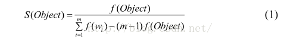

http://blog.csdn.net/u010666884/article/details/50320997

针对于中文

## 单词获取
我们的资源有一堆文本，想要根据这些文本获取我门的日常用词。
### 初始化
- 将所有单字及常用单词放入我们的初始词典集合中，如{系，统，我，你，和，.....，我们，系统....}

### 识别并添加
如，我们的初始集合中有“系统”这个词(待评价或待识别的词/对象)，但是很明显“操作系统”也是可以作为一个词放入我们的词典集合中去的。

#### 概念
##### 对象完整性/词的完整性
对于一篇文档 Document =d1d2d3…dn，其中，di表示 Document 的第 i 个词。假设候选评价对象 Object出现在 Document 中 n 个不同的位置P1,p2,p3,….pn。如果至少存在一组 < i ,k >(1≤ i < k ≤ n )，使得Document 中第Pi-1个词和第Pk-1个词不相同，那么就将此 Object称为左完整 ( 若 Object是文本中的第 1 个词时，则一定是左完整 )；如果至少存在一组 < i , k >(1≤ i < k ≤ n )，使得 Document 中，第Pi+Object个词和第Pk+object个词不相同，那么就将此 Object称为右完整 ( 若 Object是文本中的最后一个词时，则一定是右完整)；如果 Object 既是左完整又是右完整，那么就将此 Object称为完整性的评价对象。

##### 稳定性

针对本文中候选评价对象 Object是基于规则获得的，通常是由多个词(w1w2…w3)组成的。用各个词之间的紧密耦合程度，来衡量 Object的稳定性，本文采用下式计算获得：  
 

其中， f(Object) 表示 Object在一篇文档中出现的频率；f(wi ) 表示组成 Object 的词wi在该文档中出现的频率； m表示组成该 Object的词个数； S(Object ) 表示评价对象的稳定性。


如”IOS系统平台”，由于这三个词连续出现的概率非常大，但是我们原本的词典并没有这个对象词，只有“IOS”,”系统”，“平台”三个词，所以我们如果算出这三次出现在一起的概率大于某个数的时候，那么我们就可以把这个组合词收录到我们的词典中。很明显，当对象的稳定性越大，那么它更有可能是一个词组。


因此，如果一个对象是完整的，并且其稳定性较高，那么它更有可能是一个词组。我们就将这个对象加入我们的词典集合

```
init:初始化单词集合c
for doc in docments{
  根据c来对doc进行分词，得到doc的词语集合words
  for w int words{
    if(w是完整的 并且 w的稳定性高){
      将w添加到c
    }
  }
}
```

当然这样的词语获取方式是挺简陋的。


## 文本分词
现在我们有词语集合c了，有个新的文本需要我们去将整个文本分裂成一个一个的词语，暂时思考中。
