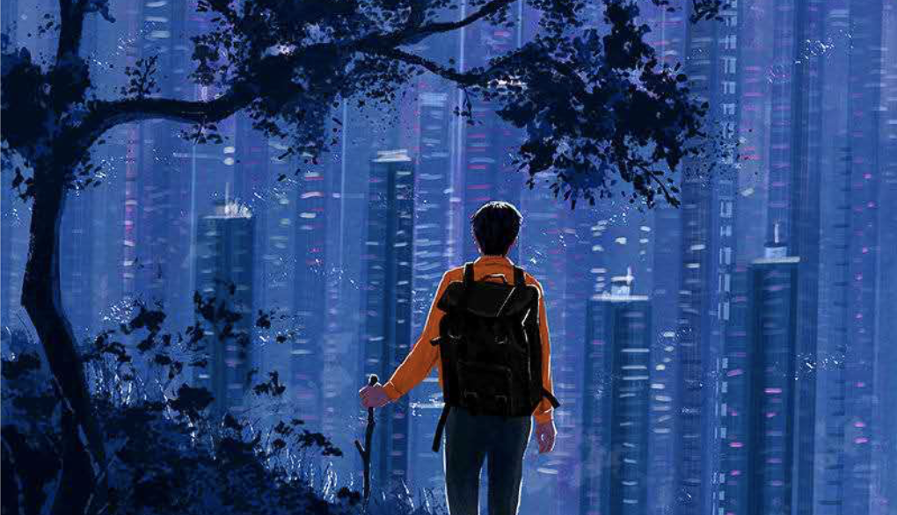
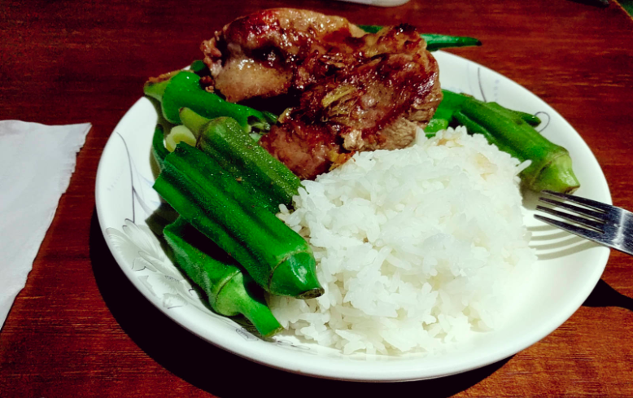
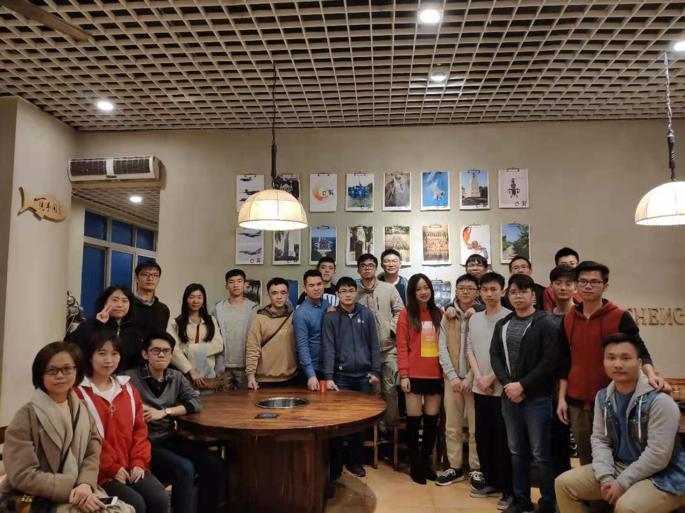
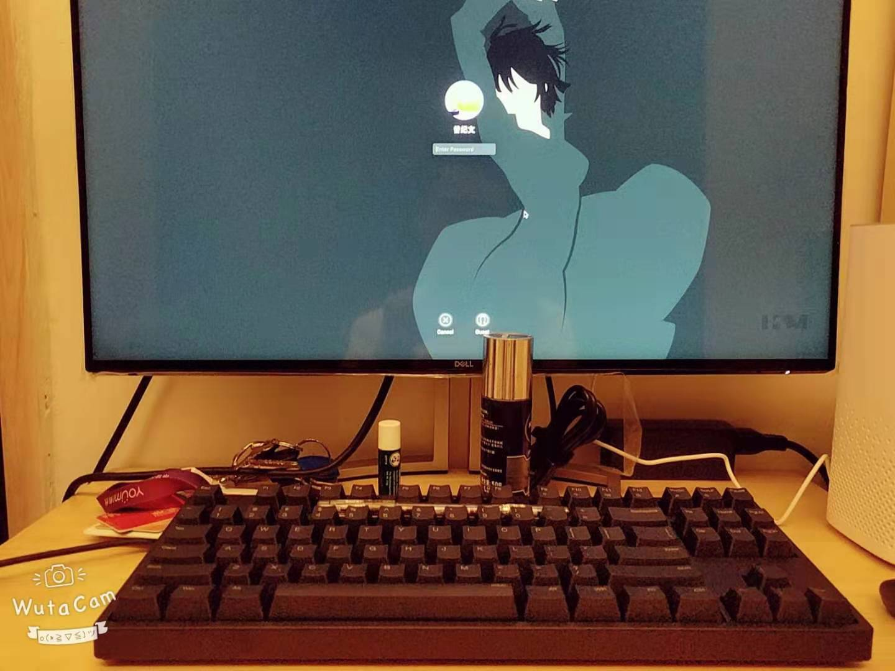
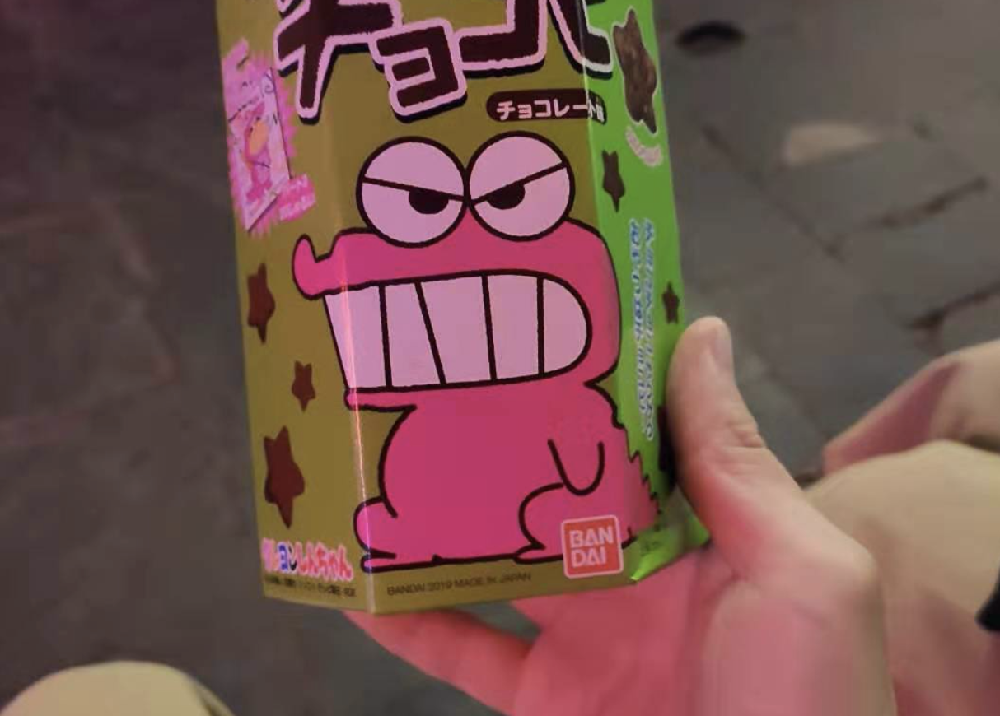

&#8195;&#8195;以前虽然也有写年终总结，但都是蜻蜓点水，一笔带过。随着自己步入中年，回首往事还是颇为感概，心想还是必须要将这种连绵不绝的心情写下来。

## 工作

&#8195;&#8195;18年毕业，因此19年算是我真正步入社会的完整的一年。

&#8195;&#8195;大四就在有米实习，那时候的自己还很稚嫩。那时候我所拥有的一切只有我对未来的憧憬，以及3千块左右的积蓄。毕业后，租房子交押金，身上就只剩下几百块。那段日子，每天吃饭都要考虑一下吃啥才能撑到下个月十号发实习工资。周末也只能自己做饭，好节省点钱。虽说心情忐忑，但也终归是一路顺风地度过。

&#8195;&#8195;在有米遇到了很多很优秀的同事甚至珍贵的朋友，在他们身上学到了对待工作的态度、专业的能力、代码洁癖。

&#8195;&#8195;后来，我所珍重的朋友，一个个的离开了有米，投身到不同的行业，而我也在国庆前提出离职，11月到字节跳动搬砖。

&#8195;&#8195;这些珍贵的人啊，我希望长久的日后，也能时常相聚。“无为在歧路，儿女共沾巾”。

## 学习

&#8195;&#8195;要说2019最不顺心的事，除了离职那几个月，那就是没能养成系统的学习习惯。2019年只看了十来本书，远远没能达到要求。不过《圣殿春秋》、《月亮与六便士》、《局外人》等个人评价也颇高。此外，专业类书籍也只看了三四本，如《深入理解计算机操作系统》还没看完，阅读博客也只写了两篇，因此个人行动能力——差评。相对有点安慰，就是证券交易类书籍阅读完成率有70%。（《量价分析》落在了北京，心痛）

&#8195;&#8195;年初定的每周一篇博客也未能很好的实现，只写了十来二十篇。真是心存惭愧。

## 锻炼

&#8195;&#8195;19年的目标本来是想跑个500km的。现在看来，自己还是too young too simple了。

&#8195;&#8195;19年年初的几个月，基本每周都能跑三天，共15公里左右。但是5、6月份，病痛复发，又去做了几次手术，修养了几个月。在九月、十月才基本康复。康复后，在深圳初始的两个月也每周跑个三四次，每次4km。

&#8195;&#8195;然而，然而，复发了，虽然不是很严重。直至现在，每天都要涂药水。🤮

## 感情

&#8195;&#8195;年前最开心的事，就是和莫老师达成长期战略合作协议。和莫老师逛啤酒街的时候，发现我俩都是真的穷（一杯啤酒60多块，消费不起）......

&#8195;&#8195;不过比较抱歉的就是，跨年和圣诞节，没能和老莫一起过，此处深表歉意，哈哈哈

## 展望

&#8195;&#8195;又到了立flag的时候了：
- 每日一瓶牛奶和水果，坚持锻炼，注重有氧运动，提升免疫力，身体康复
- 每月至少两篇博客
- 每月至少一本书：文学 x 2，历史 x 1，技术 x 3，证券/金融 x 1
- 一次省内游、一次省外游。待商榷，此处<strong>@莫老师</strong>
- 工作上，熟悉游戏发行业务，提升开发效率和水平
- 投资回报率25+%