## 作者

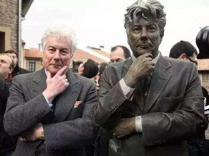

&#8195;&#8195;肯尼斯·马丁·福莱特，CBE（英语：Kenneth Martin Follett，1949年6月5日－）,英国历史小说和悬疑小说家，代表作有《针之眼》、《圣殿春秋》等。福莱特作品的最大特色是内容都有史实根据。历史上的真实人物与小说中的虚构角色巧妙融合融合，人物刻画、情节变幻、细节背景精致准确。

## 概要

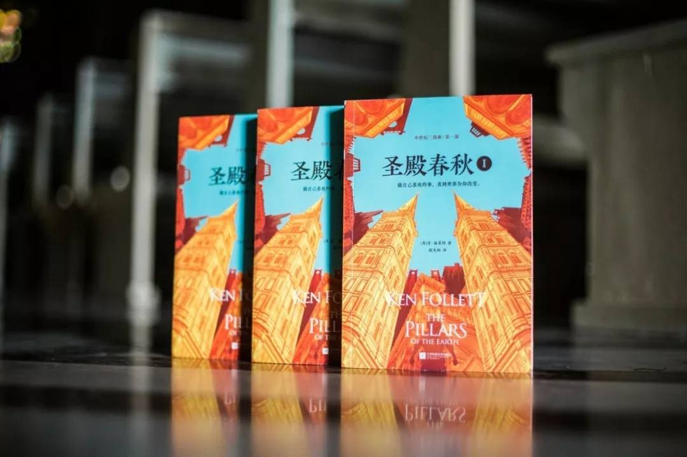

&#8195;&#8195;《圣殿春秋》以十二世纪英格兰史蒂芬国王和莫德王后之间的王位争夺战为背景，描绘了王桥大教堂近五十年修建的过程中，较为完整地表达了该时期社会的动荡不安，及各个社会阶层的生活与斗争。

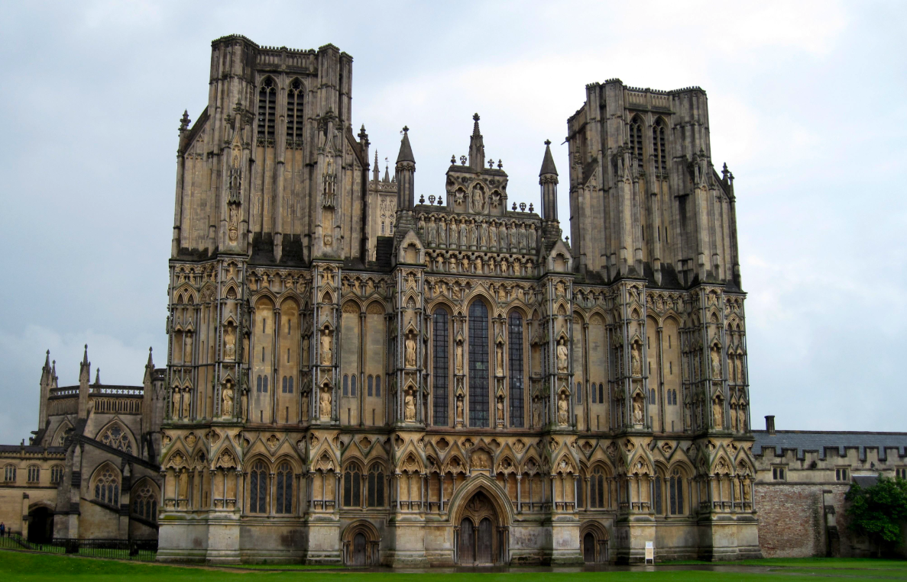

&#8195;&#8195;12世纪的英格兰。亨利一世在位后期，继承人海难身亡，其外甥斯蒂芬继承王位。亨利一世之女莫德为争夺王位不断发动战争，政局动荡，人心惶惶。故事主线是菲利普神父为了重振修道院，与一心想建造一座大教堂的汤姆相互合作，历经两代人近五十年，终于完成毕生所愿。

## 评价
&#8195;&#8195;仅“波澜壮阔、荡气回肠”尚不能表达我的赞赏。

&#8195;&#8195;《圣殿春秋》入木三分地描绘了当时动荡时期下，统治者和宗教内部、之间的权利斗争，以及广大人民群众的苦难。如果仅是而已，那这本书也只能称得上不错而已。书中的错综复杂的人性、家庭关系的描写，既能揪动读者的心弦，读起来酣畅淋漓，也很好地描绘了彼时英格兰的建筑风格、人文生活、政治风波。

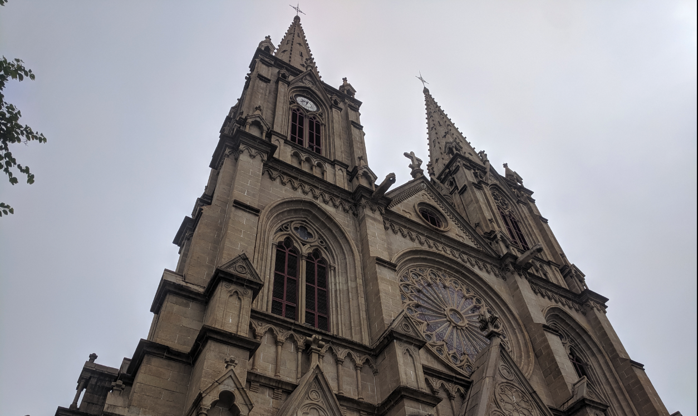

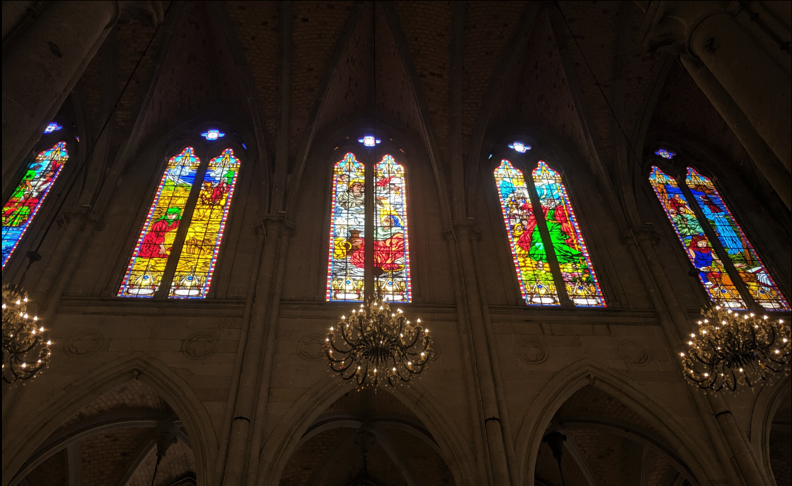

&#8195;&#8195;《圣殿春秋》对于大教堂的描绘十分精彩。在我看来，肯叔对于教堂的描绘，甚至还要优于《巴黎圣母院》的生涩、复杂的文字，让我对十二世纪的英国教堂风格、发展有了新的理解（哥特风格的引入；彩窗、飞扶壁的传播等等）。毕竟，肯叔在动笔之前可是完整考察了数十座12、13世纪大教堂的（威尔士大教堂、温切斯特大教堂、埃克塞特大教堂）。

&#8195;&#8195;书中对于人物心理活动的描写也是一大亮点。无论是汤姆失去妻子的绞心空洞、艾伦希望所有教会中人都下地狱的滔天恨意，还是阿莲娜被强暴后的屈辱愤怒无力、少年杰克偷亲心上人时的小心翼翼，都极其有力地撰住了读者的心脏。

&#8195;&#8195;关于底层人物的描写，肯叔也是极具功力。心胸酝酿十七载，笔落之处惊风云。在彼时社会的大混乱，人民群众的智慧、勇气、贪婪、愚昧都得到完美的呈现，丝毫不弱于《平凡的世界》中的众生相。

&#8195;&#8195;这本书带给我最大的冲击就是对于宗教的描写。在我们从小到大的教材、书籍中，宗教总是扮演着落后、愚昧、封建的角色（历史书上的柏拉图审判、十字军东征、哥白尼日心说、伽利略软禁；《巴黎圣母院》里的神父等等）。但是我们都忽略了，在中世纪的黑暗岁月中，教会对于普罗大众也是信仰的存在。正是这种我们眼中愚昧的信仰，造就了贫苦、动荡时期的一个个奇迹（耗时数十年甚至数世纪的大教堂建造、文化的冲突与传播等）。也正是这种信仰，在现今大都市中，也有着大量的民众甘愿皈依上帝。

&#8195;&#8195;说到底，这一切都是人心的载体。

&#8195;&#8195;书中并不存在主角，更不可能存在完美的人物。每个人都存在这样那样的缺点，有些在我们看来甚至是不可原谅的恶行。这使得很多读者前期读起来很不爽，毕竟现在都是《基督山伯爵》类爽文横行的“网络阅读时代”，呵呵呵。但也正是因为不能完全地喜欢书中的任何一个人物，所以才意识到他们真的很真实。

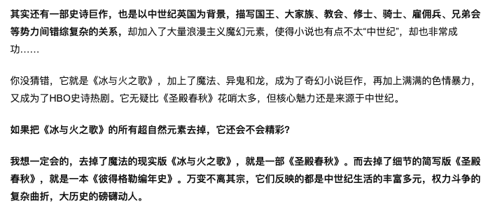

## 其他
&#8195;&#8195;《圣殿春秋》也存在着话剧、电视剧等其他表现形式，其中各有珠玉腐石。但让比较意外的是，还有人把《圣殿春秋》搬上游戏屏幕，其剧情较好的复原了原著剧情，其画质也几近无可挑剔（steam价格199，我哪有钱买嘛）。以下是一些截图：

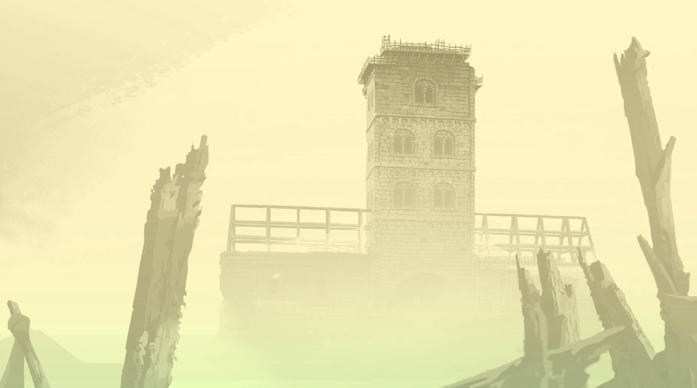

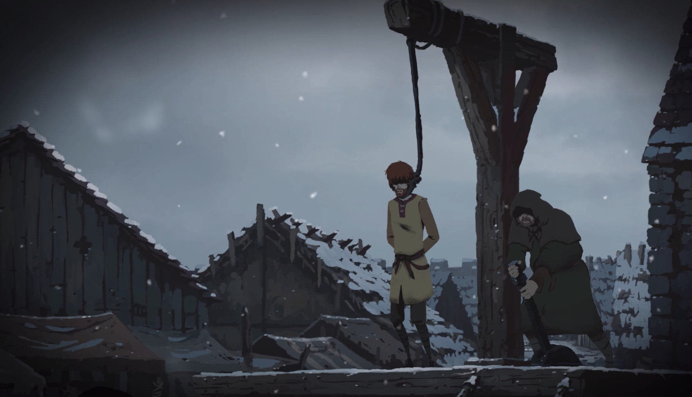

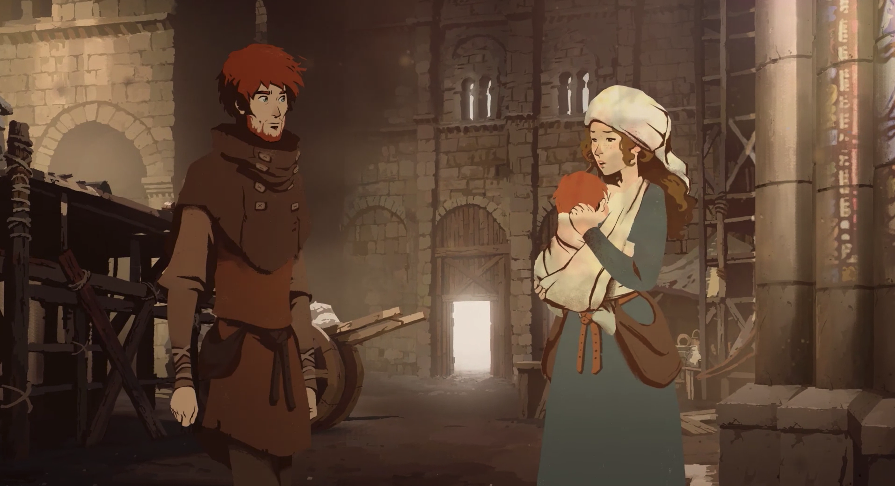

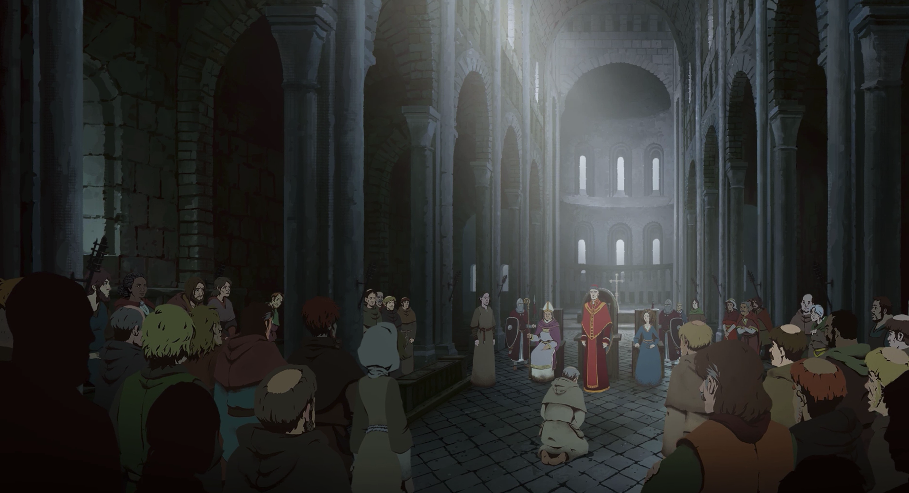

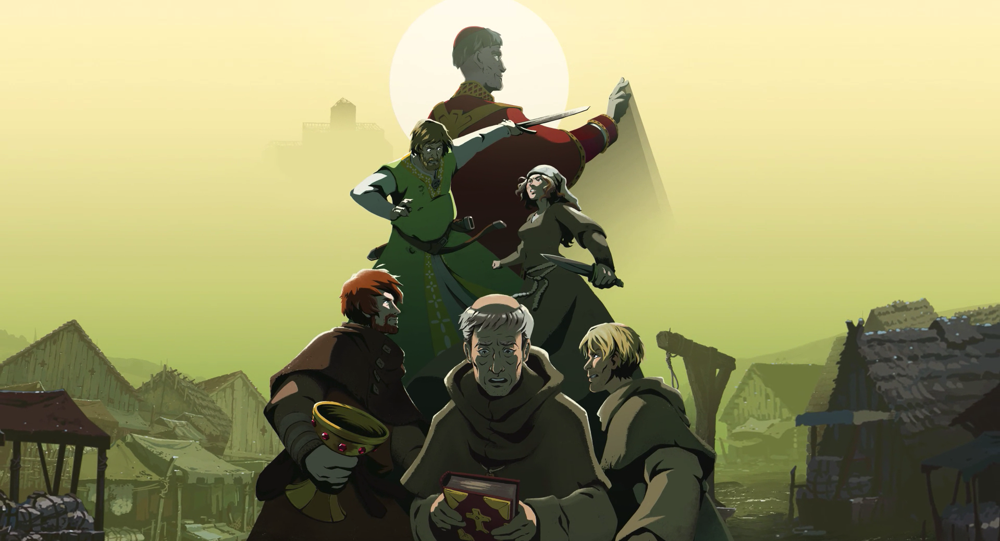

## Ref/推荐
- [大地的支柱：肯.福莱特是如何写出《圣殿春秋》的](https://book.douban.com/review/2271496/)
- [历史背景](https://book.douban.com/review/9631896/)
- [肯·福莱特 Ken Follett](https://book.douban.com/author/128699/)