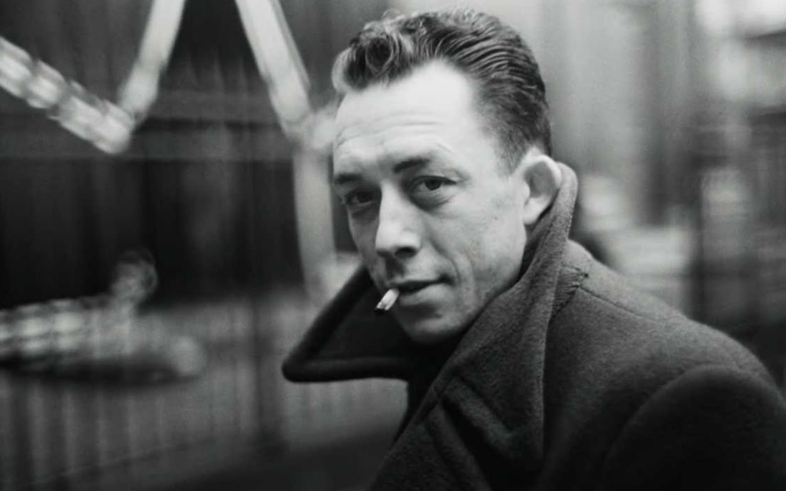

## 书透
&#8195;&#8195;默尔索在筹办母亲的葬礼中，没有哭泣，只是感觉到累。第二天，他遇到一个以往认识的女人，在性冲动下和她喝酒、做爱。回到公司工作后，上司询问他是否愿意到巴黎担任一个更高的职位，默尔索回答：“无所谓”。他没有任何的理想、爱好，没有什么必须要做成活着不做的事。他觉得活着本身，也仅是因为活着，讨论意义这种东西，本身就不存在意义。

&#8195;&#8195;后来的一次旅行中，默尔索用枪杀死了一个试图使用匕首攻击他的跟踪者。

&#8195;&#8195;法庭审判中，法官、陪审团、律师在辩论的过程中，从默尔索的罪行是应该被判处死刑还是应该判处监禁的辩论，转移到了对他灵魂的审判：一个不在母亲葬礼中哭泣的人，其罪过等同弑父。

&#8195;&#8195;默尔索拒绝说谎，被判处了死刑。

&#8195;&#8195;其实，他如果愿意上诉，有极大的可能可以免除死刑。但是，“未来的岁月并不比我已经度过的岁月更真实”。其他的命运并不比现在这样的命运更有意义。

---
## 我想
&#8195;&#8195;默尔索并不比我们中的任何一个人高贵，也不比我们中的任何一个人罪恶。在他的世界中，死亡只是一种如同吃饭、洗澡、睡觉一样的事情——死亡并不比活着更值得庆幸、开心。他只是在追求极致的真实。他是“一个毫无英雄主义的自命不凡、只是愿意为真实赴死的男人”，只是在追求一种极致的真实，一种极致的光明，如“昼日般绝对的光明，甚至不为阴影留一点余地”。

&#8195;&#8195;作者不关心，我也不关心默尔索究竟是因为何种经历失去了欲望。

&#8195;&#8195;大概我们每个人都曾有过一种感觉：舍弃半生经营，躺在青蔚的草顶上，不让感情、财富、理想、社会、责任，干扰你头顶的蓝天白云。我觉得这样就挺好了，我什么也不在乎。但是，任何一个不遵循社会规则、不掩饰真实感受、不害怕社会放逐、不恐惧死亡威胁的人，本身就不拥有存在于这个社会的权利，即便他从来没有触犯过任何一条法律。

&#8195;&#8195;在人类社会中，追求极致的真实，也许就是追求极致的虚幻；追求极致的光明，也许就是追求极致的黑暗；追求极致的理智，也许就是追求极致的盲目。这种对极致的追求所带来的幸福，也是这个世界有时让我们心碎的根源。

&#8195;&#8195;不以物喜，不以己悲，也未必真的如此美好。毕竟，这个社会，实在是太无聊了。。

---
## 只言片语
- 当我不想听对方讲话的时候，我就做出赞同的样子。                                                  
- 但是谁都知道，人生是不值得一过的。我不是不知道，三十岁死或者七十岁死，并没有什么区别。
- 在我所度过的整个荒诞的人生中，从我未来的深处，一股昏暗的气息穿越尚未到来的岁月向我扑来，这股气息一路袭来，使别人向我建议的一切都变得毫无差别，未来的岁月并不比我已经度过的岁月更真实。
- 一个在精神上杀死母亲的人和一个亲手杀死父亲的人，是要以同样的罪名退出人类社会。在任何情况下，前者都是为后者的行动做准备。
- 在我们的社会里，任何在母亲下葬时不哭的人都有被判死刑的危险。 --阿尔贝-加缪