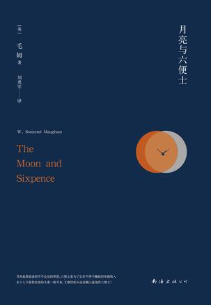
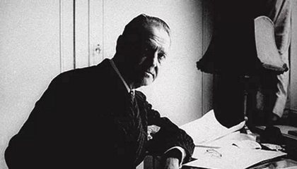

## 书透

&#8195;&#8195;斯特里克兰是一名从事证券行业多年的人，家庭环境良好，和妻子共同育有一对可爱的儿女。可是，突然有一天，斯特里克兰悄无声息地离开伦敦，去往巴黎，在一个完全陌生的地方，穷困潦倒地展开自己余生唯一要做的事：画画。从此，斯特里克兰流连于世界各地，再也没有和过去的熟人通信：他的世界里再也没有别人、没有爱、没有钱，也不关心他人的生死、苦乐，世界的生存与毁灭也无法让他的心产生一丝怜悯，他的灵魂只有画画和穷困。

## 所思
&#8195;&#8195;我不想写下斯特里克兰在巴黎以及离开巴黎后的生活，也不想写下他是否创造出不朽的名著：在他到达巴黎的那一天，他就已经成为了伟大，而这些，和他是否创造出不朽的画作没有任何关系。

&#8195;&#8195;在我读到斯特里克兰在巴黎对受其妻子之托从伦敦来探望他的“我”说“滚”以及一脸嘲讽的时候，斯特里克兰的形象在我心中就变得不可逾越了，这种感觉，与默尔索带给我的相似。因此，书中后面的故事对我的再无吸引力。如果有，那也和斯特里克兰无甚关系。我之所以读下去，只是想看看故事中其他人物的后续。在阅读后面的章节的时候，我意识到，我是带着嘲讽的。

&#8195;&#8195;我以前时常思考：我这一生是不是有必须要去做的事情，如果有，那究竟是什么。我是否要追求美妙的爱情、美满的家庭？我是否要得到一个体面的职业并拥有丰厚的收入？我是否要为社会创造财富与安稳，将自己的一生的一部分甚至全部奉献给这个社会？时至今日，我都没有找答案。

&#8195;&#8195;我又想，人生的意义究竟是什么？在体会到一系列感受之后，我深刻意识到：人生是没有意义。当我意识到这一点之后，我感受到深深的恐惧。没有人生的意义，未来将何去何从？“未来的岁月并不比我已经度过的岁月更真实”。如果真实这样，在今天死去和在明天死去相比，对我而言，也就不会有更多的快乐或者痛苦。

&#8195;&#8195;我所得到的教育、社会宣传都在向我灌输一种理念：你要做的足够好，去回报你的父母，要成为一个对社会有用的人，要为xx奋斗终身。而如果人生，更确切的说是我的人生是没有意义的话，那我在贯彻这种理念时，只不过是在按照我所得到的教育去活着而已。如果说贯彻这种理念就是我人生的意义，那么这所谓的意义，也不过是我所得到的教育希望我去做的，或者说，我人生的意义是他人赋予的而已。

<!-- 而一旦我自身正在做的事和父母、社会相悖， -->

&#8195;&#8195;难道我存在的意义，只能依赖于他人吗？

## 书中
- 常常身体得到满足时精神才能达到最高层次的自由。确实, 有时在阴沟里星空看着比在山顶更明亮。
- 他们必须自己发现，他们所读过的书，所听到的话，全是谎言！谎言！谎言！而每一次的发现，都是往那具已被钉在生活十字架上的身躯再打入一枚钉子。
- 做自己最想做的事，生活在自己喜爱的环境里，淡薄宁静、与世无争，这难道是糟蹋自己吗？这一切都取决于一个人如何看待生活的意义，取决于他认为对社会应尽什么义务，对自己有什么要求。
- 一个人要是跌进水里，他游泳得好不好是无关紧要的，反正他得挣扎出去，不然就得淹死。
- 在我看来，一个人仿佛是一个包得紧紧的蓓蕾。一个人所读的书或所做的事，在大多数情况下，对他毫无作用。然而，有些事情对一个人来说确实具有一种特殊意义，这些具有特殊意义的事情使得蓓蕾绽开一片花瓣，花瓣一片片接连开放，最后便开成一朵鲜花。

## 作者

&#8195;&#8195;毛姆是我最喜欢的作家之一。我真切地认为这世界上有人能够将自己内心对他人的看法说（其实是写）出来是一件让我很快乐的事。一个人能够忤逆绝大部分人的看法，堂而皇之地表达自己对莎士比亚、巴尔扎克、托尔斯泰、陀思妥耶夫斯基、司汤达的厌恶的部分，实在是令人心情愉悦。

## 其他
&#8195;&#8195;今天去医院看皮肤病，护士姐姐在治疗之后，液氮冷冻手术给我带来一种持久的灼烧感。可是，在这种剧烈的疼痛中，我本来阴沉的心情突然就晴朗起来。具体为何，我也不知道。

&#8195;&#8195;最近看的书我都觉得十分不错，除了《万历十五年》等部分书籍，《少年维特的烦恼》、《漫长的告别》、《圣殿春秋》等等都可以入选我书架的头等舱。后面的一段时间里，我打算歇一下，好好整理心中的思绪，把尚未读的书先放一边。

&#8195;&#8195;最后，引用我的朋友西瓜太郎的话：“成长带走的不只是时光，还有不怕失去的勇气”。