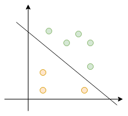

&#8195;&#8195;感知机（perceptron）是二类分类的线性分类模型，其输入为实例的特征向量，输出为实例的类别，去+1和-1二值。感知机对应于输入空间（特征空间）中将实例划分为正负两类的分离超平面，属于判别模型。感知机于1957年由Rosenblatt提出，是神经网络和支持向量机的基础。

## 感知机模型
&#8195;&#8195;假设输入空间（特征空间）为n维，输出空间y={+1, -1}。由输入空间到输出空间的函数如下：
```
f(x) = sign(wx + b)
```
&#8195;&#8195;其中w、b为感知机的模型参数，w为n维的向量（也称权值向量），b叫做偏置量；wx为w和x的内积；sign是符号函数：
```
         | +1, x >= 0
sign(x) =|
         | -1, x < 0
```

&#8195;&#8195;感知机是一种线性分类模型，其假设空间是定义在特征空间中的所有线性分类模型或者线性分类器，即函数集合{f|f(x)=wx+b}。

&#8195;&#8195;感知机有如下几何解释：线性方程 wx+b=0 对应n维特征空间中一个超平面s，其中w是超平面的法向量，b是超平面的截距。这个超平面将特征空间划分为两个部分，分别对应于实例中的正负两类。因此s被称为分离超平面。

<p align="center">

</p>

## 感知机的学习策略
&#8195;&#8195;损失函数：一个很自然的选择就是使用误分类点的数量作为损失函数。但是这样的损失函数不是参数w、b的连续可导函数，不易优化。损失函数的另一个选择是误分类点到超平面s的总距离。感知机一般采用这种距离损失函数。

&#8195;&#8195;点x到超平面s的距离如下：
```
|wx+b| / ||w||，其中||w||是w的L2范数。
```

&#8195;&#8195;对于误分类点（x,y），-y(wx+b)>0 恒成立。因为当 wx+b>0 时，y=-1；当 wx+b<0 是，y=1。因此误分类点x到s的距离为:
```
-y(wx+b)/||w||
```

&#8195;&#8195;因此感知机的损失函数定义为：
```
L = -∑y_i(wx_i +b)
```
&#8195;&#8195;显然L是连续可导的，因此我们可以使用梯度下降法来训练模型（即学习策略）。

## 感知机的学习算法
&#8195;&#8195;对L求偏导，的结果如下:
```
▽L_w = -∑x_i·y_i
▽L_b = -∑y_i
```
&#8195;&#8195;对于线性可分的数据，我们可以随机选取一个误分类点 (x_i, y_i) 来对w、b进行更新：
```
w = w + ηy_i·x_i
b = b + ηy_i
```
&#8195;&#8195;其中η（0<η≤1）是步长，在统计学习中又称为学习率。

&#8195;&#8195;对于几近线性可分的数据，我们可以选择所有误分类点来对w、b进行更新：
```
w = w + η∑y_i·x_i
b = b + η∑y_i
```

## 伪代码
&#8195;&#8195;对于线性可分的数据：
```
初始化:w = 0, b =0
while 循环次数小于最大训练轮数max_round
    计算损失函数L，以及得到误分类点集合m
    // 到达最小损失则退出
    if L < min_loss:
        break
    // 从m选取一个误分类点err_record=(x_i, y_i)
    err_record = m[rand(len(m))]
    w = w + ηy_i·x_i
    b = b + ηy_i
return w, b
```

&#8195;&#8195;对于几近线性可分的数据，如训练数据中极少部分异常数据时（理论上应该剔除这些数据）：
```
初始化:w = 0, b =0
while 循环次数小于最大训练轮数max_round
    计算损失函数L，以及得到误分类点集合m
    // 到达最小损失则退出
    if L < min_loss:
        break
    // 根据错误集调整w和b，(x_i, y_i) ∈ m，η应该随着轮数和集合m的大小变化而变化
    w = w + η∑y_i·x_i
    b = b + η∑y_i
return w, b
```

## 算法的收敛性
&#8195;&#8195;感知机学习算法存在许多解，这些解既依赖于w、b的初值，也依赖于迭代中误分类点的选择顺序。

&#8195;&#8195;为了得到唯一的超平面，对于对分离超平面增加约束条件。这就是支持向量机的想法。

&#8195;&#8195;当训练集线性不可分的时候，感知机学习算法不收敛，迭代效果会发生震荡。