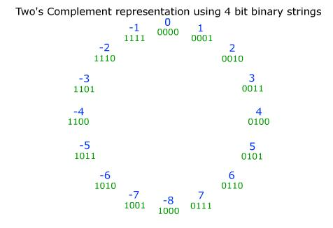
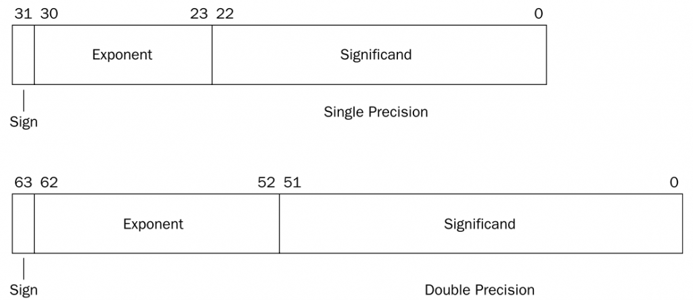

本篇将简单介绍计算机的各种数值表示方法：原码、反码、补码、浮点数。
<!-- more -->

<p align="center">

</p>

## 序
&#8195;&#8195;现有的大部分计算机都使用二进制表示法来表示数值。单个二进制并不是十分有用，但是，当把位组合起来并加上某种解释后，就赋予了不同的可能位模式含义，进而表示一个有限的集合。

&#8195;&#8195;无符号编码基于传统的二进制表示法，表示大于或者等于0的数字。补码可以表示有符号整数。浮点数是表示实数的以2位基数的版本。

&#8195;&#8195;有符号整数通常使用补码表示，当整数太大的时候，会产生溢出，可能产生负数。而浮点数有着完全不同的数学属性，其整数溢出会产生特殊的值（正无穷或者负无穷，整数溢出则产生正无穷，负数溢出则产生负无穷）；两个正数相乘永远只会产生正数，即便溢出亦不会产生负数。由于精度有限，浮点运算时不可结合的。

&#8195;&#8195;正数的表示只能编码一个相对较小的数值范围，这种表示是精确的；而浮点数可以表示一个较大的数值范围，但是这种表示只是近似的。

## 信息的存储
&#8195;&#8195;机器不会理会什么原码、反码、补码，它直接操作的对象是字节。

### 字节和字
&#8195;&#8195;大多数计算机使用8位的块，或者字节，作为最小的可寻址的内存单位，而不是访问内存中单独的位。机器级程序将内存视为一个非常大的字节数组，称为虚拟内存。内存的每个字节都有一个唯一的数字来标识，称为它的地址，所有可能的地址的集合就称为虚拟地址空间。

&#8195;&#8195;C语言中的一个指针的值（无论它指向一个整数、一个结构、或者是某个其他程序的对象）都是某个存储块的第一个字节的虚拟地址。类型的信息有C编译器维护着，它生成的世界机器级程序并不办好关于数据类型的信息。机器级程序面向的操作对象是字节（这是重点，机器不会理会什么原码、反码、补码，它直接操作的对象是字节）。

&#8195;&#8195;每台计算机都留有一个字长，知名指针数据的标称大小。虚拟地址以这样的一个字来表示，所以字长决定的最重要的系统参数就是虚拟地址空间的最大大小。32位的机器最多只能利用4G的虚拟内存空间。大多数64位机器也可以运行为32位机器编译的程序，这是一种后向兼容。我们将程序称为“32位程序”或者“64位程序”时，区别在于该程序时如何编译的，而不是其运行的机器类型。（long在32位程序时指向的是4字节，而在64位程序指向的是8字节）。

&#8195;&#8195;为了避免由于依赖“典型”大小和不同编译器设置带来的奇怪行为，ISO C99引入了一类数据类型，其数据大小是固定的，不随编译器的和机器设置而变化，如：int64_t,int32_t等。

&#8195;&#8195;在几乎所有的机器上，多字节对象都被存储为连续的字节序列，对象的地址为所使用字节中的最小地址。

### 大端法、小端法
&#8195;&#8195;某些机器在内存中按照从最低有效字节到最高有效的顺序存储对象；而另一些机器则相反。前者称为下端法，后者称为大端法。二者并无明显的优劣之分。我们现在使用的大多数PC使用的是小端法。（关于大端法、小端法的命名，传闻是《格列佛游记》中关于吃鸡蛋时应该先打破大的一端还是小的一端的争议。）
```
十六进制数0x0012AB9F表示法：
地址： 低   ->   高
大端： 00 12 AB 9F
小端： 9F AB 12 00
```

我们可以使用一个程序来查看一个数值究竟是以大端法还是小端法表示:
```
// pt为指向某个数值的指针，len为该数值的字节大小
void show(unsigned char *pt, size_t len) {
    size_t i;
    for (i=0; i < len; i++) {
        // 按地址从低到高打印每个字节
        printf(" %.2x", start[i]);
    }
    printf("\n");
}

int main() {
    int32_t val = 0x0012AB9F;
    show((unsigned char *)&val);
}
```

### 字符串的表示
&#8195;&#8195;C语言中字符串被编码为一个以null（其值为0）字符结尾的字符数组。

## 原码
&#8195;&#8195;直接使用数值的二进制表示则为原码。如数值3的原码为：0101。原码使用最高位作为符号位。

&#8195;&#8195;n位的原码可以表示的数值范围为： [-[2(n-1)-1], 2^n(-1)-1]，如8位的原码可以表示[-127,127]。
```
+3 = 0011
-3 = 1011
+0 = 0000
-0 = 1000
```
&#8195;&#8195;我们可以发现在原码表示法中，0有两种表示。这对于计算机来说并不友好。（我们需要谨记，机器的操作对象是字节，它不会管你的数值是怎样表示。在我们的期待中，等式“0 + 1”的结果应该是“1”，但是如果机器对1000进行加1，则结果仍然是0，只是从-0变为+0而已。）而且这种表示法，还浪费了一个数值表示：0没必要有两种表示方法。


## 反码
&#8195;&#8195;反码是数值存储的一种，多应用于系统环境设置，如linux平台的目录和文件的默认权限的设置


## 补码
&#8195;&#8195;补码很好的解决了原码的不足之处：解决了原码中0存在两种表示方式的问题。最重要的是，补码向机器掩盖了数值的正负属性。（补码使得数值在机器看来都是非负数）。

### 补码的表示
&#8195;&#8195;n位补码的表示范围为:[-2^(n-), 2^(n-1)-1]。如8位的补码可以表示[-128, 127]。

<p align="center">

</p>

- 在补码中，最小值为10...0，最大值为01...1。
- 溢出：7+1 = 0111+0111 = 1000 = -8
- 2^n称为补码的模。一个数值的补码加k和减(2^n-k)的结果是一样的。如四位补码的模为8；7的补码表示为0111，加上3：0111+0011=1010，即溢出成为-6；7减（16-3）即7-13 = 0111-1101=1010（13的补码表示为1101）。（类比：一个时钟的模为12，往回拨8个小时和往后拨4个小时得到的结果是一样的。）

&#8195;&#8195;在机器看来，对所有的数字进行加减都只是简单的进行二进制加减，没有正负之分。由于补码的表示刚好构成一个循环且表示是连续的（一个时钟，并没有正负之分）。

### 关于补码的联想
&#8195;&#8195;C、C++等大部分语言都支持有符号（默认）和无符号整数。Java只支持有符号数。
&#8195;&#8195;我们可以将补码理解为温度的开尔文表示方法。开尔文将温度的最低值-273.15度定义为0开尔文温度，使得所有对温度的计算都是正数的运算，屏蔽了我们0下温度的概念。这也是热力学中为什么开尔文温度的使用比摄氏度更广泛的原因。
&#8195;&#8195;同样，补码也使得机器屏蔽了我们对所有正负的定义，在机器看来，所有的数字都是正数，最小值为1000（如同热力学中最低温度为0开尔文度），只需按照正数来进行运算，然后将运算结果解释为人类的数值定义即可。

### 补码的解析
&#8195;&#8195;补码使得只需按照正数来进行运算，然后将运算结果解释为人类的数值定义即可。所谓的解析，就是将补码转化为原码显示给人类即可(我们的机器都有这样的电路，用于将补码转化为原码)：
- 如果补码的符号位为“0”，表示是一个正数，其原码就是补码。
- 如果补码的符号位为“1”，表示是一个负数，只需将除最高位外的所有位取反加一即可得到原码。

&#8195;&#8195;我们发现这个转化步骤和原码转化为补码的步骤是完全一样的。因此，我们只需使用一个电路，就可以将补码和原码相互转化。

<p align="center">

</p>

&#8195;&#8195;可见，补码的使用，使得机器对数值的运算和解析都十分方便。

## 浮点数的表示
<p align="center">

</p>
- s符号位
- M：尾数
- E：阶码

&#8195;&#8195;数值解释：V=(-1)^s * (1+f) * 2^(E-bias)，其中bias为2^(k-1)-1。k为E的位数。使用偏置量bias可以使得数值更为平滑。

&#8195;&#8195;那些可表示的浮点数不是均匀分布的，越靠近原点处它们越稠密，即越是靠近0的数，我们的表示误差就越小。一些较大的数我们是无法精确表示的，只能以最接近它的数值来表示。

&#8195;&#8195;浮点数详细解释比较麻烦，暂不介绍。