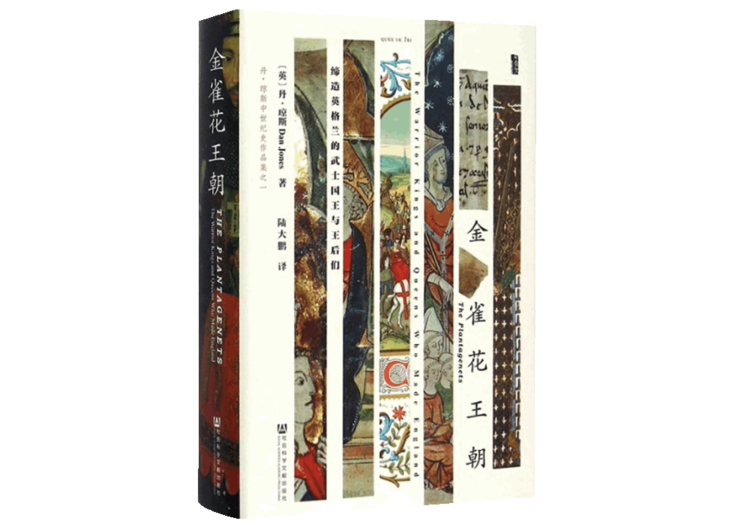
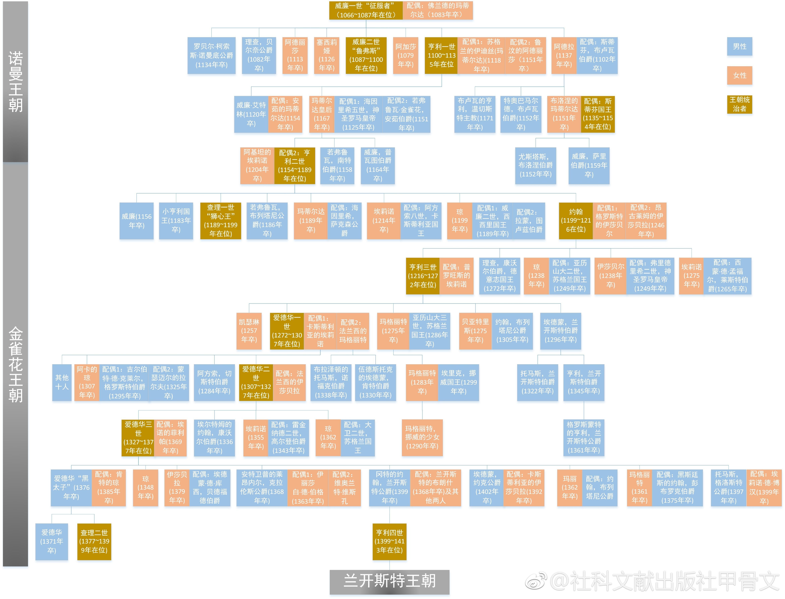
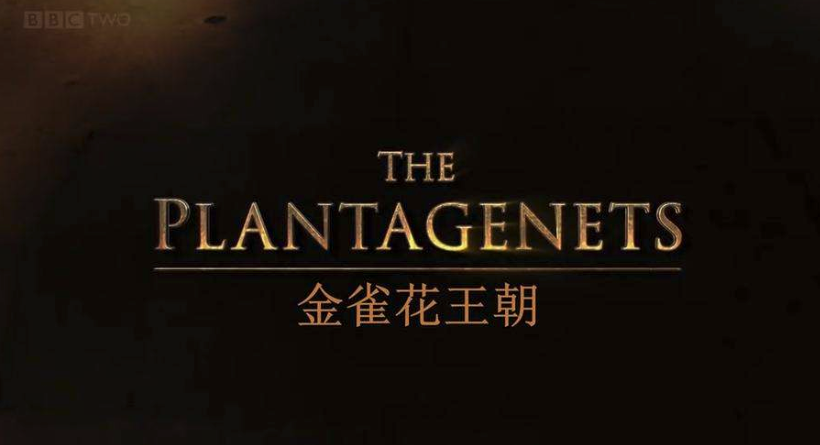

《金雀花王朝》主要讲述了1154~1399年内英格兰及其统治者（金雀花王朝及其贵族阶级）的主要历史事件。
<!--more-->

## 概要

&#8195;&#8195;王室家族是一个源于法国安茹的贵族，从12世纪开始统治英格兰，首任国王是亨利二世（其母为征服者威廉的孙女，嫁予安茹伯爵——一个喜爱金雀花的家族）。除了家族原有世袭领地安茹伯国外，该朝还统治过诺曼底公国、英格兰王国、阿基坦公国（亨利二世的妻子埃莉诺是阿基坦公国的继承者），具有广大的统治版图。

&#8195;&#8195;金雀花王朝的正式君主有八位：亨利二世、狮心王利差、无地王约翰、亨利三世、英格兰之锤爱德华一世、爱德华二世、爱德华三世、黑太子之子理查二世等。书中较为详细地描述了八位君主在位期间英格兰等地区的政治、军事斗争，以及律法发展。

## 族谱
- 威廉一世本为诺曼底公爵，其表亲英王死后无嗣。威廉夺得王位。
- 威廉一世死后（其子），其侄子史蒂芬篡夺王位；其女玛蒂尔达与子亨利二世（安茹伯爵之妻）起兵争夺王位
- 史蒂芬死后，亨利二世继位（妻子为阿基坦公国的继承人），开始了金雀花王朝的历史，统治着广大的版图。晚年，亨利二世遭到妻子、王子（包括下任国王理查）。
- 亨利二世死后，理查继位，人称狮心王，是一名优秀的军事将领，热衷于十字军东征，取得一系列辉煌的胜利。1199年，在某次战役中，脱除盔甲，主动尝试躲避敌箭，失败后死。
- 理查一世死后，其弟约翰继位（也曾参与对亨利二世的反叛）。先前因法国的领地已被全部封予他的几个兄长，没有可继承的土地留给他，故被称为“无地王”。期间统治无能、暴政，多次与贵族阶层产生冲突、战争，困扰于英格兰动乱，在贵族们的逼迫下于1215年签订了具有限制王权的法律文件《自由大宪章》，这被认为是早期民主政治发展的标志。
- 1216年约翰死后，其子亨利三世继位（时年9岁），1231年后亲政，多次把贵族头衔、领地授予外戚，因此本土贵族不满，被迫于1258年签订限制王权的《牛津条例》，确定“十五人议会”协助国王统治国家，此举被认为是英国议会的起源。
- 亨利三世死后，爱德华一世继位。爱德华在位期间颁布了大量法律法规，改善了司法系统，多次取得对外战争的胜利，但未能完全多去亨利二世死后丢失的部分版图。史称“英格兰之锤”。
- 爱德华一世死后，其子爱德华二世继位，统治无法，宠信佞臣，非法剥夺其妻即王后的领土、与贵族阶级产生巨大冲突。1327年，王后与其情夫发动政变，罢黜爱德华二世。五个月后，被杀害。
- 爱德华被罢黜后，其子爱德华三世年幼继位，其母与情夫把持朝政。1330年，18岁的爱德华三世发动政变，重新掌握政权。同期，法兰西国王去世后，无男性继承者，王位被传予瓦卢瓦王朝的腓力六世。爱德华三世认为自己应该继承法兰西王位（因其母为上任法兰西国王之女），开启了英法之间的百年战争。在位期间，对苏格兰、威尔士、法兰西获得一系列战争的胜利。其子即为著名的黑太子。
- 爱德华三世去世后（其子黑太子因病去世），其孙10岁的理查二世继位。在位初期尤其三位叔父辅政。中后期梳理本土贵族阶级、宠信其众多朋友并授予他们不符礼节、阶级的土地、头衔。后其堂兄发动兵变，罢黜之。
- 理查二世被废黜后，堂兄亨利四世继位。
- 亨利四世死后，其父亨利五世继位。亨利五世极具抱负与才能：团结贵族与王室成员、外交军事兼施与法国瓦卢瓦王朝联姻，并在胜利条约中获得法兰西国王继承权。然而，在加冕为法兰西国王的前两个月去世。
- 亨利五世去世后，其子亨利六世继位，并加冕为英格兰国王、法兰西国王（但在后续的战争中，法兰西的土地又重新被瓦卢瓦王朝夺走）。亨利六世统治后期与约克公爵发生战争，与其子被处死。至此，金雀花王朝落幕。

这两百五十多年的波澜壮阔中，又似有跌宕起伏的周期性。

## 与中国封建王朝的差异
&#8195;&#8195;政权上：中国的朝廷是唯一的执政团，其他任何组织都无权对政权进行质疑、惩处。而金雀花王朝时期的英格兰是政教结合的体制，教会对民众、国家具有很大的影响力，甚至到达能够影响国王行政权力。因此，在两三百年的金雀花历史中，时常能发生王室和教会的观点冲突、权力冲突。教会常会使用绝罚来对王室进行惩处，即不允许在该国内进行任何宗教活动。那是的英格兰人基本都是基督教徒，婚姻、葬礼、生活、工作都与教会活动息息相关。因此绝罚会对整个国家的生产活动产生巨大的冲击。国王也要得到教会的加冕，其统治才具备像相应的君权合法性。

&#8195;&#8195;封建程度上：中国的君主对于诸侯具备绝对的宗主权，即所有的土地都是属于皇帝的，诸侯只是土地的管理者，并不具备所有权。这就是我们常说的“普天之下，莫非王土”。但是在中世纪的欧洲，土地的所有权是归属于诸侯的。国王充当的角色更倾向于诸侯的协调者、管理者。如无特殊情况，国王无权剥夺诸侯的领土。如果一个贵族迎娶了其他诸侯或者国家国王的女儿，而这个领土又没有其他继承者，那么这个贵族将具备这个领土的继承权，从而得到这个领土甚至王国的所有权。因此，金雀花王室、诸侯十分喜欢将王室子女嫁给其他诸侯或者国王，通过联姻来维持、获取大量领土。这在中国封建社会是绝对不可能存在的：土地的所有权永久归属于皇帝，任何贵族无权更改、赠与、占有他贵族土地的所有权、使用权。

&#8195;&#8195;军事上：由于经济基础（即土地所有权）制度的差异，中国的君主对全国所有的军事力量具备绝对的领导权（起码在名义上）。然而，中世纪的英格兰，绝大部分土地都属于诸侯，国王无法直接控制诸侯土地、财富、军事力量。因此，任何对外战争，都需要得到其他诸侯的认可和支持，国王才有足够的人力、物力来支撑战争。这也是为什么当金雀花王朝的君主想征服、收复在欧洲大陆的领土（阿基坦公国、安茹公国等）的时候，诸侯大部分情况下会反对的原因：这些土地不是英格兰的土地，只属于国王，和诸侯没有利益关系，没必要浪费力量为国王打仗。

&#8195;&#8195;文化上：中国封建时期，对于已经侵略完成或者征服完成的土地，会同时统一语言、文字、货币、法律统治以及文化教育，尽量给予被侵略地的原住民和原国民同样的政治、经济、法律权利。而中世纪甚至是殖民时期的英国，对于已经侵略的土地，都比较喜欢强制对被侵略地的原住民进行英格兰法律、风俗统治，甚至对于这些原住民经济剥削（如对犹太人、苏格兰人的侵略）。因此造成这些被侵略地的原住民对英格兰的敌对意识，最终结果就是，被英格兰侵略统治的地区，会频繁发生叛乱，然后重新独立。

&#8195;&#8195;单从这些方面来看，那时的中国封建制度优越性或者文化包容性远远优于英格兰。关于种族歧视，不只是二战的纳粹，中世纪的英格兰、欧洲大陆同样严重，只是随着文明的进步，种族歧视慢慢消亡罢了。

&#8195;&#8195;还有一个比较有趣的一点：虽然无论在中国还是英格兰，皇/王位的继承嫡长子继承，但是对于违逆、叛乱王室的王子，两国的差异明显。亨利二世在位期间，王后联合众多王子发动叛乱，起军攻打国王。虽说这场叛乱被评定了，但是参与判断的两位王子，在国王去世后，却仍然成功、合法继承了王位。在中国，对于叛逆者，能够不被处死就已经很稀奇了，还能承袭皇位，那绝对是无稽之谈。

## 对法律的影响
&#8195;&#8195;金雀花王朝对英国的法制进程也同样产生了重大的影响，其主要代表事件有：巡回法庭的形成、《大宪章》的颁布、陪审团制度的确立、议会制度的雏形初现、程序先于权利等。在此不再细说，推荐阅读[《金雀花王朝对英国法律的影响》](https://www.zhihu.com/question/266964065/answer/316584147)

- “未经正当法律程序进行答辩，对任何财产和身份的拥有者一律不得剥夺其土地或住所、不得逮捕或监禁、不得剥夺其继承权和生命。” ——爱德华三世

&#8195;&#8195;金雀花王朝的法律制度，对后来的英国，甚至这个欧美大陆都产生了及其重大的影响。

## 其他

&#8195;&#8195;比较有趣的一点是，BBC拍的一系列纪录片：《金雀花王朝》。纪录片中，演讲者周游英格兰、苏格兰的地区，较为生动得讲解了金雀花王朝的诡云谲波，推荐一看。