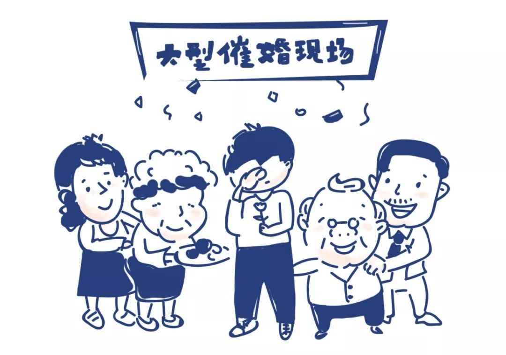
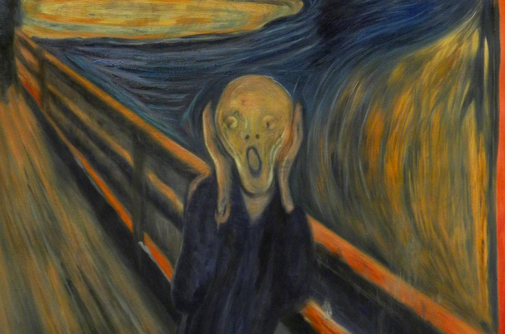

&nbsp;&nbsp;&nbsp;&nbsp;&nbsp;&nbsp;&nbsp;&nbsp;对于才二十四岁的我来说，现在就将自己对婚姻的看法写下来，未免有点贻笑大方。只是我在最近几年的感情状况发生了比较大的变化，因此，我觉得我有必要把这些东西梳理清晰。毕竟，玻璃碎片不安置好的话，是很容易扎上自己和他人的。

&nbsp;&nbsp;&nbsp;&nbsp;&nbsp;&nbsp;&nbsp;&nbsp;我在念大学的时候，就已经被老妈子催着说找女朋友。在她老人家看来，一个人在二十岁左右还没能谈恋爱大概这辈子就废了。毕竟在动物园打猎都打不到，那别说在茫茫野原了。

&nbsp;&nbsp;&nbsp;&nbsp;&nbsp;&nbsp;&nbsp;&nbsp;从我老妈子催我开始，我和她之间的聊天频次开始逐渐降低。2019年（现在是三月底），我已经挂了她三次电话。我实在是没办法接受这要的沟通。

## 象牙
&nbsp;&nbsp;&nbsp;&nbsp;&nbsp;&nbsp;&nbsp;&nbsp;我世界观的看法有很大一部分是在初高中形成的。初中时大部分人感情萌芽的时期，我们总是会做出一些连现在想起都会红着脸躲避的事情。在初中的时候，我认识了很多朋友，我很珍惜的朋友，尽管很多人现在已经不联系了（倒不是失去联系的方式）。初中开始，我开始染上阅读的恶习，因此，大部分耳熟能详的书籍我都有阅读过。同时，现在想起也会觉得很庆幸的是，在初中认识了一位异性蛀书虫。

&nbsp;&nbsp;&nbsp;&nbsp;&nbsp;&nbsp;&nbsp;&nbsp;特别强调是一位异性，主要是她对我的爱情观、婚姻观的塑造有着极其重要的影响。这倒不是因为这位女士在爱情、婚姻上对我的思想有多大的冲击，只是她在我婚姻观形成的过程中扮演过不可代替的角色而已。现在想起这位女士，仍然心生感激。

&nbsp;&nbsp;&nbsp;&nbsp;&nbsp;&nbsp;&nbsp;&nbsp;在读书的过程中，思想也就在形成。在初高中，能和蛀书虫小姐聊天（只在网上）是我为数不多的开心事情之一。我们会聊各自最近看过的书籍、今天踩到的无辜蚂蚁、天边隐现的彩虹......兴起之时，也会交换一下各自对某个作家、某本书籍、某个角色的看法。我们聊过三毛、路遥、余华、莫言、王小波，也聊过加西亚-马尔克斯、渡边淳一、村上春树、雨果。交流的过程中总是免不了对书中的某个角色的爱情、婚姻发表一下各自稚嫩的看法。 

&nbsp;&nbsp;&nbsp;&nbsp;&nbsp;&nbsp;&nbsp;&nbsp;上大学后，阅读的世界就更加广阔了，也开始对世界各个地区的婚姻习俗有了一个极其笼统的了解。我也在这个时候想象着自己未来的婚姻。我所期待的婚姻很简单，不过是两个无聊的人，做一些无聊但有趣的事罢了。

&nbsp;&nbsp;&nbsp;&nbsp;&nbsp;&nbsp;&nbsp;&nbsp;我想象过两个人一起去逛菜市场和老板杀价；想象过一起在刚醒来的城市绿道上跑步；想象过在厨房给彼此做饭；想象过两人一起看书时，我坐在沙发一头对着书哈哈大笑，她侧卧在另一头对着书欲泫欲泣......

&nbsp;&nbsp;&nbsp;&nbsp;&nbsp;&nbsp;&nbsp;&nbsp;在每一个这样的场景中，都有着蛀书虫女士的身影。

&nbsp;&nbsp;&nbsp;&nbsp;&nbsp;&nbsp;&nbsp;&nbsp;后来，我们基本不再联系了。

## 婚姻

&nbsp;&nbsp;&nbsp;&nbsp;&nbsp;&nbsp;&nbsp;&nbsp;孩子对于婚姻的看法很大程度上受父母婚姻的影响。如果孩子本身都不认可父母的婚姻，那么这个孩子很大程度上，对婚姻存在着恐惧。我实在没办法说我期待一段类似我父母的婚姻。这倒不是说我父母的婚姻糟糕，相反，他们两人能携手二十几年，感情之深浅绝非我二十几年的认知就能理解的。但是，我仍然没办法接受我未来的婚姻生活如我父母一般。其主要原因大概还是新一代的人和上一代的人思想观念的差异。

&nbsp;&nbsp;&nbsp;&nbsp;&nbsp;&nbsp;&nbsp;&nbsp;婚姻是两个人的事情，不是两个家庭的事情。这话说的未免太过理想化了，毕竟我们每个人身上都捆绑着来自原家庭的线。一旦两个人的结合是损害到原家庭利益、荣誉，或者对方不符合父母的要求，矛盾就会产生。在矛盾无法调节的情况下，是接受父母的要求，还是另寻他人呢？我尚未知道答案。

&nbsp;&nbsp;&nbsp;&nbsp;&nbsp;&nbsp;&nbsp;&nbsp;繁衍不是婚姻的目的。我不是那种结婚后就非要有个孩子的人。孩子是双方爱情的产物，而不仅仅是交配后的结果、养老的手段。

&nbsp;&nbsp;&nbsp;&nbsp;&nbsp;&nbsp;&nbsp;&nbsp;物质基础对于婚姻是重要的。我所理解的物质基础，是指各自具备满足自身物质需求、精神需求的经济生产能力，不是一方严重依赖另一方的经济基础，也不是把财富、名望作为择偶标准。

&nbsp;&nbsp;&nbsp;&nbsp;&nbsp;&nbsp;&nbsp;&nbsp;我所期待的婚姻很简单，不过两个无聊的人，做一些无聊但有趣的事。如果没有结伴同行，那么独身走路也是不错的选择。