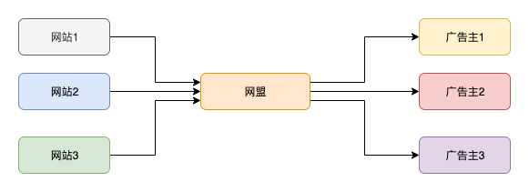
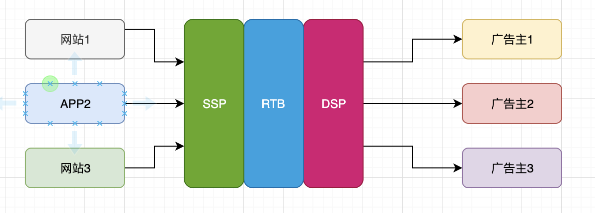
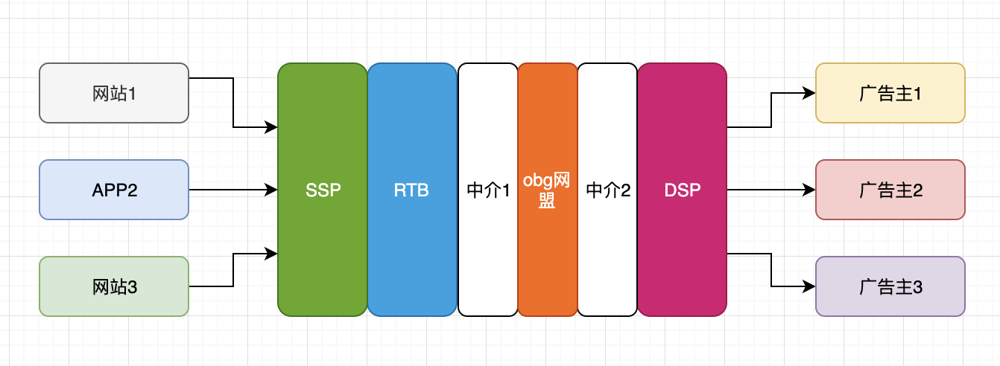

介绍一下网盟广告行业

## 网盟
### 广义上的网盟

其实就是连接广告主和流量方的平台:
- 广告主在平台创建广告，然后将广告放入广告池
- 流量媒体向平台请求广告
- 在有用户打开应用或者网页的时候，媒体就展示广告

### 稍细分的平台

可以将平台根据功能模块来划分：

- dsp：广告主在dsp创建广告：填写广告信息，然后将广告放入dsp广告池
- ssp：媒体在ssp创建账号，设置网站/app类型、广告位信息（如网站上部可以放banner、侧边栏可以放浮动图片、开屏广告等）
- 当有用户打开应用或者网页的时候，就请求ssp，带上广告位信息（如大小、位置等）、cookie、地区等用户信息。ssp根据媒体的信息和用户请求的信息，请求rtb
- rtb根据用户信息、媒体信息，从dsp的广告池里面选取最合适的广告（含出价、ecpc、ecpm等评估）返回给ssp
- ssp将广告返回给媒体，然后媒体展示广告

这几个并非缺一不可。比如，哪怕没有rtb，也还是能投放广告的：ssp直接从上一层的广告池取广告即可。

有些小公司或者小项目组就单独做ssp/rtb/dsp等服务来赚钱。有米也有ssp、rtb、dsp等项目组。而obg网盟项目组的地位类似于中间商：

因此我们狭义上的网盟就是这些中间商。由于层层剥削，导致跳转链路过长，甚至一个广告在dsp已经下线了，也要等一段时间下游中间、ssp才知道。这也是链接检测的背景：找出无法跳转或者跳转层级过长的广告

## 广告的分类
- 按入库方式
    - api：通过请求广告主接口返回的广告
    - s2s（server to server）:商务直接和广告主说要广告；广告主发来广告的基本信息；商务在demter手动创建的广告。一般这些广告质量都比较优良
- 按结算方式：
    - cpi：conversion per install。用户安装就算一次转化
    - cpa：conversion per action。用户的每次目标行为（如安装、订阅、充值等）就算一次转化。因此cpi是cpa的一种。只是网盟一般将cpa特指为订阅广告。
- 按是否可激励：
    - incent：激励广告。即允许使用激励流量（如送积分、给钱给用户等来引诱用户）的广告。这种流量的点击率、转化率比较高，但用户质量差（可能拿了积分或者钱后就会卸载游戏），留存率低
    - no-incent：非激励流量。

在我们的数据库，就是ad_tx字段

## 广告主
- 通过广告入库方式分为：s2s/api广告主。
- 通过广告结算方式分为：cpa广告主、cpi广告主。在有米网盟系统，一个广告主不能同时投放cpa和cpi广告，如果需要，就创建两个广告主账号。

## 渠道
- 按流量区分
    - 直接流量渠道：如头条、抖音、微博等互联网应用，这种比较少
    - 间接流量渠道：如其他网盟，较大的网盟有mv、papaya等
- 按规模
    - 个人渠道：一般就几个人搭建的小网盟（人少好分钱）
    - 企业渠道：一般有工商注册的合法公司，类似于有米网盟
- 按对接方式（类似于s2s/api广告主的区分方式）：
    - api渠道：通过api（adpub服务）来拉取我们广告的的渠道
    - s2s渠道：通过找有米的商务来要广告的渠道
- 按广告类型
    - cpa渠道：专门跑cpa广告的渠道
    - cpi去掉：专门跑cpi广告的渠道
    - 这种划分方式比较少用

在我们的数据就是aff_tx字段

## 推荐
- [今日头条ocpm、ocpc、cpa、三种转化出价方式](http://www.seocss.com/seojishu/meiriyitie/628.html)
- [计算广告](https://book.douban.com/subject/26596778/) 这本书虽然比较古老，但是很多概念都是互联网广告的基础