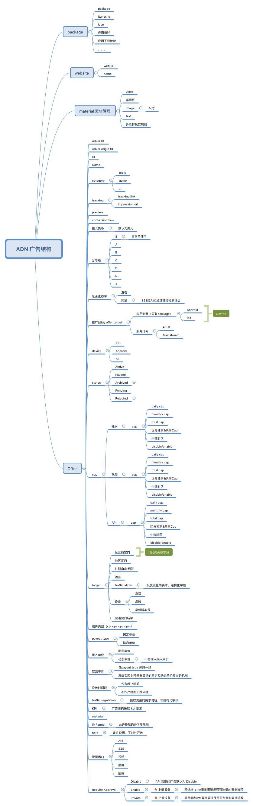
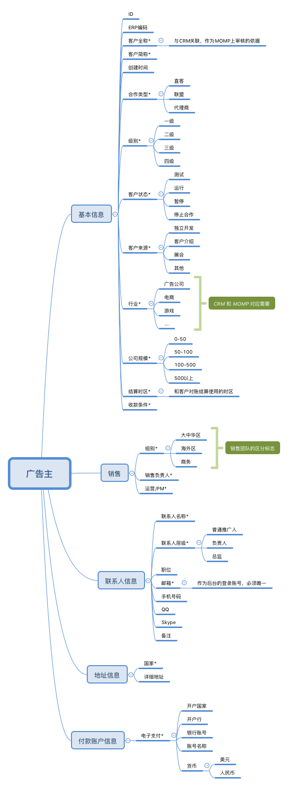
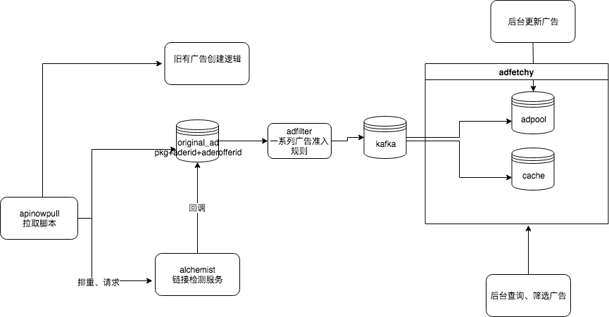

# 新广告池需求：一个全新的广告池，兼容处理网盟、api（未来考虑adn）
## adpool

### 广告结构
 - 上游联盟 == 广告主（下游渠道 == 开发者）
 - 一层广告结构

### 广告创建
链接检测 alchemist
- 链接检测抽离服务化成alchemist，alchemist和广告系统独立开，创建广告时将广告链接、广告id、检测类型和回调链接等参数请求alchemist，
  alchemist负责将链接检测的详细结果回传给中间层
- 链接检测评级系统收回到中间层，业务逻辑产品定
- 链接检测服务化流程 https://conf.umlife.net/display/ADN/2018-03-XX

广告创建
- 使用api从上游拉取的广告，先入临时广告表，同时请求alchemist
- 接收alchemist的回调，将链接检测结果写入link_detail，关联到临时广告表
- 一个独立的服务，将临时表里面的广告经过一系列准入规则（评级，价格筛选，排重，标签）筛选，进入广告创建队列
- 广告创建队列使用kafka，创建和更新分开不同的topic，广告创建、更新、广告更新日志各不同的consumer
- 将后台维护的adapi收回到中间层，后台创建广告调用adpool的接口、广告查询和筛选通过adfetchy接口进行查询
原有的广告创建流程：
https://conf.umlife.net/pages/viewpage.action?pageId=51645573&preview=/51645573/51645562/adapi.png

新的广告创建流程：

迁移方案：
- 由于老的adn需要继续支持，前期我们需要维护两个广告池，一个现有的广告池，一个是新的广告池
- 原有adn上游联盟数据需要同步到新网盟的广告主账户
- 网盟的广告直接导入到新的广告池，adn通过api拉取的广告，双写到新的广告池

