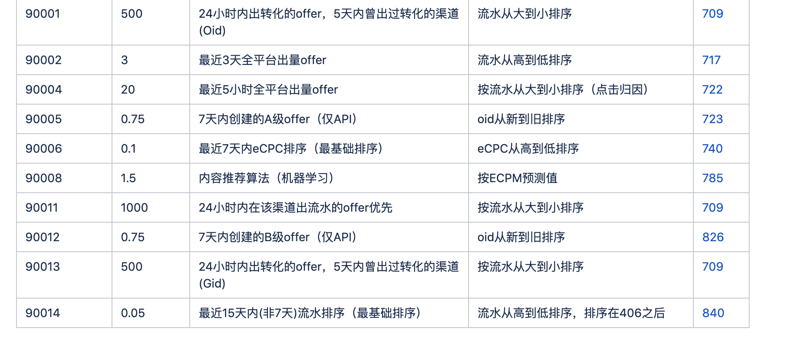

wiki https://conf.umlife.net/pages/viewpage.action?pageId=64526371

主要用户优化广告外放排序：库里面广告数量很大，渠道一般就拉一万几千条广告，我们要尽量将优质的广告排在前面外放。

## 规则列表
<p align="center">

</p>


## baton任务样例
每条规则都有其权重以及排序规则。如90001规则：权重500，符合这个规则的广告有
```
select aid, oid,
-- 权重：0.002=1/500
0.002*row_number() over (partition by aid order by sum(revenue) desc) as weigh
from stat where oid in(
    -- 近两天出过转化的广告
    select distinct oid from stat
    where dt>date_sub(now(), interval 2 day)
        and revenue > 0
)
-- 近五天出过转化的aid、oid
where dt>date_sub(now(), interval 5 day)
group by aid, oid
having sum(revenue)>0
-- 按流水排序
order by sum(revenue) desc
```

注意：weight越小，代表外放优先级越高。

## 举例
假设现在有广告ABC与规则1和2
- 规则1下：weight_a = 0.01, weight_b = 1.00, weight_c =0.03
- 规则2下：weight_a = 5.00, weight_b = 0.02, weight_c =0.05
-（min）  weight_a = min(0.01, 5)=0.01, weight_b = 0.02, weight_c =0.03

按照去min运算，外放优先级为：A>B>C （即按权重从小到大排序）

## 应用
- 权重数据由baton定时从效果数据如db20.stat汇总后，写入stat_sort表：aid-oid-weight
- 广告外放时，adfetchy会调用adsort_api，来根据stat_sort里面的数据对广告进行排序

## 其他规则
- 广告上下线、拉黑规则、备胎规则、别名：https://conf.umlife.net/pages/viewpage.action?pageId=58991144
- api广告下放排序规则/cac规则：https://conf.umlife.net/pages/viewpage.action?pageId=64526371