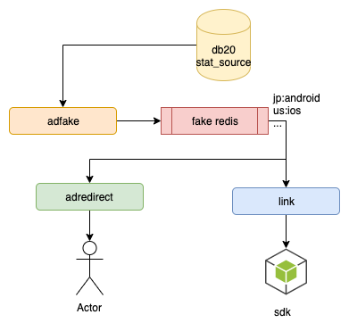
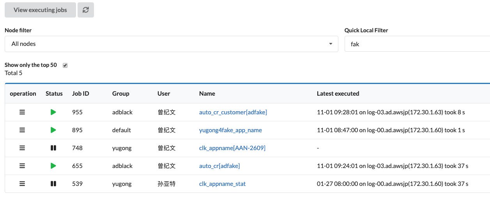

简单介绍一下刷cr任务。

## 背景
如果广告的转化率cr过高，广告主就有可能怀疑我们的流量是刷子，并对我们进行扣量。为此，我们需要创建一些假点击，来降低cr（控制在3%以下），从而降低被广告主扣量的风险。

## 实现方案

- adfake 从报表查询cr过高的oid-aid，并计算还要补充多少点击才能满足cr要求：fake_cnt = cov/0.03 - clk
- adfake 将需要刷的数据（fake任务：aid-oid-trackinglink）写入redis cr队列
- adredirect在收到无效点击（如国家定投错误等）的时候，就会从cr队列获取对应国家的fake任务，然后跳转到对应的需要刷cr的广告的trackinglink
- link服务（sdk链接检测服务）当没有链接检测任务，就会从cr队列拿出cr任务，并进行跳转

## 相关服务和任务

- adfake
- adredirect
- link
