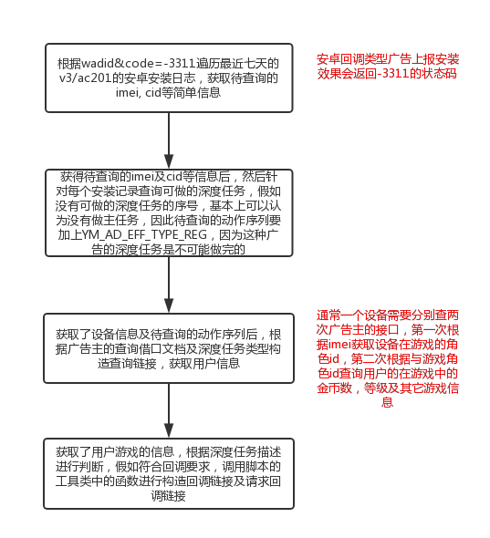

深度任务对接 https://conf.umlife.net/pages/viewpage.action?pageId=46242410

中间层支撑https://conf.umlife.net/pages/viewpage.action?pageId=38830600

### 部署
应该使用https://codeship-awscn.umlife.net 系统进行发布。下面是手工发布的流程，不推荐
- 跳板机 ssh -p 36000 ymserver@awscn-ma-01.umlife.net
- 机器：国内 log_02
- 路径：
	- awscn-log-02:~/vhost/gateway/analytics/crond/deep_mission
	- 日志：/data1/bak/wall/v3/ac201
- db：pma-maindb-awscn.umlife.net
	- awscn-db-02
	- 任务在youmi.ad_further_job，包名在youmi.ad_package
- 运行：crontab 定时运行


测试机:
```
ssh -p 36000 ymserver@52.193.7.38
~/vhost/gateway_ocean/ad_now/api_now
```

### 业务描述
目前积分墙的注册、等级等回调类型任务是有米事先通过发送带回调链接的链接给广告主，当广告主监控到用户已经注册或者相应的等级达到之后的话，就会主动回调有米，有米进行结算，并且请求开发者，告知任务完成，获得相应的积分。


但是广告主的回调有时候是很久之后才发生，这时候用户就无法及时看到积分增加，因此为了良好的用户体验，我们需要及时更新用户的积分，也就是“主动查询深度任务广告”

“主动查询深度任务广告”类型中，广告主只提供用户在游戏当中角色信息的查询接口，需要我们查询用户的游戏角色信息，然后按照广告主设定的等级进行判断，假如符合深度任务描述，我们自己构造回调链接，并主动请求回调链接，达致充当广告主回调的角色。

### 主要流程
- 获取用户角色信息
- 判断角色是否完成任务：下载、等级、金币量等
- 如果任务完成，则请求开发者，告知任务完成，用户获取相应积分

获取角色信息流程如下：


对于不同的广告主，获取角色信息的接口有要求，一般有idfa、ip等信息，参数名、加密方法是不一样的，因此这是需要配置的地方


### 代码流程
- 根据广告ad(积分墙广告id)及其主任务批量获取目标设备信息:array('ei', 'cid', 'ad', 'aid', 'from', 'product', 'rsd'):
	- 查询七天内的日志
	- 遍历每一行日志，获取ad等于wadid的日志，读取该日志中的设备的信息
- 检查任务，如果完成就回调
	- 遍历每条目标信息
	- 根据设备调用广告主接口获取用户id
	- 根据用户id获取用户信息，如等级、金币量等
	- 遍历任务列表
		- 判断用户是否完成任务，
		- 如果完成的任务，构造回调url，发送回调请求

[样例代码](./sample.php)
