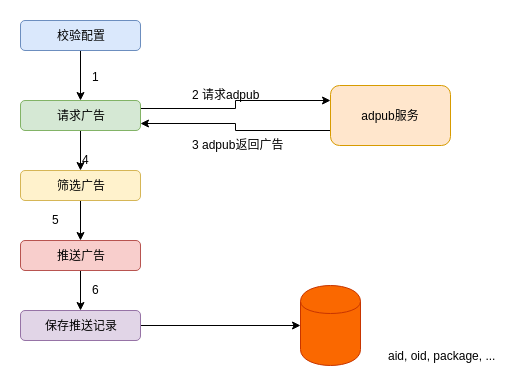
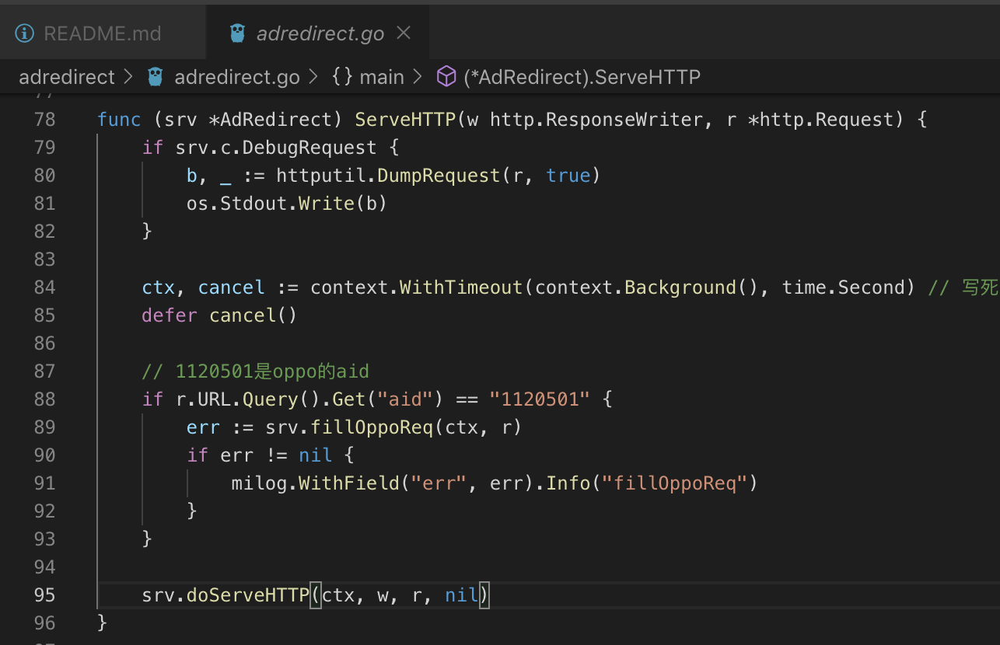

ssp的业务们想和oppo的应用商店合作，在adn这边实现了这个功能。但是oppo嘴大，有自己的一套协议，不愿意直接请求我们的adpub来获取广告，需要我们将广告推送给他们。

## 广告推送服务adpush

具体请见adpush的readme： https://git.umlife.net/adxmi/adn/tree/master/adpush

广告下放记录写在db40 的push_pkgs表：aid-oid-pkg-ut。oppo点击的时候不会上传包名给我们，只有aid和pkg，因此我们需要在收到点击的时候，从push_pkgs根据aid、pkg查询对应的oid，然后将广告信息填充到点击上报url中。

oppo的接口文档见：https://jira.umlife.net/browse/AAN-3677

## 广告点击服务
oppo的点击上报又是不遵循adredirect接口，需要我们去兼容：从push_pkgs根据aid、pkg查询对应的oid，然后将广告信息填充到点击上报url中。

