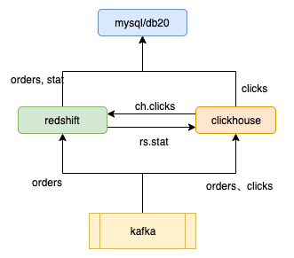
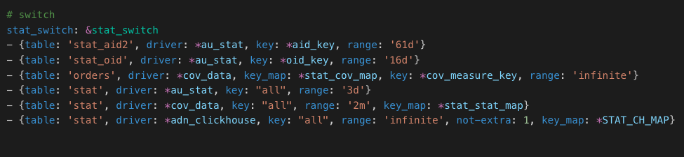
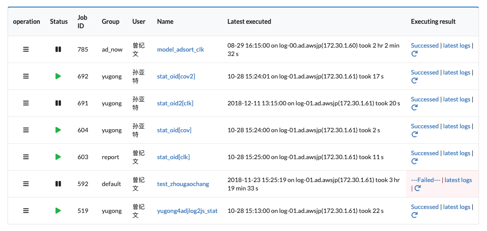
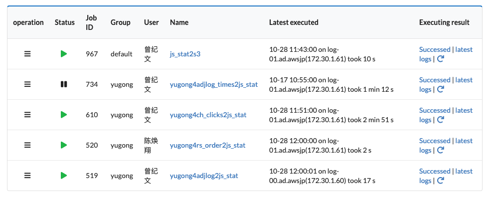

介绍一下报表相关的东西和baton上的任务。

## 网盟报表
现在报表主要就有三个数据源：mysql/db20、redshift（简称rs）、clickhouse（简称ch）

- ch：k2sql消费kafka写入。包含orders和clicks
- rs：k2sql消费kafka写入。包括orders
    - yugong4rs_orders2rs_stat&diffq: 将rs.orders按小时汇总到rs.stat
    - ch_clicks2rs_stat： 将ch.clicks按小时汇总到rs.stat

rs.stat里面的数据一般保留3～6个月。三个月前的数据会移动到ch.stat，由yogong4rs_stat2ch_stat负责。

demeter里面的报表
- conversion report：查询的是rs.orders
- click report:查询的时候ch.clicks
- stat report：根据用户所需的字段、时间范围自动选择不同的库表（rs.stat、mysql.stat、stat_oid、stat_aid2等）查询。路由[demeter报表配置](https://git.umlife.net/adxmi/canary-config/blob/master/demeter/define.yml)如下：

- stat_aid2、stat_oid都是从db20.stat汇总得到的。（stat表太大了，因此将一些频繁使用的维度写到stat_aid2, stat_oid）
- stat_aid2是一个没有oid字段的表
- stat_oid不记录点击小于10的维度
- 脚本见baton：stat_oid[cov]，stat_oid[cov2], stat_oid[clk], stat_aid[cov], stat_aid[clk]等

当查询条件符合range和key/key_map要求的时候，就会选择对应的table进行查询。

### ssp的报表
- db20.js_report: 这是ssp的报表，也是最蛋疼的表，查询的是db20.js_stat
    - js_stat是从ch.clicks, rs.orders, ch.adjlog汇总得到的

