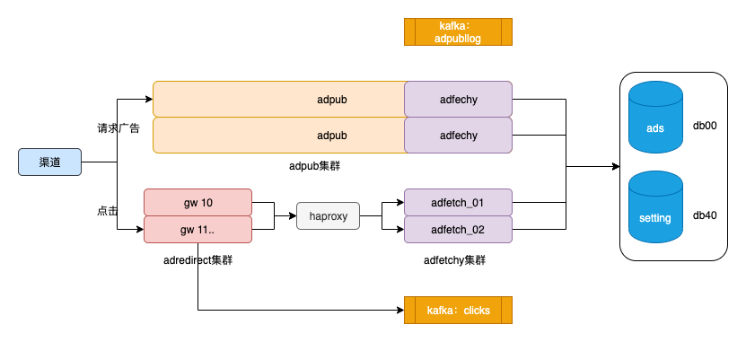
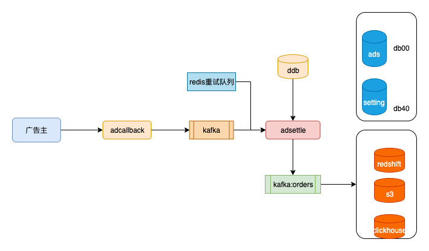

介绍一下广告外放、点击、转化回调。

注意，大部分的服务的接口都由proto来定义。从每个接口的request、response的proto结构就基本能够知道这个接口是干啥的了

- adfetchy：在线广告缓存以及各种规则的筛选。提供http接口和redis接口
- adpub：广告外放接口服务
- adredirect：广告点击接口服务

### adfetchy
- 背景：
    - 点击、下放、结算阶段都需要查看广告信息，如果每次都查询数据库，那么io、延迟都会很高，甚至会把数据库拖垮，因此将在线广告缓存到内存，提供接口来查询广告
- 广告缓存
    - 缓存有全量同步和增量同步：
        - 每次启动时会全量加载在线广告到内存；运行时会定期进行全量更新；
        - 同时为了能够更加实时了更新广告，使用了binlog来增量更新:adnsync服务会监听广告数据库的变更，将变更信息写入kafka；adfetchy消费kafka，得到对应的广告，然后在数据库查询该广告，最后更新缓存
- 广告筛选：
    - 内存查找广告
    - 内存筛选广告：如广告类型ad_tx、top ad等
    - 注意：aid层面出过转化的广告、备胎等都是top ad
    - 筛选后进行过滤：如等级名单过滤、各种黑白名单（广告主、广告、国家、广告类型、操作系统、运营商等）过滤
    - 返回广告给调用者
- 接口
    - adfetchy提供了两个接口：http接口和redis接口。adredirect就是使用redis接口来调用adfetchy集群的
    - 提供了lib方式调用：调用者只需在代码中引入adfetchy package即可。adpub服务就是这用调用adfetchy的

### 外放
主要是adpub、adfetchy服务

- adpub提供广告拉取接口，供下游使用
- adpub以library的方式调用adfetchy：参数有广告类型(cpa/cpi)、流量类型（adult/main stream）等。（其实也可以使用外部调用来请求adfetchy服务）
- adfetchy从内存缓存里面获取数据，并进行各种黑白名单过滤
- 都是批量拉取的。拉取日志会写入ch.adpublog（kafka-k2sql），拉取时刻的价格会写入db20.stat_price： aid-oid-price，供结算时使用

### 点击
主要是addredirect、adfetchy

- adredirect使用redis接口来请求adfetchy集群，获取广告信息（如广告类型、下一跳地址）等
- 判断点击是否合法，如根据x-real-ip获取国家，判断点击地区是否符合广告定投地区
- 从redis哪出这个渠道补贴的信息，如果需要补贴，则产生补贴回调。具体见allowance服务。详情我不了解
- adredirect广告请求进行重定向
- 写点击日志到kafka（消费到ddb、clickhouse）

### 结算

1. 广告主发生转化会回调adcallback
2. adcallback将tid、oid、aid、gid、payout等信息写入kafka
3. adsettle消费kafka、redis延时回调队列
    - 确定回调是否正常，如回调机器ip白名单（防止有人冒充广告主）
    - 根据tid判断ddb是否有相应点击。如果没有，原因可能是ddb写入延迟，因此会将tid等信息放入redis延时队列
    - 填充结算日志信息（渠道信息、广告信息、），如：ad_tx, aff_tx, country等
    - 确定是否扣量等 
    - 将结算日志写入kafka
   