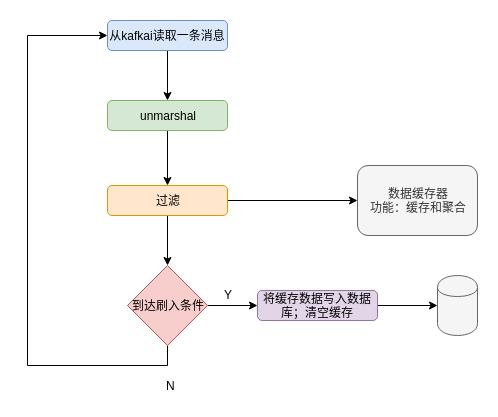

## k2sql
一个消费kafka数据然后写入数据库的服务。使用方法见README或者线上服务的配置
<p align="center">

</p>


## yugong
跨数据库操作的工具：
- 从数据库dim查询出条件数据
- 根据条件数据从数据库src查询出目标数据
- 将目标数据插入到数据库dst

<p align="center">

</p>


使用方法参见baton中的任务，或者yugong的readme。大致流程如下：
```
rows = []
if not query_dims:
    rows =[{}] // 至少执行一次
else:
    rows = select(dims, query_dims)

for row in rows:
    // 执行prepare语句，prepare可以有多条
    for pre in prepares:
        execute(dst, pre)

    // 执行query_dims中的select子句
    data = select(src, select, row)
    // 执行query_dims中的insert子句，插入dst
    execute(dst, insert, data)

    // 执行after操作，after可以有多条
    for aft in after:
        execute(dst, aft)
```

## baton
见其readme

<p align="center">

</p>
