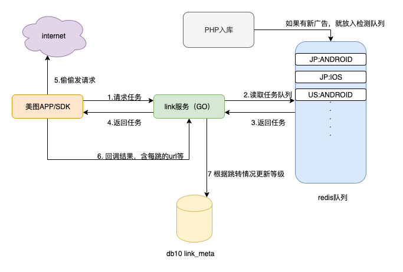
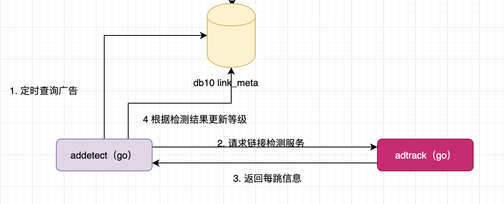
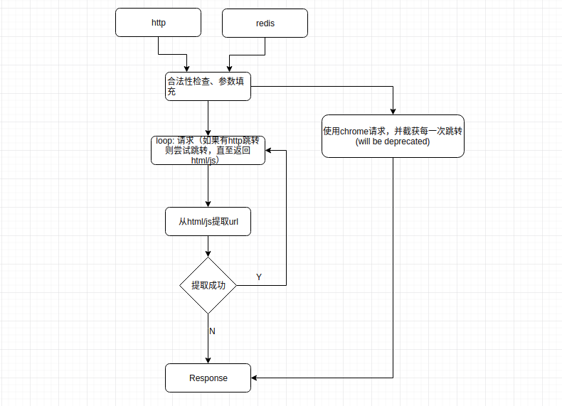

## 链接检测
### 背景
当前库内的广告数量过多（每天约有百万广告入库），这些广告质量良莠不齐（如跳转时间过长、跳转层数过多，有些甚至无法跳转到应用商店/落地页），如果将哪些质量差的广告下放给渠道，哪怕渠道展示了这些广告，并有用户点击了，转化率也低下。

为此，我们使用链接检测来检测广告，通过广告跳转层数和能否跳转到落地页来给广告评级，评级优良的广告（ABCN级）才会下放给渠道。

当前我们的链接检测有两种：sdk和代理。

## sdk 链接检测

以前网盟和美图合作，美图app会瞒着用户偷偷的发送网络请求来检测我们给美团的链接。(虽说现在已经不合作了，但是有些用户还是没有更新应用，每天都有两百万的请求量)

代码逻辑：
- PHP入库代码对于新广告或者信息发生变更的广告，会往链接检测队列发送任务（oid、url、country、os、cpa/cpi等信息），这一步的代码量比较少，见[gateway-ocean/gateway仓库](https://git.umlife.net/gateway-ocean/gateway/blob/master/ad_now/api_now/ymm_api_now_link_track.php) , 运行在log-02
1. sdk请求[link服务](https://git.umlife.net/adxmi/adn/tree/master/link)
2. link服务根据sdk的操作系统以及ip地址
3. 从redis队列获取对应os、country的检测任务
4. link服务返回链接检测任务(tracking link、回调地址cb等)给sdk
5. sdk偷偷瞒着用户请求tracking link
6. sdk将请求结果通过地址cb回调link服务，回调信息有：oid、各跳转url等
7. link服务根据回调结果，判断广告等级，并更新db10等级表link_meta

美图sdk是怎么检测，不知道。。。

## 代理链接检测

1. addetect服务定期查询db10，将那些长时间没有检测的广告查出来（根据last_edited）
2. 请求链接检测服务adtrack：os、country、zone（流量类型）、url等
3. adtrack返回每跳结果
4. addetect根据跳转层次和是否到达落地页，判断等级，更新至db10 等级表link_meta

## adtrack

1. 提供一个redis接口和http接口
2. 尝试填充待检测链接url中的参数，如“xxxx?aid={aid}”，会被替换为“xxxx?aid=34545”。这些参数都是从ch.clicks表查询出来的，是实际数据。
3. 使用http请求url，获取所有30x跳转，知道返回网页
4. 如果网页不是落到页，则尝试提取url，重复步骤3；如果是落地页或者提取失败，则进入步骤4
5. 返回所有的跳转层级url

## 对外链接检测服务
提供外部服务的saas话链接检测服务。具体见服务track的文档

## ref 
- 等级判断标准：https://conf.umlife.net/pages/viewpage.action?pageId=67243314。 具体实现见：addetect
- wiki目录：https://conf.umlife.net/pages/viewpage.action?pageId=46243026